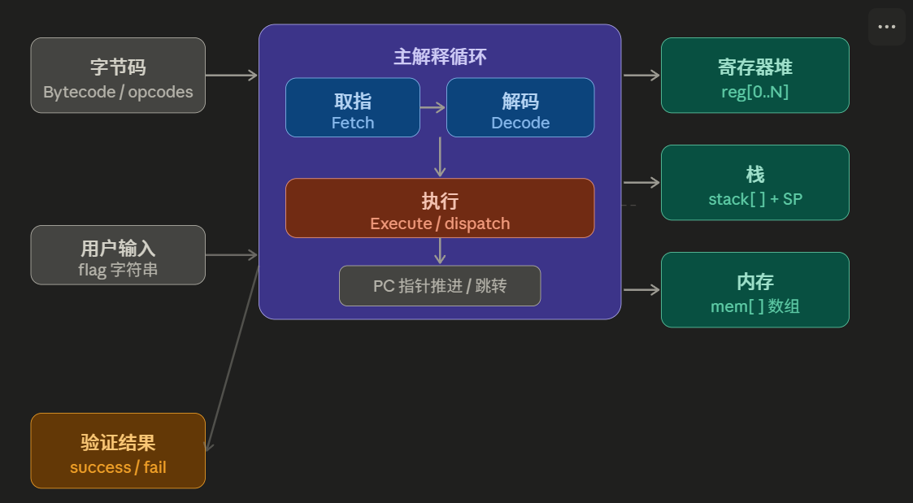
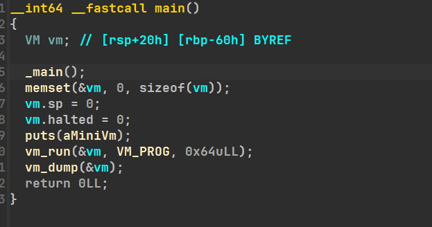
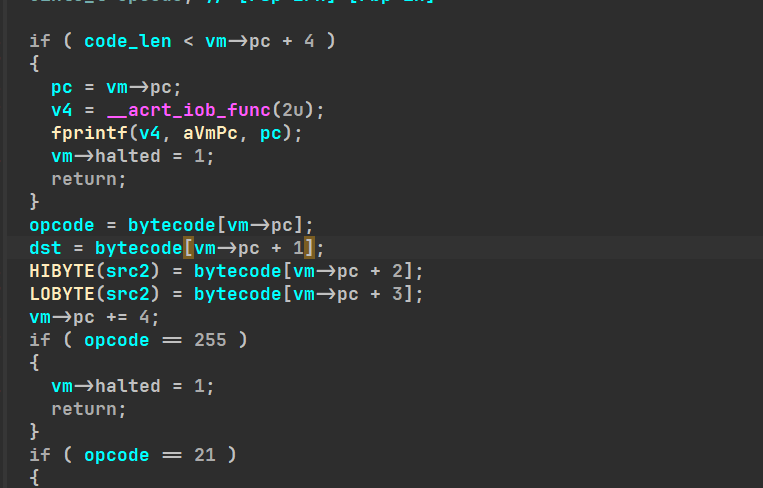
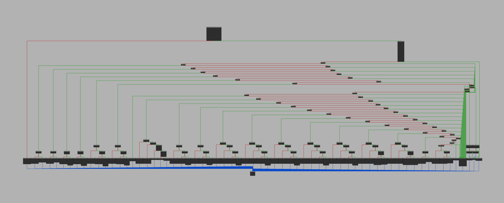

VM（虚拟机）本质是**题目作者自己实现了一套指令集**，就如x86,arm64按规则让机器码对应不同的汇编。

比如8086的`JMP`对应`E8`操作码，可以自实现让`JMP`对应`78`，这样就达到了让本来在反汇编8086的ida等工具失败的效果；

然后还会自定义数组等以实现寄存器等CPU功能。




## 0x01 从零到一自实现一个虚拟机

先从源码角度认识一下虚拟机，对后续看反编译的代码结构有很大帮助

#### *1. 常量定义*

```c
#define REG_COUNT    8      /* 通用寄存器数量 */
#define MEM_SIZE     256    /* 内存大小（字节） */
#define STACK_SIZE   64     /* 栈深度 */
#define INSN_SIZE    4      /* 每条指令的字节数（定长编码） */

/* 标志寄存器的可能取值，由 CMP 指令设置 */
#define FLAG_EQ  0   /* 两个操作数相等 */
#define FLAG_LT  1   /* dst < src */
#define FLAG_GT  2   /* dst > src */
```

#### *2. 指令集定义（Opcode 枚举）*

一般都有这一套最基础的，ida的反汇编常见形式在注释中；

将在后面给出每个指令的具体实现；

可以看出，这套指令集一个指令最多三个操作数；

```c
typedef enum {
    OP_NOP   = 0x00,  /* 什么也不做，常用作填充 */
    OP_MOV   = 0x01,  /* r[dst] = r[src1]              寄存器间赋值 */
    OP_LDI   = 0x02,  /* r[dst] = (src1<<8)|src2       加载16位立即数 */
    OP_LOAD  = 0x03,  /* r[dst] = mem[r[src1]]         从内存读 */
    OP_STORE = 0x04,  /* mem[r[dst]] = r[src1]         写入内存 */
    OP_ADD   = 0x05,  /* r[dst] = r[src1] + r[src2] */
    OP_SUB   = 0x06,  /* r[dst] = r[src1] - r[src2] */
    OP_XOR   = 0x07,  /* r[dst] = r[src1] ^ r[src2] */
    OP_AND   = 0x08,  /* r[dst] = r[src1] & r[src2] */
    OP_OR    = 0x09,  /* r[dst] = r[src1] | r[src2] */
    OP_SHL   = 0x0A,  /* r[dst] = r[src1] << src2      左移，src2是立即数 */
    OP_SHR   = 0x0B,  /* r[dst] = r[src1] >> src2      右移 */
    OP_CMP   = 0x0C,  /* flag = cmp(r[dst], r[src1])   比较，设置标志位 */
    OP_JMP   = 0x0D,  /* pc = (src1<<8)|src2            无条件跳转（绝对地址） */
    OP_JEQ   = 0x0E,  /* if flag==EQ: pc = (src1<<8)|src2 */
    OP_JNE   = 0x0F,  /* if flag!=EQ: pc = (src1<<8)|src2 */
    OP_PUSH  = 0x10,  /* stack[sp++] = r[dst] */
    OP_POP   = 0x11,  /* r[dst] = stack[--sp] */
    OP_CALL  = 0x12,  /* push(pc+INSN_SIZE); pc = addr  子程序调用 */
    OP_RET   = 0x13,  /* pc = pop()                    从子程序返回 */
    OP_IN    = 0x14,  /* r[dst] = getchar()            读一个字节输入 */
    OP_OUT   = 0x15,  /* putchar(r[dst])               输出一个字节 */
    OP_HALT  = 0xFF,  /* 停机 */
} Opcode;
```

#### *3. 虚拟机状态结构体*

所有运行时状态都放在这个结构体里。

```c
typedef struct {
    uint32_t regs[REG_COUNT]; /* 通用寄存器 r0~r7 */
    uint32_t pc;              /* 程序计数器：下一条要执行的指令地址（字节偏移） */
    uint8_t  flag;            /* 标志寄存器：保存上次 CMP 的结果 */
    uint8_t  mem[MEM_SIZE];   /* 内存区域：可存放数据（输入、中间值、密文等） */
    uint32_t stack[STACK_SIZE]; /* 调用栈 */
    int      sp;              /* 栈指针：指向栈顶的下一个空位 */
    int      halted;          /* 是否已停机（执行了 HALT 或出错） */
} VM;
```

#### *4.核心执行函数：vm_step()*

先取指：从内存中读取数据（类似code段）；

再执行：用`switch+case`匹配数据与对应字节码的操作，执行后移动指针向后推进一条指令（类似CS,IP的执行方式）

```c
void vm_step(VM *vm, const uint8_t *bytecode, size_t code_len) {

    /* ---- 取指阶段（Fetch）----
     * 从字节码数组中读出当前 PC 处的 4 个字节。
     * 在 IDA 里，这行代码通常长这样：
     *   opcode = bytecode[rax]; rax = vm->pc;
     * 找到这行，向上追 bytecode 数组的来源，就能定位字节码。
     */
    if (vm->pc + INSN_SIZE > code_len) {
        fprintf(stderr, "[VM] PC 越界：0x%04X\n", vm->pc);
        vm->halted = 1;
        return;
    }

    uint8_t opcode = bytecode[vm->pc];     /* 操作码 */
    uint8_t dst    = bytecode[vm->pc + 1]; /* 目标操作数 */
    uint8_t src1   = bytecode[vm->pc + 2]; /* 第一源操作数 */
    uint8_t src2   = bytecode[vm->pc + 3]; /* 第二源操作数 */

    /* 解码阶段（Decode）：提前算好常用组合 */
    uint32_t imm16 = ((uint32_t)src1 << 8) | src2; /* 16 位立即数 */

    /* 边界检查：寄存器编号合法性 */
#define CHECK_REG(r) do { \
    if ((r) >= REG_COUNT) { \
        fprintf(stderr, "[VM] 非法寄存器编号 %d\n", (r)); \
        vm->halted = 1; return; \
    } \
} while(0)

    /* ---- 执行阶段（Execute）——大 switch ----
     * PC 默认向后推进一条指令，跳转指令会覆盖这个值。
     */
    vm->pc += INSN_SIZE;

    switch (opcode) {

    /* --------------------------------------------------
     * NOP：空操作，PC 已经前进，什么都不做
     * 常见用途：占位、对齐、迷惑逆向者
     * -------------------------------------------------- */
    case OP_NOP:
        break;

    /* --------------------------------------------------
     * MOV r[dst], r[src1]
     * 寄存器间赋值，最基础的指令
     * -------------------------------------------------- */
    case OP_MOV:
        CHECK_REG(dst); CHECK_REG(src1);
        vm->regs[dst] = vm->regs[src1];
        break;

    /* --------------------------------------------------
     * LDI r[dst], imm16
     * 加载一个 16 位立即数到寄存器
     * CTF 题用它把密钥/密文常量嵌入字节码
     * -------------------------------------------------- */
    case OP_LDI:
        CHECK_REG(dst);
        vm->regs[dst] = imm16;
        break;

    /* --------------------------------------------------
     * LOAD r[dst], [r[src1]]
     * 从内存地址 r[src1] 读一个字节到 r[dst]
     * 用于读取预先存在 mem[] 里的 flag 字符
     * -------------------------------------------------- */
    case OP_LOAD:
        CHECK_REG(dst); CHECK_REG(src1);
        if (vm->regs[src1] >= MEM_SIZE) {
            fprintf(stderr, "[VM] 内存越界读：addr=0x%X\n", vm->regs[src1]);
            vm->halted = 1; return;
        }
        vm->regs[dst] = vm->mem[vm->regs[src1]];
        break;

    /* --------------------------------------------------
     * STORE [r[dst]], r[src1]
     * 把 r[src1] 的值写入内存地址 r[dst]
     * -------------------------------------------------- */
    case OP_STORE:
        CHECK_REG(dst); CHECK_REG(src1);
        if (vm->regs[dst] >= MEM_SIZE) {
            fprintf(stderr, "[VM] 内存越界写：addr=0x%X\n", vm->regs[dst]);
            vm->halted = 1; return;
        }
        vm->mem[vm->regs[dst]] = (uint8_t)vm->regs[src1];
        break;

    /* --------------------------------------------------
     * 算术 / 逻辑运算
     * CTF 题的 flag 验证几乎都由这几条组成
     * -------------------------------------------------- */
    case OP_ADD:
        CHECK_REG(dst); CHECK_REG(src1); CHECK_REG(src2);
        vm->regs[dst] = vm->regs[src1] + vm->regs[src2];
        break;

    case OP_SUB:
        CHECK_REG(dst); CHECK_REG(src1); CHECK_REG(src2);
        vm->regs[dst] = vm->regs[src1] - vm->regs[src2];
        break;

    case OP_XOR:
        CHECK_REG(dst); CHECK_REG(src1); CHECK_REG(src2);
        vm->regs[dst] = vm->regs[src1] ^ vm->regs[src2];
        break;

    case OP_AND:
        CHECK_REG(dst); CHECK_REG(src1); CHECK_REG(src2);
        vm->regs[dst] = vm->regs[src1] & vm->regs[src2];
        break;

    case OP_OR:
        CHECK_REG(dst); CHECK_REG(src1); CHECK_REG(src2);
        vm->regs[dst] = vm->regs[src1] | vm->regs[src2];
        break;

    /* --------------------------------------------------
     * SHL / SHR：移位，src2 直接作立即数（移位量）
     * -------------------------------------------------- */
    case OP_SHL:
        CHECK_REG(dst); CHECK_REG(src1);
        vm->regs[dst] = vm->regs[src1] << src2;
        break;

    case OP_SHR:
        CHECK_REG(dst); CHECK_REG(src1);
        vm->regs[dst] = vm->regs[src1] >> src2;
        break;

    /* --------------------------------------------------
     * CMP r[dst], r[src1]
     * 比较两个寄存器，结果存入 flag。
     * 这是逆向时的关键分支——flag 决定后续跳转方向。
     * 如果你在 IDA 看到 "if (reg_a != reg_b) goto fail_label"，
     * 那就是这条指令 + JNE 的组合。
     * -------------------------------------------------- */
    case OP_CMP:
        CHECK_REG(dst); CHECK_REG(src1);
        if      (vm->regs[dst] == vm->regs[src1]) vm->flag = FLAG_EQ;
        else if (vm->regs[dst] <  vm->regs[src1]) vm->flag = FLAG_LT;
        else                                       vm->flag = FLAG_GT;
        break;

    /* --------------------------------------------------
     * 跳转指令：JMP / JEQ / JNE
     * 注意：跳转目标是字节码的绝对字节偏移，
     * 所以目标地址 = imm16（不需要乘以 INSN_SIZE）
     * -------------------------------------------------- */
    case OP_JMP:
        vm->pc = imm16;
        break;

    case OP_JEQ:  /* 相等时跳转 */
        if (vm->flag == FLAG_EQ) vm->pc = imm16;
        break;

    case OP_JNE:  /* 不相等时跳转（最常用：任何一位不对就 fail） */
        if (vm->flag != FLAG_EQ) vm->pc = imm16;
        break;

    /* --------------------------------------------------
     * 栈操作：PUSH / POP
     * 用于保存临时值或实现子程序调用约定
     * -------------------------------------------------- */
    case OP_PUSH:
        CHECK_REG(dst);
        if (vm->sp >= STACK_SIZE) {
            fprintf(stderr, "[VM] 栈溢出\n");
            vm->halted = 1; return;
        }
        vm->stack[vm->sp++] = vm->regs[dst];
        break;

    case OP_POP:
        CHECK_REG(dst);
        if (vm->sp <= 0) {
            fprintf(stderr, "[VM] 栈下溢\n");
            vm->halted = 1; return;
        }
        vm->regs[dst] = vm->stack[--vm->sp];
        break;

    /* --------------------------------------------------
     * CALL addr / RET
     * 实现子程序：CALL 把返回地址压栈，RET 弹出跳回。
     * 有些 CTF VM 用 CALL 来调用内置的"检查函数"，
     * 这时函数体本身也是字节码。
     * -------------------------------------------------- */
    case OP_CALL:
        if (vm->sp >= STACK_SIZE) {
            fprintf(stderr, "[VM] CALL：栈溢出\n");
            vm->halted = 1; return;
        }
        vm->stack[vm->sp++] = vm->pc; /* 压入 CALL 之后的下一条地址 */
        vm->pc = imm16;               /* 跳转到被调函数 */
        break;

    case OP_RET:
        if (vm->sp <= 0) {
            fprintf(stderr, "[VM] RET：栈下溢\n");
            vm->halted = 1; return;
        }
        vm->pc = vm->stack[--vm->sp]; /* 恢复返回地址 */
        break;

    /* --------------------------------------------------
     * I/O 指令
     * IN  r[dst]     : 从 stdin 读一个字节（即读 flag 字符）
     * OUT r[dst]     : 向 stdout 输出一个字节（打印 "Correct!" 等）
     * CTF 题通常会有一段循环：每次 IN 读一个 flag 字符 → 验证
     * -------------------------------------------------- */
    case OP_IN:
        CHECK_REG(dst);
        vm->regs[dst] = (uint8_t)getchar();
        break;

    case OP_OUT:
        CHECK_REG(dst);
        putchar((int)vm->regs[dst]);
        break;

    /* --------------------------------------------------
     * HALT：停机指令
     * VM 执行到这里时，主循环退出。
     * 验证成功和失败分支最终都会跳到 HALT，
     * 区别在于跳之前有没有输出 "Correct" 或 "Wrong"。
     * -------------------------------------------------- */
    case OP_HALT:
        vm->halted = 1;
        break;

    /* --------------------------------------------------
     * 未知 opcode：通常是被混淆的 NOP
     * -------------------------------------------------- */
    default:
        fprintf(stderr, "[VM] 未知 opcode: 0x%02X at PC=0x%04X\n",
                opcode, vm->pc - INSN_SIZE);
        vm->halted = 1;
        break;
    }
}

```

 #### *5. 主循环：vm_run()*

不断调用 vm_step()，直到 halted 为真。

这就是 CTF 题源码里那个 while(1) { opcode=\*pc++; switch... }

```c
void vm_run(VM *vm, const uint8_t *bytecode, size_t code_len) {
    while (!vm->halted) {
        vm_step(vm, bytecode, code_len);
    }
}

// 辅助函数：打印当前 VM 状态（调试用）
void vm_dump(const VM *vm) {
    printf("\n--- VM STATE (PC=0x%04X) ---\n", vm->pc);
    for (int i = 0; i < REG_COUNT; i++) {
        printf("  r%d = 0x%08X (%u)", i, vm->regs[i], vm->regs[i]);
        if ((i & 1) == 1) printf("\n");
        else               printf("    ");
    }
    printf("  flag = %s    sp = %d\n",
           vm->flag == FLAG_EQ ? "EQ" : vm->flag == FLAG_LT ? "LT" : "GT",
           vm->sp);
    printf("----------------------------\n\n");
}

```

#### *6.示例字节码*

```c
 *  示例字节码：一个完整的 flag 验证程序 
 *
 *  【逻辑说明】
 *    程序验证输入的 2 个字符是否为正确 flag："xm"。
 *    处理逻辑为：将输入字符与密钥 0x1F 进行异或（XOR），
 *    然后与预先计算好的密文比对：
 *      'x' ^ 0x1F = 0x67
 *      'm' ^ 0x1F = 0x72
 *    如果完全匹配，输出 "OK\n" 并停机；
 *    如果任意字符不匹配，跳转到 FAIL 分支输出 "NO\n" 并停机。
 *
 * ============================================================ */
static const uint8_t VM_PROG[] = {
    /* === 字符 1 验证 === */
    /* 0x00 */ OP_LDI,  0, 0x00, 0x1F,   /* r0 = 0x1F              ← 加载 XOR 的固定密钥 */
    /* 0x04 */ OP_IN,   1, 0x00, 0x00,   /* r1 = getchar()         ← 读取第 1 个字符 */
    /* 0x08 */ OP_XOR,  1, 1,    0,      /* r1 = r1 ^ r0           ← 对输入进行异或转换 */
    /* 0x0C */ OP_LDI,  2, 0x00, 0x67,   /* r2 = 0x67              ← 加载密文 ('x' ^ 0x1F) */
    /* 0x10 */ OP_CMP,  1, 2,    0,      /* flag = cmp(r1, r2)     ← 比较转换结果与密文 */
    /* 0x14 */ OP_JNE,  0, 0x00, 0x48,   /* if != jump to 0x48     ← 不等则跳转到 FAIL 分支 */

    /* === 字符 2 验证 === */
    /* 0x18 */ OP_IN,   1, 0x00, 0x00,   /* r1 = getchar()         ← 读取第 2 个字符 */
    /* 0x1C */ OP_XOR,  1, 1,    0,      /* r1 = r1 ^ r0           ← 对输入进行异或转换 */
    /* 0x20 */ OP_LDI,  2, 0x00, 0x72,   /* r2 = 0x72              ← 加载密文 ('m' ^ 0x1F) */
    /* 0x24 */ OP_CMP,  1, 2,    0,      /* flag = cmp(r1, r2)     ← 比较转换结果与密文 */
    /* 0x28 */ OP_JNE,  0, 0x00, 0x48,   /* if != jump to 0x48     ← 不等则跳转到 FAIL 分支 */

    /* === 成功分支 (SUCC) === */
    /* 0x2C */ OP_LDI,  0, 0x00, 'O',    /* r0 = 'O'               */
    /* 0x30 */ OP_OUT,  0, 0,    0,      /* putchar(r0)            */
    /* 0x34 */ OP_LDI,  0, 0x00, 'K',    /* r0 = 'K'               */
    /* 0x38 */ OP_OUT,  0, 0,    0,      /* putchar(r0)            */
    /* 0x3C */ OP_LDI,  0, 0x00, '\n',   /* r0 = '\n'              */
    /* 0x40 */ OP_OUT,  0, 0,    0,      /* putchar(r0)            */
    /* 0x44 */ OP_JMP,  0, 0x00, 0x60,   /* JMP 0x60               ← 躲开 FAIL 区域，直接跳向 HALT */

    /* === 失败分支 (FAIL) === */
    /* 0x48 */ OP_LDI,  0, 0x00, 'N',    /* r0 = 'N'               ← JNE 直接跳向此处 */
    /* 0x4C */ OP_OUT,  0, 0,    0,      /* putchar(r0)            */
    /* 0x50 */ OP_LDI,  0, 0x00, 'O',    /* r0 = 'O'               */
    /* 0x54 */ OP_OUT,  0, 0,    0,      /* putchar(r0)            */
    /* 0x58 */ OP_LDI,  0, 0x00, '\n',   /* r0 = '\n'              */
    /* 0x5C */ OP_OUT,  0, 0,    0,      /* putchar(r0)            */

    /* === 结束停机 === */
    /* 0x60 */ OP_HALT, 0, 0x00, 0x00,   /* 停机                   ← 所有流程汇聚此处停机 */
};


// main函数
int main(void) {
    VM vm;
    memset(&vm, 0, sizeof(VM));   /* 清零所有状态 */
    vm.sp = 0;
    vm.halted = 0;

    printf("Mini VM — 输入 flag（2个字符）：\n");

    /* 运行字节码 */
    vm_run(&vm, VM_PROG, sizeof(VM_PROG));

    /* 打印最终寄存器状态（辅助调试） */
    vm_dump(&vm);

    return 0;
}
```

```
Mini VM — 输入 flag（2个字符）：
> xm
OK

--- VM STATE (PC=0x0064) ---
  r0 = 0x0000000A (10)      r1 = 0x00000072 (114)
  r2 = 0x00000072 (114)      r3 = 0x00000000 (0)
  r4 = 0x00000000 (0)      r5 = 0x00000000 (0)
  r6 = 0x00000000 (0)      r7 = 0x00000000 (0)
  flag = EQ    sp = 0
----------------------------
```


# 0x02 ida反编译

我们把刚才写的程序编译后丢给ida；

VM-PROG是即将执行的我们定义的字节码数组；



重点在`vm_run`：

主循环,当VM不为停机（halted）指令时，进入`vm_step`解析字节码；



先是检查完整性，然后四位一组将字节码（opcode）解析，然后移动CSIP指针，最后开始`if(opcode==...)`将字节码翻译为指令。

下面都是if或者switch判断（也是最难逆向的部分）：




# 0x03 实战

最难的部分肯定是逆向opcode对应的指令了，可能是8086类似指令集，也可能是自定义的指令，做起来就是硬读汇编；难一点的还有标志寄存器、堆栈之类的自实现的东西，特别难逆；

### ~~最好的方法：让AI识别指令集反汇编（顺带把题解了）~~

~~毕竟现在把IDA的几千行纯汇编丢给AI都能解了~~

### 方法一：写逆向脚本

先dump`opcode`数组；

识别指令格式以及每一个分支的指令，简化成人类稍微能看点的代码，写成if-else的形式，让`opcode[i++]`匹配并打印，有时候要设置zf之类的标志位；

然后就有了稍微好看一点的伪汇编；

以上面的VM为例

```py
# 格式：[opcode:1] [dst:1] [HIBYTE(src2):1] [LOBYTE(src2):1]
```

```py
BYTECODE = bytes([
    0x02, 0x00, 0x00, 0x1F,
    0x14, 0x01, 0x00, 0x00,
    0x07, 0x01, 0x01, 0x00,
    0x02, 0x02, 0x00, 0x67,
    0x0C, 0x01, 0x02, 0x00,
    0x0F, 0x00, 0x00, 0x48,
    0x14, 0x01, 0x00, 0x00,
    0x07, 0x01, 0x01, 0x00,
    0x02, 0x02, 0x00, 0x72,
    0x0C, 0x01, 0x02, 0x00,
    0x0F, 0x00, 0x00, 0x48,
    0x02, 0x00, 0x00, 0x4F,
    0x15, 0x00, 0x00, 0x00,
    0x02, 0x00, 0x00, 0x4B,
    0x15, 0x00, 0x00, 0x00,
    0x02, 0x00, 0x00, 0x0A,
    0x15, 0x00, 0x00, 0x00,
    0x0D, 0x00, 0x00, 0x60,
    0x02, 0x00, 0x00, 0x4E,
    0x15, 0x00, 0x00, 0x00,
    0x02, 0x00, 0x00, 0x4F,
    0x15, 0x00, 0x00, 0x00,
    0x02, 0x00, 0x00, 0x0A,
    0x15, 0x00, 0x00, 0x00,
    0xFF, 0x00, 0x00, 0x00,
])

# ── 操作码助记符表 ─────────────────────────────────────────────────────────
# 从 vm_step() 逆向整理，含操作数格式说明
OPCODE_TABLE = {
    0x00: ("NOP",  ""),
    # default case in switch → MOV dst, r[hi]
    0x01: ("MOV",  "reg_reg"),
    0x02: ("LOAD", "reg_imm16"),      # regs[dst] = src2
    0x03: ("LOAD", "reg_mem"),        # regs[dst] = mem[regs[hi]]
    0x04: ("STORE","mem_reg"),        # mem[regs[dst]] = regs[hi]
    0x05: ("ADD",  "reg_lo_hi"),      # dst = r[lo] + r[hi]
    0x06: ("SUB",  "reg_hi_lo"),      # dst = r[hi] - r[lo]
    0x07: ("XOR",  "reg_lo_hi"),      # dst = r[lo] ^ r[hi]
    0x08: ("AND",  "reg_lo_hi"),
    0x09: ("OR",   "reg_lo_hi"),
    0x0A: ("SHL",  "reg_hi_imm"),     # dst = r[hi] << lo
    0x0B: ("SHR",  "reg_hi_imm"),     # dst = r[hi] >> lo
    0x0C: ("CMP",  "reg_reg"),        # flag: 0=eq, 1=lt, 2=gt
    0x0D: ("JMP",  "imm16"),
    0x0E: ("JE",   "imm16"),          # if (!flag)  → flag==0 → equal
    0x0F: ("JNE",  "imm16"),          # if (flag)   → flag!=0 → not equal
    0x10: ("PUSH", "reg"),
    0x11: ("POP",  "reg"),
    0x12: ("CALL", "imm16"),
    0x13: ("RET",  ""),
    0x14: ("IN",   "reg"),            # regs[dst] = getchar()
    0x15: ("OUT",  "reg"),            # putchar(regs[dst])
    0xFF: ("HALT", ""),
}

# ── 辅助：字节值 → 可打印字符提示 ────────────────────────────────────────
def char_hint(val: int) -> str:
    if val == 0x0A:
        return "  ; '\\n'"
    if 0x20 <= val <= 0x7E:
        return f"  ; '{chr(val)}'"
    return ""

# ── 反汇编核心 ─────────────────────────────────────────────────────────────
def disasm(bytecode: bytes) -> None:
    pc = 0
    total = len(bytecode)

    print(f"{'Offset':<8} {'Raw Bytes':<14} {'Instruction'}")
    print("-" * 55)

    while pc + 4 <= total:
        op  = bytecode[pc]
        dst = bytecode[pc + 1]
        hi  = bytecode[pc + 2]   # HIBYTE(src2) → 通常是第二个寄存器索引
        lo  = bytecode[pc + 3]   # LOBYTE(src2) → 立即数低字节 / 第三操作数
        imm = (hi << 8) | lo     # src2 完整 16 位立即数

        raw = f"{op:02X} {dst:02X} {hi:02X} {lo:02X}"
        offset = pc
        pc += 4

        # ── 查表解码 ──────────────────────────────────────────────────────
        if op not in OPCODE_TABLE:
            print(f"[{offset:04X}]  {raw}   UNKNOWN  opcode=0x{op:02X}")
            continue

        mnem, fmt = OPCODE_TABLE[op]

        if fmt == "":
            asm = mnem
        elif fmt == "reg":
            asm = f"{mnem:<5} r{dst}"
        elif fmt == "reg_reg":
            asm = f"{mnem:<5} r{dst}, r{hi}"
        elif fmt == "reg_imm16":
            hint = char_hint(lo) if hi == 0 else ""
            asm = f"{mnem:<5} r{dst}, 0x{imm:04X}{hint}"
        elif fmt == "reg_mem":
            asm = f"{mnem:<5} r{dst}, [r{hi}]"
        elif fmt == "mem_reg":
            asm = f"{mnem:<5} [r{dst}], r{hi}"
        elif fmt == "reg_lo_hi":
            asm = f"{mnem:<5} r{dst}, r{lo}, r{hi}"
        elif fmt == "reg_hi_lo":
            asm = f"{mnem:<5} r{dst}, r{hi}, r{lo}"
        elif fmt == "reg_hi_imm":
            asm = f"{mnem:<5} r{dst}, r{hi}, {lo}"
        elif fmt == "imm16":
            asm = f"{mnem:<5} 0x{imm:04X}"
        else:
            asm = f"{mnem}"

        print(f"[{offset:04X}]  {raw:<13}  {asm}")

    if pc < total:
        print(f"\n[警告] 末尾有 {total - pc} 个未对齐字节")

if __name__ == "__main__":
    disasm(BYTECODE)
```

```
Offset   Raw Bytes      Instruction
-------------------------------------------------------
[0000]  02 00 00 1F    LOAD  r0, 0x001F
[0004]  14 01 00 00    IN    r1
[0008]  07 01 01 00    XOR   r1, r0, r1
[000C]  02 02 00 67    LOAD  r2, 0x0067  ; 'g'
[0010]  0C 01 02 00    CMP   r1, r2
[0014]  0F 00 00 48    JNE   0x0048
[0018]  14 01 00 00    IN    r1
[001C]  07 01 01 00    XOR   r1, r0, r1
[0020]  02 02 00 72    LOAD  r2, 0x0072  ; 'r'
[0024]  0C 01 02 00    CMP   r1, r2
[0028]  0F 00 00 48    JNE   0x0048
[002C]  02 00 00 4F    LOAD  r0, 0x004F  ; 'O'
[0030]  15 00 00 00    OUT   r0
[0034]  02 00 00 4B    LOAD  r0, 0x004B  ; 'K'
[0038]  15 00 00 00    OUT   r0
[003C]  02 00 00 0A    LOAD  r0, 0x000A  ; '\n'
[0040]  15 00 00 00    OUT   r0
[0044]  0D 00 00 60    JMP   0x0060
[0048]  02 00 00 4E    LOAD  r0, 0x004E  ; 'N'
[004C]  15 00 00 00    OUT   r0
[0050]  02 00 00 4F    LOAD  r0, 0x004F  ; 'O'
[0054]  15 00 00 00    OUT   r0
[0058]  02 00 00 0A    LOAD  r0, 0x000A  ; '\n'
[005C]  15 00 00 00    OUT   r0
[0060]  FF 00 00 00    HALT
```

然后硬读汇编，至于是人读还是AI读...


### 方法二：ida断点动态trace

比上面的静态方法会清晰一些，主要运用于case里面塞函数的更好用，当然纯代码也行，但还是要猜指令逻辑；

在每个case入口打断点，断点执行打印函数传参信息与寄存器；

#### 操作流程

##### 第一步：找到每个 case 的处理函数地址

比如这题的 VM 是分发给子函数执行的（fastcall 规则），在 IDA 里找到：

```c
switch(opcode):
    case LOAD_CONST  → 0x7FF67A7615D5
    case STORE_NAME  → 0x7FF67A...
    case COMPARE     → 0x7FF67A...
    ...
```

##### 第二步：在每个 case 函数入口设条件断点

在 IDA 断点设置里：

- **Location**：填函数地址（如 `0x7FF67A7615D5`）
- **Condition**：写 False （让断点不暂停执行）
- **Edit Script**：写真正要执行的打印脚本

##### 第三步：断点脚本内容

```python
# 每次执行到 LOAD_CONST 这个 case 时自动运行
pc_addr = idc.get_name_ea_simple("pc")      # 找到 VM 的 pc 变量地址
pc      = ida_bytes.get_word(pc_addr)        # 读当前 VM pc 值

sp_addr = idc.get_name_ea_simple("SP_")
sp      = ida_bytes.get_word(sp_addr)        # 读 VM 栈指针

# 读 x64 fastcall 传参寄存器（就是这个 case 函数的入参）
rcx = idc.get_reg_value("rcx")
rdx = idc.get_reg_value("rdx")
r8  = idc.get_reg_value("r8")
r9  = idc.get_reg_value("r9")

op_name = "LOAD_CONST"
print(pc, op_name, "sp={}".format(sp), rcx, rdx, r8, r9)
```

每个 case 写一份类似的脚本，只改 `op_name` 和读取的寄存器。

##### 第四步：喂入真实 flag 输入，让程序跑完

IDA 的 Output 窗口（或重定向到文件）就会自动输出 trace：

```
0  LOAD_CONST   sp=0  1  0  0  475378216224
1  STORE_NAME   sp=1  0  32  2324953371952  9295712209692852480
0  LOAD_CONST   sp=0  1  1  4294967295  1
1  STORE_NAME   sp=1  1  72  2324953371952  9295712209692852480
...
8  COMPARE      sp=3  3  136  2324953372256  2324953372161
9  JNT          sp=1  4  152  4294967295  1
```

#### 如何从 trace 分析 flag

拿到 trace 后，重点关注：

```
COMPARE  → 比较了什么值？ → rcx/rdx 就是两侧操作数
JNT/JMP  → 跳转是否发生？ → 判断当前输入对不对
```

如：

```
行8:  COMPARE sp=3  136  [val_A]  [val_B]
      ↑ 对比了 val_A 和 val_B

行9:  JNT sp=1  4  152  ...
      ↑ JNT = Jump if Not True，即不等则跳
      ↑ 如果跳了 → 输入错误
```


### 方法三：frida黑盒插桩爆破

不理解 VM 逻辑，只观测输入→输出的副作用；

猜猜爆，如果是单字节加密（简单VM常见，因为处理字符串比较有点麻烦）就可以frida爆破（其实动调也差不多）

也可以通过侧信道等方式，这里不再赘述。

最好也要知道大体的加密方式，这样才能选好插入点，方法很多，主要看具体题。


*为什么没有ctf实战？因为ai都一把梭爆了，碰到有意思的VM题会再更新。*

*本博客主要是想让我们都了解一下题目原理，从而可以看懂AI在干什么，能简单指导AI，并看懂AI输出的东西，学有所成*


