# 0x00 绪论

## 何为frida

一般用于安卓逆向，通过动态插桩自由改变运行时函数（程序）行为的工具，本质是**原来指向对象的指针指向你hook的代码**，也可以主动调用方法或者查找内存等等；

| 能力              | 举例                                 |
| ----------------- | ------------------------------------ |
| **监控函数调用**  | 打印每次 `open()` 被调用时的文件路径 |
| **查看/修改参数** | 拦截加密函数，打印明文参数           |
| **篡改返回值**    | 让 `isRooted()` 永远返回 `false`     |
| **追踪内存读写**  | 监控某个地址被谁读写                 |
| **调用任意函数**  | 主动调用目标 App 内部的私有方法      |


## 安装

**电脑端**：

16版本的frida没有大改，网上大多教程都能用

```cmd
pip install frida==16.1.3 frida-tools==12.3.0 -i https://pypi.tuna.tsinghua.edu.cn/simple
```

**安卓端**（server）：

使用魔改版过检测：https://github.com/hzzheyang/strongR-frida-android

下载同版本`frida-server-16.1.3-android-arm64`，

push到安卓设备上，注意路径上不要有"frida"字符串避免检测*（ACE干了）*


## 初始化

**安卓端**：./启动server即可

**电脑端**：

安卓端启动好后，两种启动方式：*具体的选择方法可以看看下面的例题*

- ### 1. Attach 模式 — 附加到已运行的进程

  目标进程已经在跑了，Frida 注入进去。

  ```bash
  # 通过进程名附加
  frida -U -n "AppName（进程名）" -l your_hook.js  # 不知道进程名可以执行 frida-ps -U 获取
  
  # 通过 PID 附加
  frida -U -p 1234 -l your_hook.js
  ```

  **缺点**：进程启动时的代码（比如 `onCreate` 里的初始化逻辑）你来不及 hook，因为那时候你还没附加进去。

  ------

  ### 2. Spawn 模式 — 由 Frida 启动进程

  将启动App的权利交由Frida来控制，即使目标App已经启动，在使用Frida注入程序时还是会重新启动App。

  ```bash
  frida -U -f "com.example.app（包名）" -l your_hook.js
  ```

  > `-U`：USB连接；
  >
  > `-f` ：spawn模式启动，full launch 的意思；
  >
  > `-l` :  后接加载的脚本

  **优点**：能 hook 到程序启动最早期的逻辑，比如：

  ​	`	JNI_OnLoad`,`Application.attach`,`Activity.onCreate`,反调试代码,root检测.anti-frida等。

  **缺点**：有些 App 检测 spawn 行为

  

# 0x01 常见`api`

## 1.Java层 API

### Java反射

- 反射是 Java 在**运行时**动态地**获取类信息**、**访问字段**、**调用方法**、**创建实例**的机制，是Java层hook的基础；

### 先写`Java.perform(() => {...})`

- Frida 注入进程后，ART 虚拟机（Android Runtime）不一定立刻就绪

  `Java.perform` 的作用是：**等 JVM 完全初始化后，再执行回调里的代码**

  所有 Java 层操作都必须在这个回调内部写，否则会报错

### 一、修改方法

#### 实例方法

```js
const Clazz = Java.use("android.widget.Clazz");
Clazz.method1.overload("java.lang.CharSequence").implementation = function(para1) {
    //your hook js...
    //return value;
}
```

- `Java.use("包名.类名")` 获取一个 Java 类的**包装对象**

  相当于 Java 里的 `Class.forName()`，但返回的是 Frida 可操作的对象

  参数是完整类名，包括包路径

- `Clazz.method` 拿到 `method1` 这个方法

- `.overload("java.lang.CharSequence")` 指定**重载版本**——如果方法有多个重载（接收 String、int、CharSequence 等），必须明确指定参数类型，否则 Frida 不知道 hook 哪个

- `.implementation = function(...)` 把原来的实现**整体替换**成你的函数
- 参数 `para1` 就对应原方法的参数

- 如果方法有返回值，不写`return`，原始的 `method1` 就不会执行了（相当于吞掉调用）

#### 静态方法

```js
// 静态方法（假设有个 StaticUtil.getKey()）
StaticUtil.getKey.implementation = function() {
    return this.getKey(); // this = 类本身，不是实例
};

// 实例方法（onCreate）
Activity.onCreate.implementation = function(bundle) {
    this.onCreate(bundle); // this = 当前 Activity 实例
};
```

- 静态方法和实例方法写法一样，Frida 会自动区分

  > ### Q:  hook静态方法和实例方法有什么不同？不创建实例怎么能hook静态方法？
  >
  > ### A:   hook 不是"调用"，是"替换"
  >
  > 你不需要实例，是因为 hook 做的事情是：
  >
  > ```
  > 把 JVM 里这个方法的函数指针替换掉
  > ↓
  > 等别人调用这个方法时，自动跑你的代码
  > ```
  >
  > 你只需要找到**方法在内存里的位置**，跟这个方法有没有实例无关。
  >
  > 
  >
  > **静态方法 vs 实例方法 的底层差异**：
  >
  > **静态方法**在 JVM 里是：
  >
  > ```
  > 类加载时就确定地址，属于 Class 对象本身
  > 调用时：直接 invokestatic → 跳到固定地址
  > ```
  >
  > **实例方法**在 JVM 里是：
  >
  > ```
  > 通过对象的 vtable（虚函数表）分派
  > 调用时：invokevirtual → 查对象的 vtable → 跳转
  > ```
  >
  > Frida 做的是在 ART 层把这个方法的入口地址替换掉，**无论哪种方法，替换地址这个动作本身都不需要实例。**
  >
  > hook 是"在方法入口处埋伏"，埋伏这个动作不需要实例；
  >
  > 但实例方法被触发时，Frida 会把**真实的调用者对象**作为 `this` 交给你，这是和静态方法最核心的区别。


### 二、主动调用方法

Frida 里操作 Java 有两种模式：

| 操作                  | 方式                                   |
| --------------------- | -------------------------------------- |
| 调用**静态方法/字段** | `Java.use("类名").静态方法()` 直接调用 |
| 调用**实例方法/字段** | 必须拿到一个**对象实例**才能调用       |

`Java.use` 只给你一个类的"句柄"（相当于反射里的 `Class` 对象），**不是实例**。

对于非静态方法，需要用`Class.$new`构造一个对象`obj`,再`obj.method`调用；或者用 `Java.choose` 去堆上找已存在的实例。

#### 静态方法

```js
const Utils = Java.use("com.example.app.Utils");
const result = Utils.decrypt("encryptedString");
console.log("Decrypted:", result);
```

- 不用写 `.implementation`，直接像普通函数一样**调用**
- 注意：这里调用的是静态方法，实例方法需要先创建对象

#### 实例方法，需要先构造对象：

```js
const Foo = Java.use("com.example.Foo");
const instance = Foo.$new("构造参数"); // 相当于 new Foo("构造参数")
const result = instance.someMethod("arg");
```


###  三、找内存中已有的实例 —— `Java.choose`

`Java.choose` 的作用是**在 Java 堆内存中搜索某个类的所有存活实例**，然后让你对每个实例执行操作。

```javascript
Java.choose("完整类名", {
    onMatch: function(instance) {
        // 找到一个实例时触发
    },
    onComplete: function() {
        // 搜索完成后触发
    }
});
```

本质上它是在扫描 JVM/ART 的堆，找出所有该类型的对象引用。


## 2.native层API

### 一、获取native层函数对象

#### 1. 按导出符号查找（最简单）

```javascript
// 有符号名直接找
const addr = Module.getExportByName("libnative.so", "Java_com_example_MainActivity_check");
console.log("地址:", addr);
```

#### 2. 按模块基址 + 偏移（IDA 里看到的偏移）

```javascript
const base = Module.getBaseAddress("libnative.so");
// IDA 里函数偏移是 0x1234，注意 thumb 函数要 +1
const funcAddr = base.add(0x1234);
```

#### 3. 枚举所有导出符号

```javascript
Module.enumerateExports("libnative.so").forEach(exp => {
    if (exp.name.includes("verify") || exp.name.includes("check")) {
        console.log(exp.name, exp.address);
    }
});
```


### 二、修改函数 —— `Interceptor.attach`

```js
Interceptor.attach(targetAddr, {
    // 函数进入时触发
    onEnter(args) {
        // args[0], args[1]... 对应函数参数
        console.log("[+] 进入函数");
        console.log("arg0:", args[0]);           // 打印指针值
        console.log("arg0 int:", args[0].toInt32());   // 作为 int 读
        console.log("arg0 str:", args[0].readUtf8String()); // 作为字符串读
        
        // 保存参数给 onLeave 用
        this.arg0 = args[0];
        
        // 修改参数
        args[1] = ptr(0x1);
    },
    
    // 函数返回时触发
    onLeave(retval) {
        console.log("[+] 返回值:", retval.toInt32());
        
        // 修改返回值（强制返回 1）
        retval.replace(1);
    }
});
```

**模板：hookJNI函数**

```js
JNI 函数签名固定：前两个参数是 JNIEnv* 和 jobject/jclass
javascript// 目标：Java_com_ctf_MainActivity_verify(JNIEnv*, jobject, jstring input)
const verify = Module.getExportByName("libnative.so", "Java_com_ctf_MainActivity_verify");

Interceptor.attach(verify, {
    onEnter(args) {
        // args[0] = JNIEnv*
        // args[1] = jobject (this)
        // args[2] = jstring (第一个 Java 参数)
        
        // 用 Java.vm.getEnv() 读 jstring 内容
        const env = Java.vm.getEnv();
        const input = env.getStringUtfChars(args[2], null).readCString();
        console.log("[*] 输入:", input);
    },
    onLeave(retval) {
        console.log("[*] 结果:", retval.toInt32());
        retval.replace(1); // 强制返回 true
    }
});
```

### 三、主动调用 —— NativeFunction

导出函数：

```js
// 目标函数原型：int add(int a, int b)
const add = new NativeFunction(
    Module.getExportByName("libnative.so", "add"),
    'int',        // 返回值类型
    ['int', 'int'] // 参数类型列表
);

const result = add(3, 5);
console.log("结果:", result); // 8
```

> ### 基础类型
>
> | C/JNI 类型                      | NativeFunction 中写法 |
> | ------------------------------- | --------------------- |
> | `void`                          | `'void'`              |
> | `int` / `jint`                  | `'int'`               |
> | `unsigned int`                  | `'uint'`              |
> | `long`                          | `'long'`              |
> | `int64_t` / `jlong`             | `'int64'`             |
> | `uint64_t`                      | `'uint64'`            |
> | `float`                         | `'float'`             |
> | `double`                        | `'double'`            |
> | `char` / `uint8_t` / `jboolean` | `'uint8'`             |
> | `xxx*` / 任何指针               | `'pointer'`           |
> | `size_t`                        | `'size_t'`            |

如果是非导出函数，只能用 IDA 里看到的偏移：

```javascript
Java.perform(() => {
    const base = Module.getBaseAddress("libnative.so");
    
    // IDA 里函数地址是 0x2A40
    const funcAddr = base.add(0x2A40);
    
    // ARM Thumb 指令集：地址要 OR 1
    // const funcAddr = base.add(0x2A40 | 1);
    // 在 IDA 里：
	// - 函数地址末位是奇数 → Thumb 模式，Frida 里偏移要 | 1
	// - 也可以看 IDA 状态栏显示 "ARM" 还是 "THUMB"
	// ARM64（aarch64）不存在 Thumb 问题，直接用偏移
    
    const decrypt = new NativeFunction(
        funcAddr,
        'pointer',           // 返回 char*
        ['pointer', 'int']   // char* input, int len
    );
    
    const input = Memory.allocUtf8String("encrypted");
    const result = decrypt(input, 9);
    console.log("解密:", result.readUtf8String());
});
```

# 0x02 例题:frida lab

## 0x1

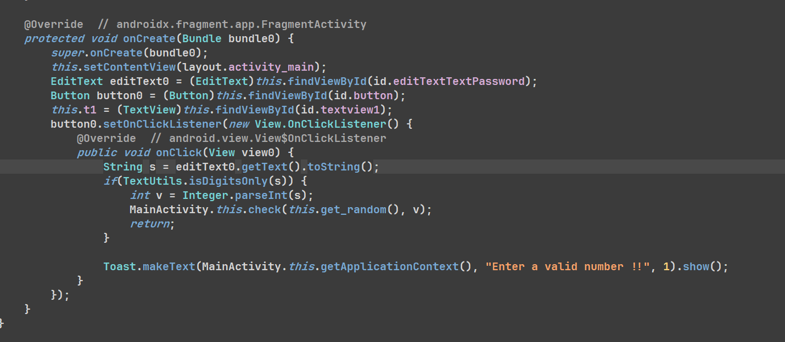

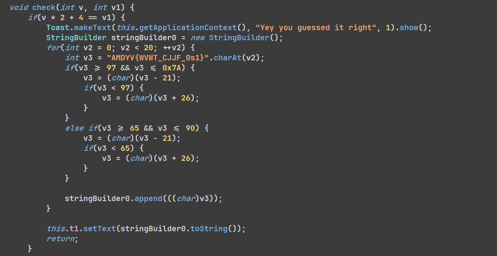

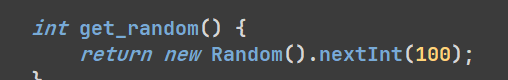

要输入一个数字`v`，要求是`get_random`生成的随机数的2倍+4；

所以我们要用得到生成的随机数，

选择修改`get_random`方法，让他在返回之前多一步打印出随机数，

因为原程序就已经调用了`get_random`方法，所以采用spawn方式hook；

```js
Java.perform(function() {
    var MA = Java.use("com.ad2001.frida0x1.MainActivity");
    MA.get_random.implementation = function() {
        var ret = this.get_random();
        console.log("Original return value: " + ret);
        return ret;
    };
});
```

```
Spawned `com.ad2001.frida0x1`. Resuming main thread!
[22041211AC::com.ad2001.frida0x1 ]-> Original return value: 16
```

安卓端输入16*2+4=36即显示出flag；

## 0x2

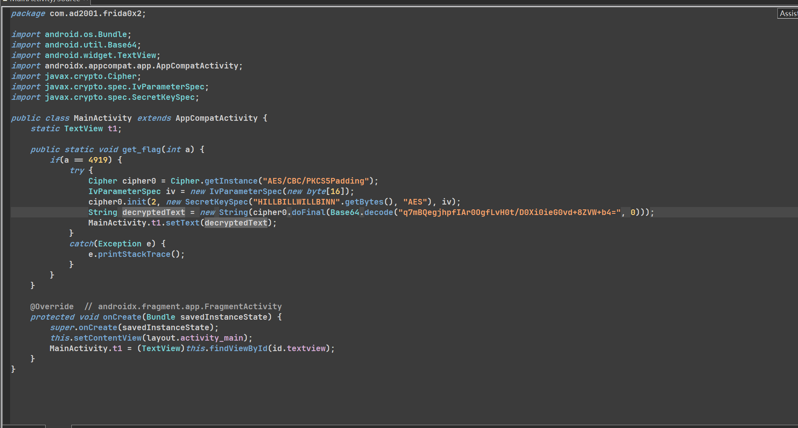

需要主动调用`get_flag`静态方法，传参`4919`通过验证;

但是调用成功了还要回显，既然有个`setText`方法调用了解密后的flag，可以hook此方法插入一行打印参数值，

注意返回值类型要正确，最好值也要和原来一样，对此可以`return 原方法调用`来处理；

注意`setText`方法有重载，要用`.overload`指定传入参数类型以指定正确方法；

```js
Java.perform(function() {
    var textView = Java.use("android.widget.TextView");
    textView.setText.overload("java.lang.CharSequence").implementation = function(text) {
        console.log(text);
        return Java.use("android.widget.TextView").setText.overload("java.lang.CharSequence").call(this, text);
    };

    var MA = Java.use("com.ad2001.frida0x2.MainActivity");
    MA.get_flag(4919);
});
```

```cmd
frida -U -f "com.ad2001.frida0x2" -l frida0x2.js
```

```
Spawned `com.ad2001.frida0x2`. Resuming main thread!
[22041211AC::com.ad2001.frida0x2 ]-> HOOK ME!
```

何意味，原来**是spawn方法的问题**：

hook的get_flag方法中有这样一行代码

```java
MainActivity.t1.setText(decryptedText);
```

这里的`t1`是`MainActivity`的静态成员，是`OnCreate`方法中创建的

```java
MainActivity.t1 = (TextView)this.findViewById(id.textview);
```

但是spawn方式启动还`OnCreate`没有执行，`t1`是`null`，主动调用`get_flag`就在执行`setText`之前抛了 `NPE`（空指针异常），被 `catch` 静默吞掉了。

> **Android 应用启动时序**：
>
> 用 `-f` spawn 一个 app 时，发生的事情是这样的：
>
> ```
> Frida spawn app
>       │
>       ├─ 创建进程
>       ├─ 加载 DEX / 类
>       ├─ 【你的 JS 脚本在这里执行】  ← 很早！
>       │
>       └─ Android Framework 开始走 Activity 生命周期
>               │
>               ├─ Application.onCreate()
>               ├─ MainActivity.onCreate()   ← t1 在这里才被赋值
>               │       t1 = findViewById(R.id.textview)
>               └─ onResume() → 界面显示
> ```

那么用`attach`方式执行即可：

先安卓端启动app，再附加

```
frida -U -n "Frida 0x2" -l frida0x2.js
```

```
Attaching...
FLAG{BABY_HOOKS_0x2}
```

*然后发现其实也不用hook`setText`了，安卓端能显示，还是安卓基础太差了T T*

## 0x3

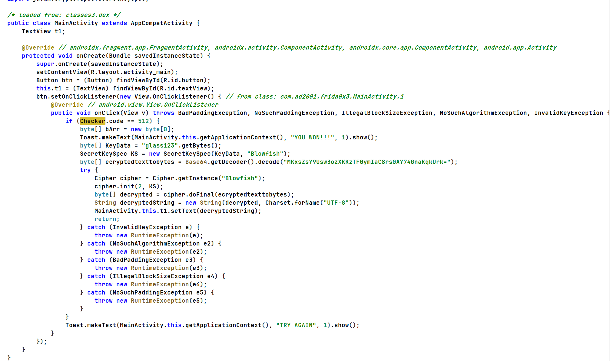

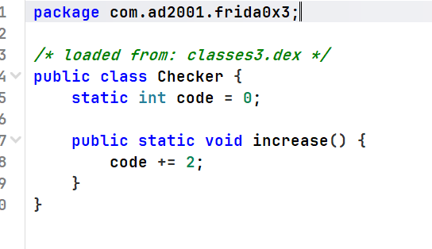

要把`Checker.code`改为`512`，

直接拿到`Checker`类修改成员变量即可；

attach附加；

```js
Java.perform(function() {
    var Checker = Java.use("com.ad2001.frida0x3.Checker")
    Checker.code.value = 512;
})
```

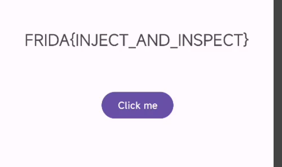

## 0x4

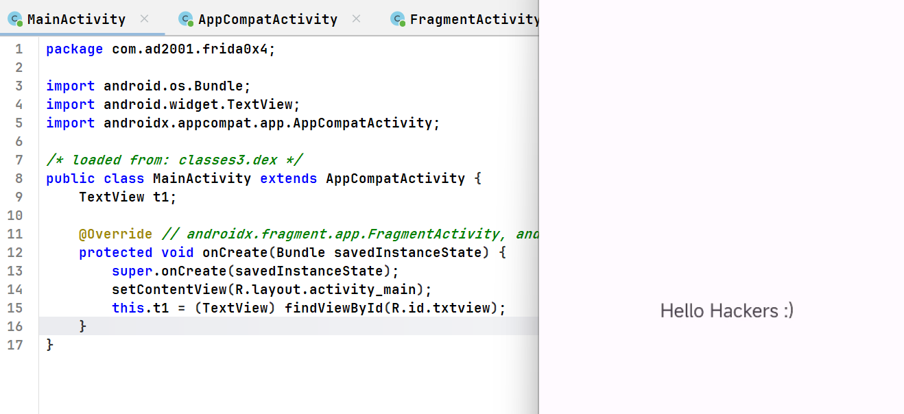

没东西，应该是要主动调用函数；

看看包里有什么，找到一个`check`方法：

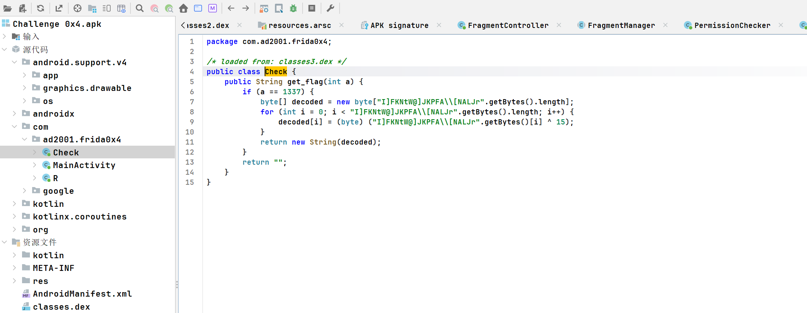

看来是要主动调用这个方法，

但是这是个实例方法，我们还要构造一个实例再调用；

frida中使用`$new`来构造实例；

```js
Java.perform(function() {
    var check = Java.use("com.ad2001.frida0x4.Check");
    var obj = check.$new();
    var flag = obj.get_flag(1337);
    console.log(flag);
});
```

```
frida -U -n "Frida 0x4" -l frida0x4.js
```

```
FRIDA{XORED_INSTANCE}
```

## 0x5

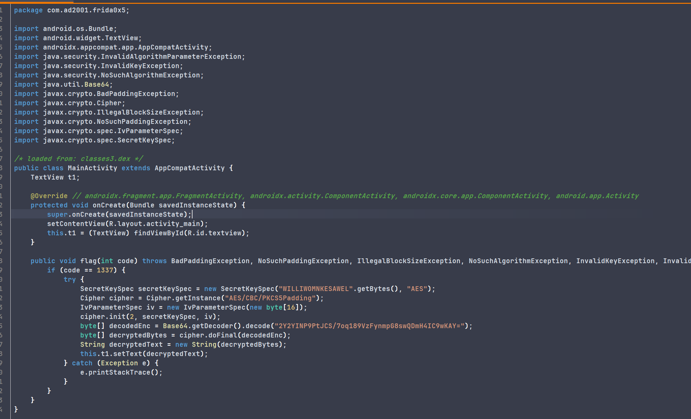

需要主动调用`flag`方法，但是`flag`方法没有返回值，可以像0x2那样hook掉`setText`方法使其有回显；

再创建实例主动调用`flag`；

```js
Java.perform(function() {
    var textView = Java.use("android.widget.TextView");
    textView.setText.overload("java.lang.CharSequence").implementation = function(text) {
        console.log(text);
        return Java.use("android.widget.TextView").setText.overload("java.lang.CharSequence").call(this, text);
    };

    var MA = Java.use("com.ad2001.frida0x5.MainActivity");
    var obj = MA.$new();
    obj.flag(1337);
});
```

```
frida -U -n "Frida 0x5" -l frida0x5.js
```

```
Error: java.lang.RuntimeException: Can't create handler inside thread Thread[Thread-46,5,main] that has not called Looper.prepare()
```

何意味，原来是有线程问题，`MainActivity`必须要在特定线程中构造；

> 这个报错是经典的 Android 线程问题。`Can't create handler inside thread that has not called Looper.prepare()` 意思是你在一个没有 Looper 的后台线程里尝试创建 Android UI 对象（`MainActivity.$new()` 内部需要 Handler）。
>
> **解决方法：用 `Java.scheduleOnMainThread` 把实例化操作调度到主线程执行。**
>
> ```javascript
> Java.perform(function() {
>     // Hook TextView.setText —— 这个放在外面没问题
>     var textView = Java.use("android.widget.TextView");
>     textView.setText.overload("java.lang.CharSequence").implementation = function(text) {
>         console.log("[TextView] text = " + text);
>         return this.setText.overload("java.lang.CharSequence").call(this, text);
>     };
> 
>     // 实例化 Activity 必须在主线程（有 Looper 的线程）里做
>     Java.scheduleOnMainThread(function() {
>         var MA = Java.use("com.ad2001.frida0x5.MainActivity");
>         var obj = MA.$new();
>         obj.flag(1337);
>     });
> });
> ```

但是这好像有点麻烦了，更好的方法是直接调用原程序中已经构造好的`MainActivity`，这样也正好能在安卓端显示，不用hook`setText`方法了；

```js
Java.perform(function() {
    Java.choose("com.ad2001.frida0x5.MainActivity",{
        onMatch: function(instance){
            console.log("find one");
            instance.flag(1337);
        },
        onComplete: function(){}
    });
});
```

```
frida -U -n "Frida 0x5" -l frida0x5.js
```

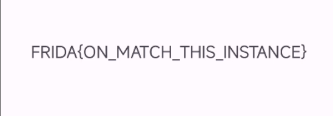

## 0x6

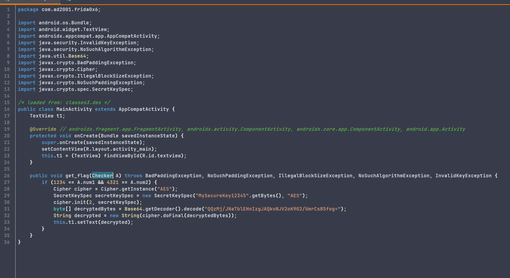

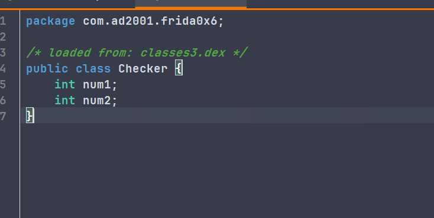

要创建一个`checker`实例，正确给成员变量赋值，再找`MainActivity`实例，主动调用`get_flag`检验；

```js
Java.perform(function() {
    var Checker = Java.use("com.ad2001.frida0x6.Checker");
    var obj = Checker.$new();
    obj.num1.value = 1234;
    obj.num2.value = 4321;

    Java.choose("com.ad2001.frida0x6.MainActivity",{
        onMatch: function(instance){
            console.log("Find MainActivity");
            instance.get_flag(obj);
        },
        onComplete: function(){}
    });

});

```

```
frida -U -n "Frida 0x6" -l frida0x6.js                
```


## 0x7

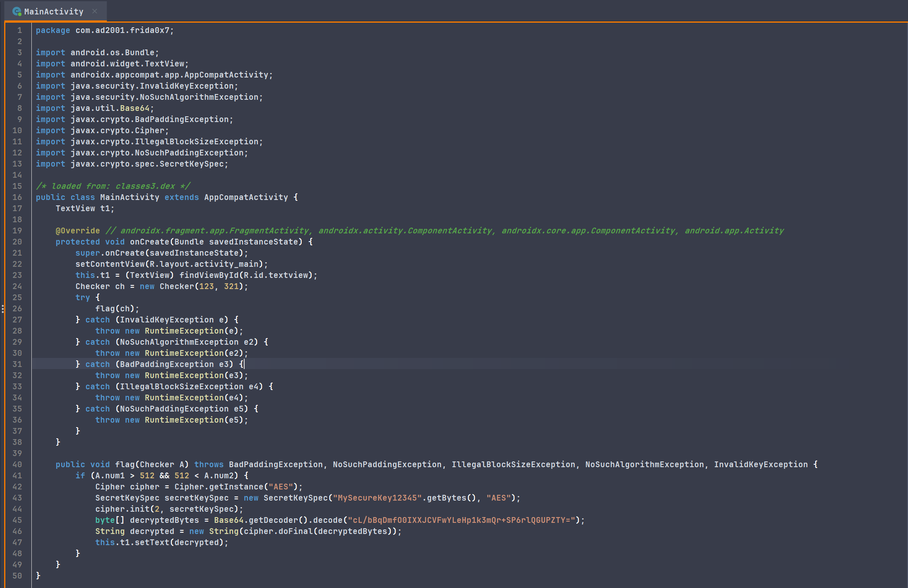

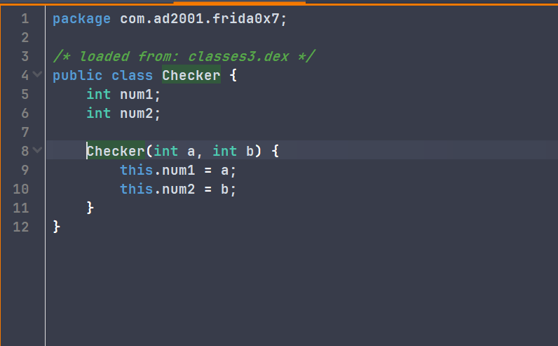

构造成员函数均大于512的`Checker`类，调用`MainActivity`的`flag`方法即可；

```js
Java.perform(function() {
    var Checker = Java.use("com.ad2001.frida0x7.Checker");
    var obj = Checker.$new(114514, 114514);

    Java.choose("com.ad2001.frida0x7.MainActivity",{
        onMatch: function(instance){
            console.log("Find MainActivity");
            instance.flag(obj);
        },
        onComplete: function(){}
    });

});
```

```
frida -U -n "Frida 0x7" -l frida0x7.js
```


## 0x8

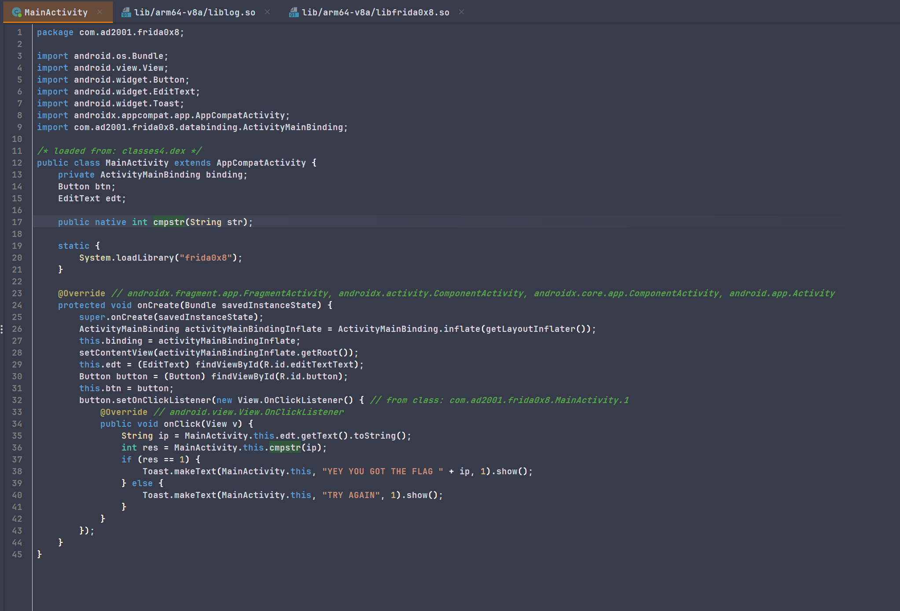

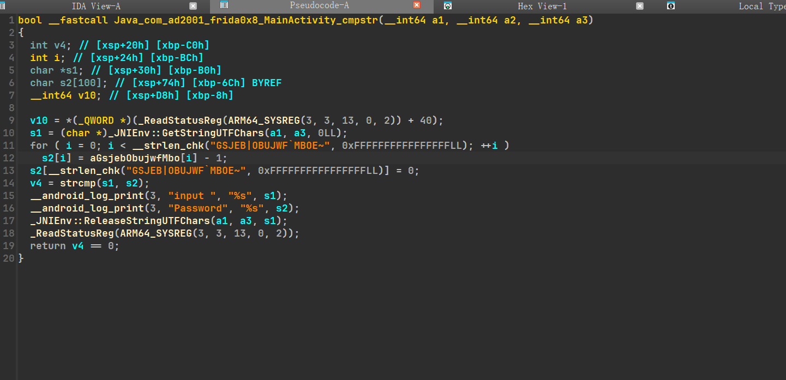

调用了`native`层函数`cmpstr`，输入的字符串即flag要与`native`层中解密后的字符串做比较；

我们尝试hook`cmpstr`中的`strcmp`函数，让他返回s2，即flag；

```js
Java.perform(function() {
    const strcmp = Module.getExportByName("frida0x8.so", "strcmp");
    Interceptor.attach(strcmp, {
        onEnter(args) {
            var str1 = Memory.readCString(args[0]);
            var str2 = Memory.readCString(args[1]);
            console.log("strcmp called with: " + str1 + " and " + str2);
        },

        onLeave(retval) {
            console.log("strcmp returned: " + retval);
        }

    });
});
```

```
frida -U -n "Frida 0x8" -l frida0x8.js
```

```
unable to find export 'strcmp'
```

找不到，原来strcmp是libc.so中的函数；

> `libc.so` 不需要 Java 层显式导入，它是 **Android 每个进程都会自动加载的基础库**，和你的 app 代码无关。
>
> ```
> 进程内存空间
> ├── frida0x8.so   ← System.loadLibrary 加载
> ├── libc.so       ← 系统自动加载，永远在那里
> ├── libdvm.so
> └── ...
> ```

把源代码中的`"frida0x8.so"`改为`"libc.so"`,重新启动；

找到了很多函数实例，我们要过滤一下；

尝试只有特定输入的情况下才会回显；

```js
Java.perform(function() {
    const strcmp = Module.getExportByName("libc.so", "strcmp");
    Interceptor.attach(strcmp, {
        onEnter(args) {
            var str1 = Memory.readCString(args[0]);
            var str2 = Memory.readCString(args[1]);
            if (str1 === "114514") {   //安卓端输入114514来过滤（strcmp的第一个参数就是这个字符串）
                console.log("Flag is: " + str2);
                this.isTarget = true;
            }
        },

        onLeave(retval) {
            if (this.isTarget) {
            console.log("strcmp returned: " + retval);
        }
        }
    });
});
```

```
frida -U -n "Frida 0x8" -l frida0x8.js
```

安卓端输入114514，submit提交；

```
Flag is: FRIDA{NATIVE_LAND}
strcmp returned: 0xffffffffffffffd6
```

## 0x9

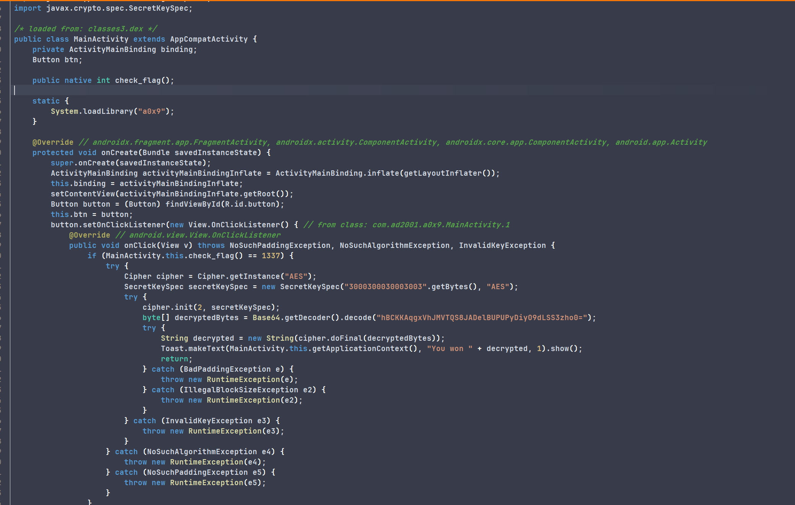

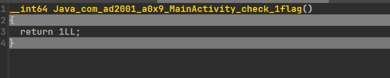

hook`native`层的`check_flag`返回值为1337即可；

```js
Java.perform(function() {
    const checkFlag = Module.getExportByName("liba0x9.so", "Java_com_ad2001_a0x9_MainActivity_check_1flag");
    Interceptor.attach(checkFlag, {
        onEnter(args) {},
        onLeave(retval) {
            retval.replace(1337);
            console.log("check_flag returned: " + retval);
        }
    });
});
```

```
frida -U -n "Frida 0x9" -l frida0x9.js
```

```
check_flag returned: 0x539
```

安卓端弹出flag：FRIDA{NATIVE_LAND_0x2}


## 0xA

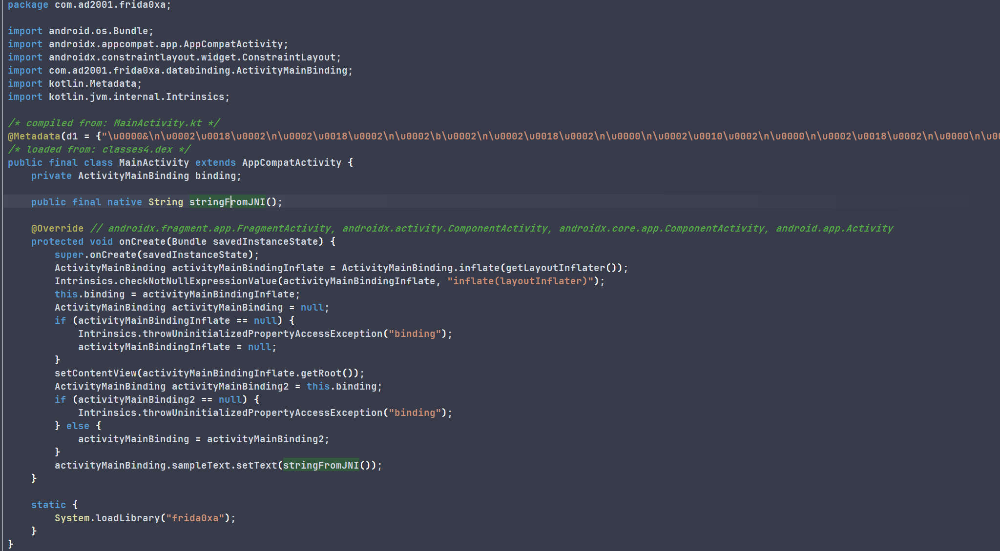

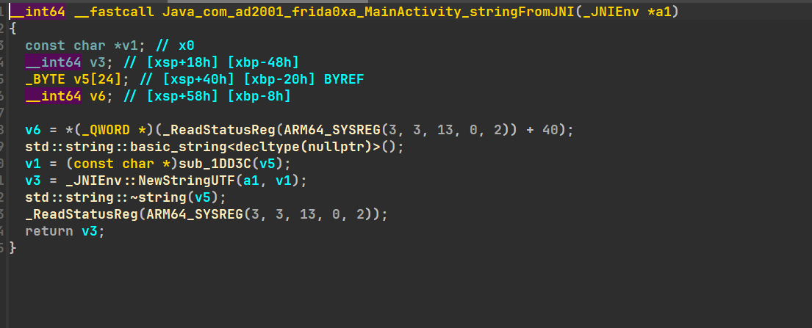

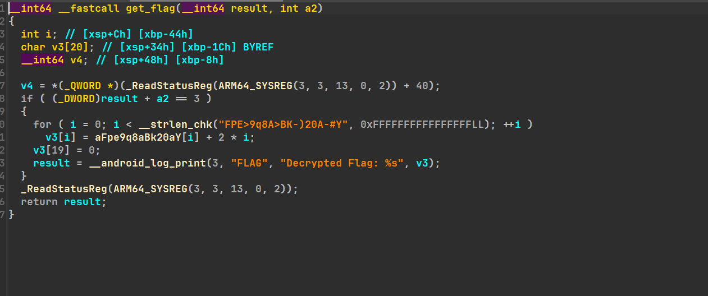

主逻辑好像没东西，需要主动调用`get_flag`函数得到`result`值；

```js
Java.perform(function() {
    const get_flag = new NativeFunction(
        Module.getExportByName("libfrida0xa.so", "get_flag"),
        'int64', 
        ['int64', 'int']
    );

    get_flag(1, 2);
});
```

```
frida -U -n "Frida 0xA" -l frida0xA.js
```

```
Error: libfrida0xa.so: unable to find export 'get_flag'
```

找不到，原来`get_flag`函数名会**被C++编译器优化**为`_Z8get_flagii`，再被ida优化回来，所以找不到

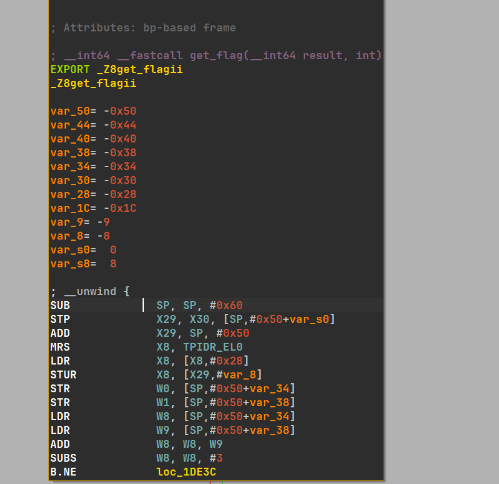

同时，`__android_log_print` 会输出到 Android Logcat，不是控制台也不是文件。

也可以hook一下；

> ```
> __android_log_print(3, "FLAG", "Decrypted Flag: %s", v3);
> //                  ↑    ↑              ↑               ↑
> //               优先级  TAG           格式串          flag内容
> ```

```js
Java.perform(function() {
    Interceptor.attach(Module.getExportByName(null, "__android_log_print"), {
        onEnter(args) {
        const tag = args[1].readCString();
        if (tag === "FLAG") {
            console.log("[FLAG]", args[3].readCString());
        }
    }
    });

    const get_flag = new NativeFunction(
        Module.getExportByName("libfrida0xa.so", "_Z8get_flagii"),
        'int64', 
        ['int64', 'int']
    );

    get_flag(1, 2);

});
```

```
FRIDA{DONT_CALL_ME}
```

## 0xB

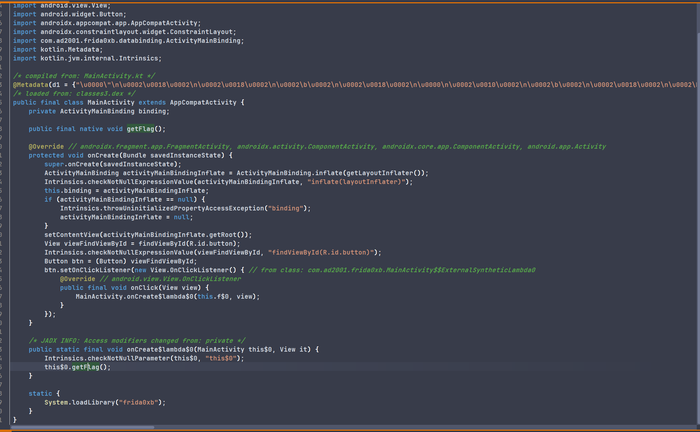

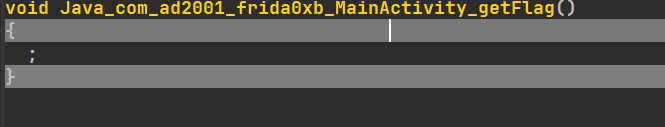

native层是空的，看看汇编

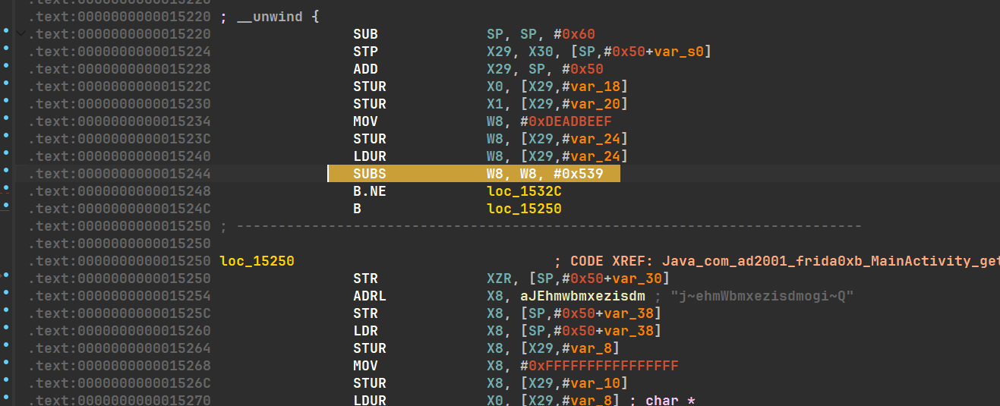

`W8`和`0x539`做了比较，`!=`则`return`，

我们手动把第一个跳转nop掉；

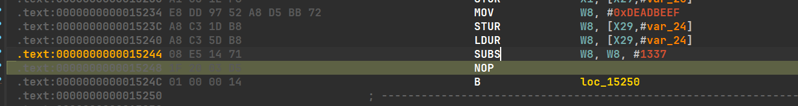

检验就出来了；

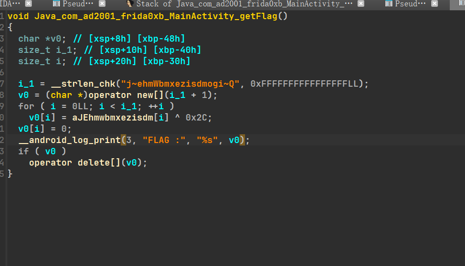

应用后直接主动调用就好了，但是我们在学frida，可以尝试用frida动态nop；

```js
Java.perform(function() {
    var getFlag = Module.getExportByName("libfrida0xb.so", "Java_com_ad2001_frida0xb_MainActivity_getFlag");
    var bneaddr = getFlag.add(0x28);

        Interceptor.attach(Module.getExportByName(null, "__android_log_print"), {
        onEnter(args) {
        const tag = args[1].readCString();
        if (tag === "FLAG :") {
            console.log("[FLAG]", args[3].readCString());
        }
    }
    });

    Memory.patchCode(bneaddr, 4, function(code) {
        var cw = new Arm64Writer(code, { pc: bneaddr });
        cw.putNop();
        cw.flush();
    });


});
```

```
frida -U -n "Frida 0xB" -l frida0xB.js
// 然后安卓端Click一下
```

```
[FLAG] FRIDA{NATIVE_HACKER}
```

