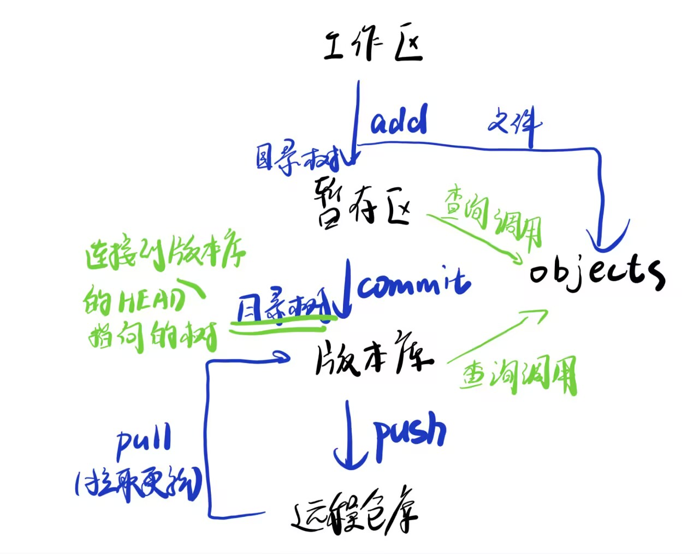

## 简介

git是一种文件传输的工具，最大单位为仓库，其中使用树结构便于多人链接协作；

主要仓库存在远程网站（eg：github，gitee），工作原理是个人**将远程仓库克隆到本地**进行修改，再**提交到远程**；


## 初始化

###  创建仓库

> Git 使用 **git init** 命令来初始化一个 Git 仓库，Git 的很多命令都需要在 Git 的仓库中运行，所以 **git init** 是使用 Git 的第一个命令。
>
> 在执行完成 **git init** 命令后，Git 仓库会生成一个 .git 目录，该目录包含了资源的所有元数据，其他的项目目录保持不变。

**但是我觉得在GitHub上直接创建再clone到本地更方便：**

> 如果我们需要克隆到指定的目录，可以使用以下命令格式：
>
> ```
> git clone <repo> <directory>
> ```
>
> **参数说明：**
>
> - **repo:**Git 仓库。
> - **directory:**本地目录。
>
> 比如，要克隆 Ruby 语言的 Git 代码仓库 Grit，可以用下面的命令：
>
> ```
> $ git clone git://github.com/schacon/grit.git
> ```
>
> 执行该命令后，会在当前目录下创建一个名为grit的目录，其中包含一个 .git 的目录，用于保存下载下来的所有版本记录。
>
> 如果要自己定义要新建的项目目录名称，可以在上面的命令末尾指定新的名字：
>
> ```
> $ git clone git://github.com/schacon/grit.git mygrit
> ```


## 工作

> 我们先来理解下 Git 工作区、暂存区和版本库概念：
>
> - **工作区：**就是你在电脑里能看到的目录。
> - **暂存区：**英文叫 stage 或 index。一般存放在 **.git** 目录下的 index 文件（.git/index）中，所以我们把暂存区有时也叫作索引（index）。
> - **版本库：**工作区有一个隐藏目录 **.git**，这个不算工作区，而是 Git 的版本库。

**基本能用到的就这个图：**



> - 当对工作区修改（或新增）的文件执行 **git add** 命令时，暂存区的目录树被更新，**即将未跟踪的文件转为已跟踪**；同时工作区修改（或新增）的文件内容被写入到对象库中的一个新的对象中，而该对象的ID被记录在暂存区的文件索引中。
> - 当执行提交操作（**git commit**）时，暂存区的目录树写到版本库（对象库）中，master 分支会做相应的更新。即 master 指向的目录树就是提交时暂存区的目录树。
> - 当执行 **git reset HEAD** 命令时（HEAD指向的就是最新的一次commit记录），暂存区的目录树会被重写，被 master 分支指向的目录树所替换，但是工作区不受影响。**有关HEAD参看下文：分支**。
>
> - 当执行 **git rm --cached <file>** 命令时，会直接从暂存区删除文件，工作区则不做出改变。
> - 当执行 **git checkout .** 或者 **git checkout -- <file>** 命令时，会用暂存区全部或指定的文件替换工作区的文件。这个操作很危险，会清除工作区中未添加到暂存区中的改动。
> - 当执行 **git checkout HEAD .** 或者 **git checkout HEAD <file>** 命令时，会用 HEAD 指向的 master 分支中的全部或者部分文件替换暂存区和以及工作区中的文件。这个命令也是极具危险性的，因为不但会清除工作区中未提交的改动，也会清除暂存区中未提交的改动。

**常用命令**：

```
git add filename       # 将单个文件添加到暂存区
git add .              # 将工作区中的所有修改添加到暂存区
git status             # 查看哪些文件在暂存区中

git commit -m "Commit message"   # 将暂存区的更改提交到本地版本库
git log                          # 查看提交历史
git diff                         # 查看工作区和暂存区之间的差异
git diff --cached                # 查看暂存区和最后一次提交之间的差异

git push origin branch-name      # 使用 git push 命令将本地版本库的提交推送到远程仓库。
```


### 分支

*类似指针**，**指向当前工作目录，所有工作会链接到当前目录上进行*。

### 创建分支

> 创建新分支并切换到该分支：
>
> ```
> git checkout -b <branchname>
> ```
>
> 例如：
>
> ```
> git checkout -b feature-xyz
> ```
>
> 切换分支命令:
>
> ```
> git switch (branchname)
> ```
>
> 例如：
>
> ```
> git switch main
> ```
>
> 当你切换分支的时候，Git 会用该分支的最后提交的快照替换你的工作目录的内容， 所以多个分支不需要多个目录。

> ### 查看分支
>
> 查看所有分支：
>
> ```
> git branch
> ```
>
> 查看远程分支：
>
> ```
> git branch -r
> ```
>
> 查看所有本地和远程分支：
>
> ```
> git branch -a
> ```
>
> ### 合并分支
>
> 将其他分支合并到当前分支：
>
> ```
> git merge <branchname>
> ```
>
> 例如，切换到 main 分支并合并 feature-xyz 分支：

> ```
> git switch main
> git merge feature-xyz
> ```

用多少学多少~