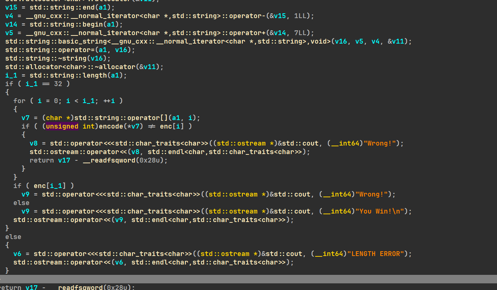
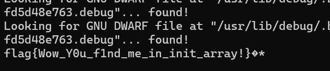

---

title: 逆向作业#2
date: 2025-11-06
tags: [wp, re]
category: CTF
published: 2025-11-06
description: 校队逆向作业#2：反调试
---

# **flower**

## 0x00   动调

elf文件,idawsl动调无法正常运行,提示Don't trace me:(,猜测有反调试.


## 0x01   去花

ida发现标红，无法f5,track到有很明显的花,4048e5处jz和jnz必有一个执行,所以call永不执行


直接nop掉call,然后选中标红段按c强转为code,找到函数头按u再按p重定义,即可正常f5


## 0x02  去反调试

对主函数按x向上追溯,发现这里第24行的cin没有执行,下第10行的断点后调试,发现在check中会跳出


进入发现ptrace反调试函数,if(调试)就进入下面的块


直接让他不进入即可,将jz改为jmp


然后就可以正常调试了,solve加密函数也能正常显示



## 0x03 解密

encode函数就是将输入自增,异或和与enc中比较

解密代码:

```c++
#include<iostream>
#include<string>
#include<algorithm>
#include<vector>
using namespace std;

unsigned int encflag[] = {0x4F,0x1A,0x59,0x1F,0x5B,0x1D,0x5D,0x6F,0x7B,0x47,0x7E,0x44,0x6A,0x7,0x59,0x67,0xE,0x52,0x8,0x63,0x5C,0x1A,0x52,0x1F,0x20,0x7B,0x21,0x77,0x70,0x25,0x74,0x2B,0x44};

int main()
{
    unsigned int key = 0x23;
    

​    for(int i = 0; i < 32; i++)
​    {
​        encflag[i] ^= key;
​        key++;
​        cout<<char((encflag[i]<<24)&0xFF);
​    }
​    return 0;

}
```

解完发现不对:111l>|9|5tEPkSjE7hU=f=Uk"k%

构造跳过验证moectf{}和内部32位长度,动调过去发现key最后被修改为0x29(函数内自增了一次)


```cpp
#include<iostream>

#include<string>

#include<algorithm>

#include<vector>

using namespace std;

unsigned int encflag[] = {0x4F,0x1A,0x59,0x1F,0x5B,0x1D,0x5D,0x6F,0x7B,0x47,0x7E,0x44,0x6A,0x7,0x59,0x67,0xE,0x52,0x8,0x63,0x5C,0x1A,0x52,0x1F,0x20,0x7B,0x21,0x77,0x70,0x25,0x74,0x2B};

int main()

{

  unsigned int key = 0x29;


  for(int i = 0; i < 32; i++)

  {

​    encflag[i] ^= key;

​    key++;

​    printf("%c",char((encflag[i])&0xFF));

  }

  return 0;

}
```

解得f0r3v3r_JuMp_1n_7h3_a$m_a9b35c3c,套上验证moectf{}即可;

# **test**

## 0x00 调试

发现flag似乎一闪而过

## 0x01 下断点

主函数中什么也没有,尝试下断点动态调试,最终找到进入了这样的函数

再断在clear之前,显示出flag



flag{Wow_Y0u_f1nd_me_in_init_array!}
