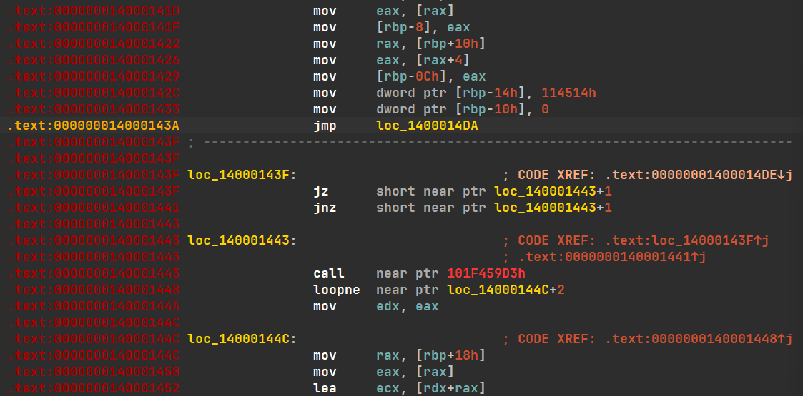
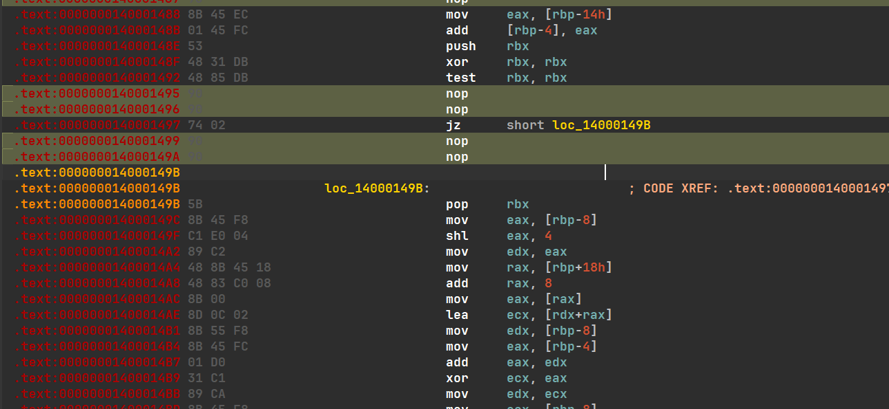
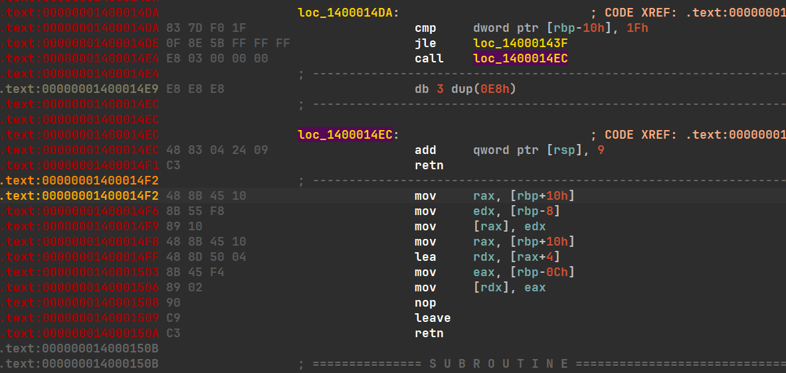
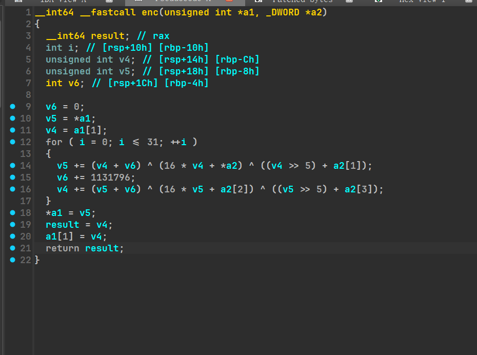
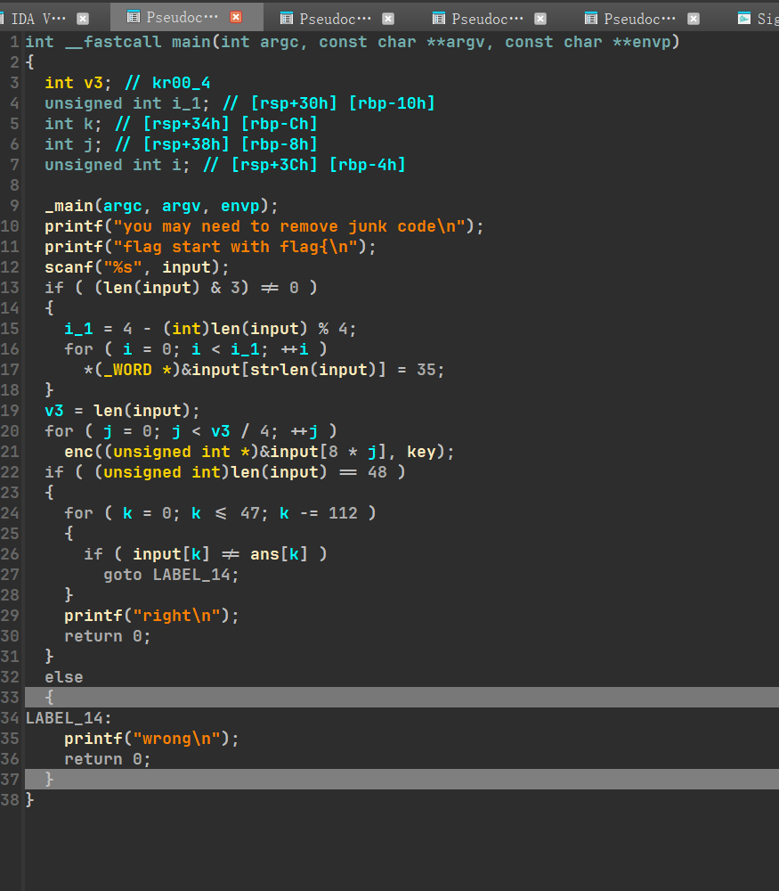
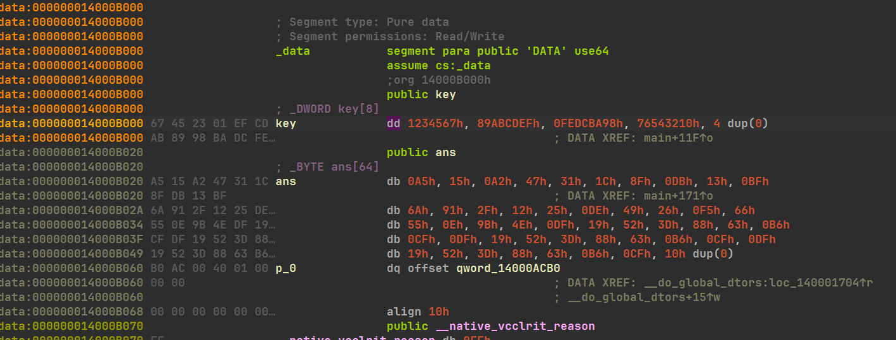

# qctf-flowers

ida打开找标红，很明显的强制错误跳转，直接nop；



call里面对栈顶rsp强制+9再return，等价直接到147F+9=1488的地址，所以call到1487直接nop；


经典xor自己再test，jnz一定不执行，jz一定执行，nop掉jnz再改地址；




和第二个花一样；



不红了，成功！


f5出来明显tea；



何意味？


找main函数引用发现前面还红了一块，继续改吧


也就那几种一样的花，不写了；

改完f5，





感觉就一个魔改tea，其他都是检验之类；


*j<v3/4看上去加密了12次，但因为传的是8乘j，后面越界了，实际上只加密了六次。*

```cpp
#include<iostream>
#include<string>
#include<algorithm>
#include<vector>
#include<cstdint>
using namespace std;

uint32_t cipher[] = {0x47A215A5,0xDB8F1C31,0x916ABF13,0xDE25122F,0x66F52649,0x4E9B0E55,0x3D5219DF,0xCFB66388,0x3D5219DF,0xCFB66388,0x3D5219DF,0xCFB66388};
uint32_t key[] = {0x1234567,0x89ABCDEF,0xFEDCBA98,0x76543210};

void tea_dec(uint32_t* v, uint32_t* k) {
    uint32_t v0 = v[0], v1 = v[1];  // v0、v1分别是密文的左、右半部分
    uint32_t delta = 0x114514 ;     //作为sum每次累加的变化值，题目中往往会修改此值
    uint32_t sum = 32 * delta;      //此处需要分析32轮加密结束后sum的值与delta的变化, 以此处加密为例子，32轮每次sum+=delta，因此最后sum=32*delta
    for (int i = 0; i < 32; i++) {  // tea加密进行32轮
        //根据加密时的顺序颠倒下面3行的顺序，将加法改为减法（异或部分都是整体，不用管），就是逆向解密过程
        v1 -= ((v0 << 4) + k[2]) ^ (v0 + sum) ^ ((v0 >> 5) + k[3]);
        sum -= delta;
        v0 -= ((v1 << 4) + k[0]) ^ (v1 + sum) ^ ((v1 >> 5) + k[1]);
    }
    // 因此解密后的内容要还给v数组
    v[0] = v0;
    v[1] = v1;
}

int main()
{
    for (int i = 0; i < 6; i++)
        tea_dec (cipher+2*i, key) ;
    for (int i = 0 ;i <= 47; i++)
        cout << *((char*)cipher+i) ;
}
```

**flag{aCupOf_FlowerTea}**##

