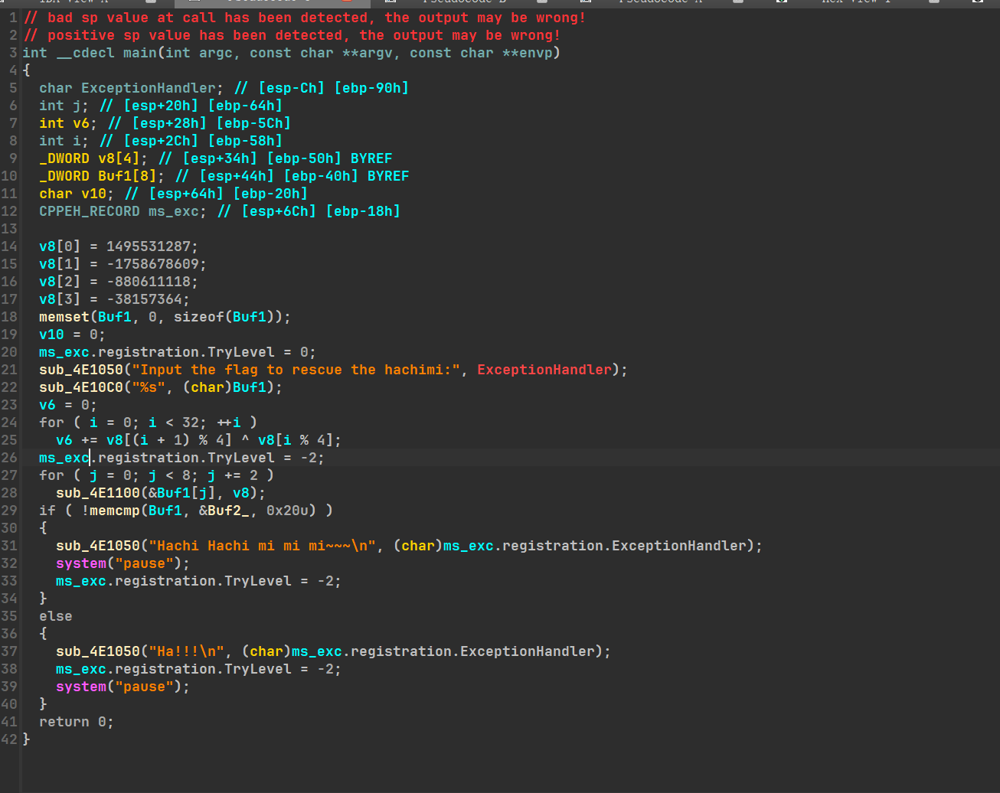
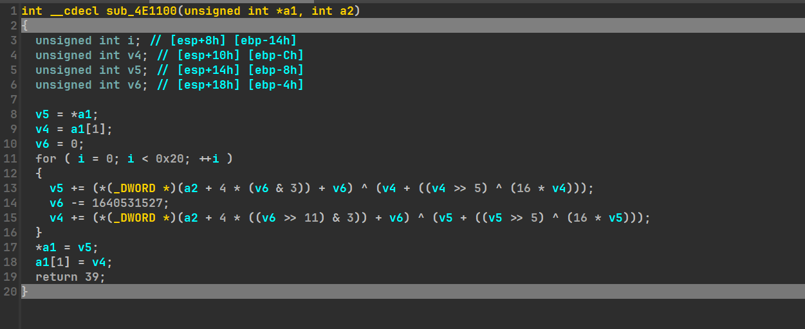

---

title: qctf-hachimi
tags: [flower, try catch, wp, re, qctf]
category: CTF
description: 浅看trycatch混淆
published: 2025-11-09
---

# hachimi

## 0x01 去trycatch反调试

ida打开发现很明显代码不完整，看到trylevel这个函数，搜索知是用于修改trycatch异常处理等级的函数，程序很可能是通过trycatch进行混淆；


看汇编，真正程序应该在except块里，


正常逻辑如下进入4e1357


其中注意到dir ecx，ecx是0，这里抛出除零异常进入expect块；


流程如下：ida默认了jmp从而忽略了expect的反编译；

// ida不能识别异常，函数只有通过jge再到jmp一条路可走，认为上面_except这一块永远不会执行；


既然jmp_145e不会执行，那就把jmp_145e nop掉,后面还有个except过滤器也nop了；

代码就正常了；

// 这样让expect一定会顺序执行，因为他本来就一定会执行，所以正好是对的



## 0x02 去花



加密代码不完整，继续看汇编；


下面的call_+5和jz很明显是花，直接force jump,得到完整加密；


先tea后异或，解密如下：

```cpp
#include<iostream>
#include<string>
#include<algorithm>
#include<vector>
#include<stdint.h>
using namespace std;

uint32_t v8[4]={};
uint8_t v9[32]={0x4D,0x7A,0x3E,0x7A,0x84,0xFF,0x51,0xB1,0x31,0x97,0xFB,0xDC,0x2B,0xA4,0xCD,0xFB,0x85,0xCD,0xA,0x2B,0xBD,0x91,0xCF,0x69,0xBA,0x2B,0x70,0xD5,0x43,0xB8,0x3E,0x1f};

 unsigned long byteswap_manual(unsigned long value)  //转大小端的函数
 {
 return ((value>>24) & 0xFF) |
((value >> 8) & 0xFF00) | 
((value << 8) & 0xFF0000) |
((value << 24) & 0xff0000);
 }


void tea_dec(uint32_t* a1, uint32_t* a2) {
  unsigned __int32 result; // eax
  unsigned int i; // [esp+8h] [ebp-14h]
  int j; // [esp+Ch] [ebp-10h]
  unsigned int v5 = 0; // [esp+10h] [ebp-Ch]
  unsigned int v6 = 0; // [esp+14h] [ebp-8h]
    for ( j = 0; j < 8; ++j )
  {
    *((uint8_t *)a1 + j) ^= *(uint8_t *)(a2 + 15 - j);
  }
  *a1 = byteswap_manual(*a1);
  *(a1+1) = byteswap_manual(*(a1+1));
    uint32_t v0 = a1[0], v1 = a2[1];  // v0、v1分别是密文的左、右半部分
    uint32_t delta = 1640531527;     //作为sum每次累加的变化值，题目中往往会修改此值
    uint32_t v7 = 32 * (-delta);      //此处需要分析32轮加密结束后sum的值与delta的变化, 以此处加密为例子，32轮每次sum+=delta，因此最后sum=32*delta
    for (int i = 0; i < 32; i++) {  // tea加密进行32轮
        //根据加密时的顺序颠倒下面3行的顺序，将加法改为减法（异或部分都是整体，不用管），就是逆向解密过程
    v5 -= (*(uint32_t *)(a2 + 4 * ((v7 >> 11) & 3)) + v7) ^ (v6 + ((v6 >> 5) ^ (16 * v6)));
    v7 += 1640531527;
    v6 -= (*(uint32_t *)(a2 + 4 * (v7 & 3)) + v7) ^ (v5 + ((v5 >> 5) ^ (16 * v5)));
    }
    // 因此解密后的内容要还给v数组
    *(uint32_t*)(v9+j) = v0;
    *(uint32_t*)(v9+j) = v1;
  return ;
}

int main()
{
  v8[0] = 1495531287;
  v8[1] = -1758678609;
  v8[2] = -880611118;
  v8[3] = -38157364;
  for(int j = 0;j < 8;j+=2)
    tea_dec((uint32_t*)(v9+j),v8);
  for(char a:v9)
    cout<<a;
}
```

 flag{ha_ha_hachimi_na_bei_lu_do};