# 安卓逆向入门


## 01 配置java层动调环境

*先下好：mumu模拟器 + jadx/JEB + adb；*

### mumu模拟器配置

下载后进入虚拟机，右上三个点打开设备设置，

打开其他--root权限，网络--桥接模式，磁盘--磁盘共享--可写系统盘；

虚拟机自带系统开发者模式打开usb调试；

重启虚拟机；

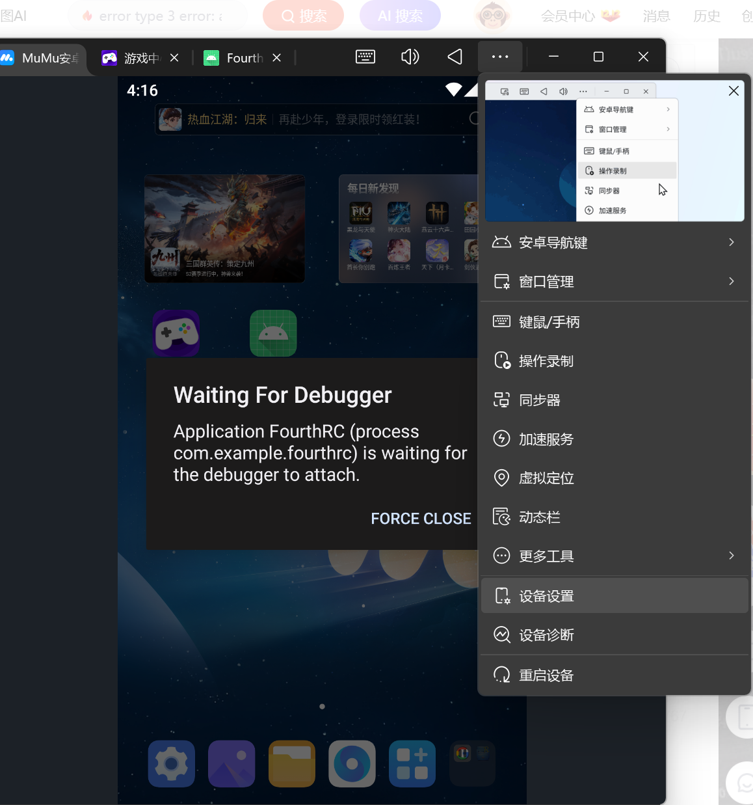

#### 检查ADB设备连接

**每次重新使用时，先把adb开了再开虚拟机！不然找不到设备；**

重启完成后，再次查看adb是否能找到设备：

```bash
adb devices
```

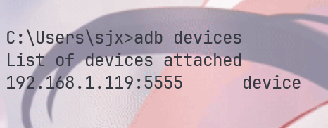

*可能会多出来emmulater开头的模拟器设备，有就直接杀掉*

```bash
adb -s emulator-5554 emu kill
```

or直接重启

```bash
adb kill-server
```


## 02 动调java层（JEB/JADX)

### 查看端口

```bash
adb devices
> List of devices attached
  192.168.1.119:5555      device
```

### 连接设备

```bash
adb connect 192.168.1.119:5555 #上面显示的端口
> already connected to 192.168.1.119:5555
```

### 安装软件

把将要动调的软件在mumu中安装；

直接拖进去就行，自动安装；

### debug模式启动app 

```bash
adb shell am start -D -n <package_name>/<activity_name> 
> Starting: Intent { cmp=xxxxxxxxxxxx }
```

> 怎么找<package_name>/<activity_name> ：
>
> 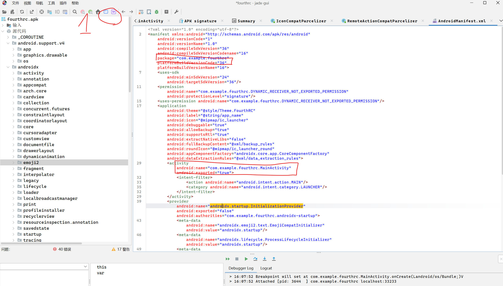
>
> 1. 按上面的紫色M前往mainfest;
> 2. 上面框就是package_name,下面框就是activity_name;（一般删掉activity_name后的.mainactivity就行；

### 越过禁止debug

1. debug需要确保 `android:debuggable="true"` *（java层）*&&`android:extractNativeLibs="true"`   *（so层）*

   `=“false”`或`根本没有这个字段`都不行；

   ##### 修改：

   1. **全局修改（一步到位）：**

      修改 ROM 参数 `ro.debuggable` 为 1

      可以通过这个查看当前的值：

      ```bash
      adb shell getprop ro.debuggable
      > 0
      ```

   2. **改当前apk文件**

      用**MT管理器**即可（传到手机端）

2. 如果是安卓高版本 如果是安卓高版本需要禁用jit优化才能动调 验证是否开启了jit*（我好像不需要？）*


### A.启动JADX动调

1. 按上方导航栏的绿色虫子；
2. 双击要调试的进程；

模拟器出现右边界面就成功了；

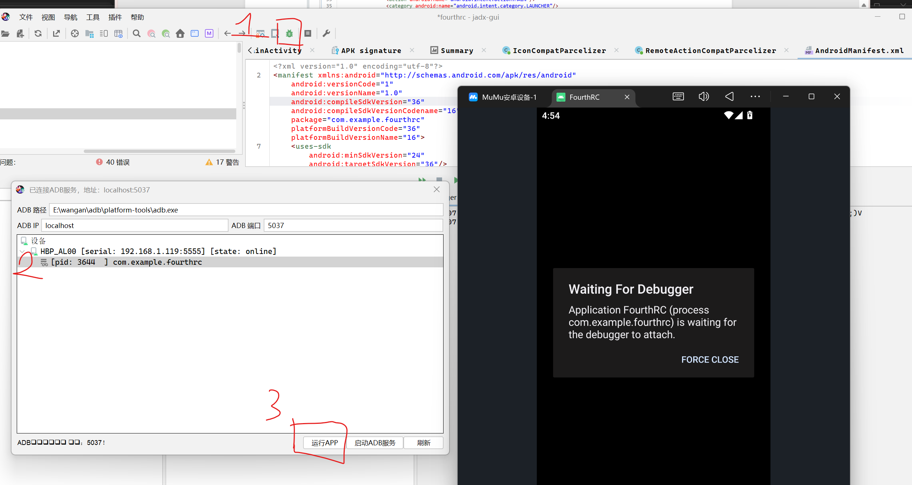

先按下面的绿色箭头，就能开始正常动调了；

有时候F8不下去了可能遇到输出输入的暂停，按下面的绿色箭头即可继续；

按绿色双箭头就能重开；

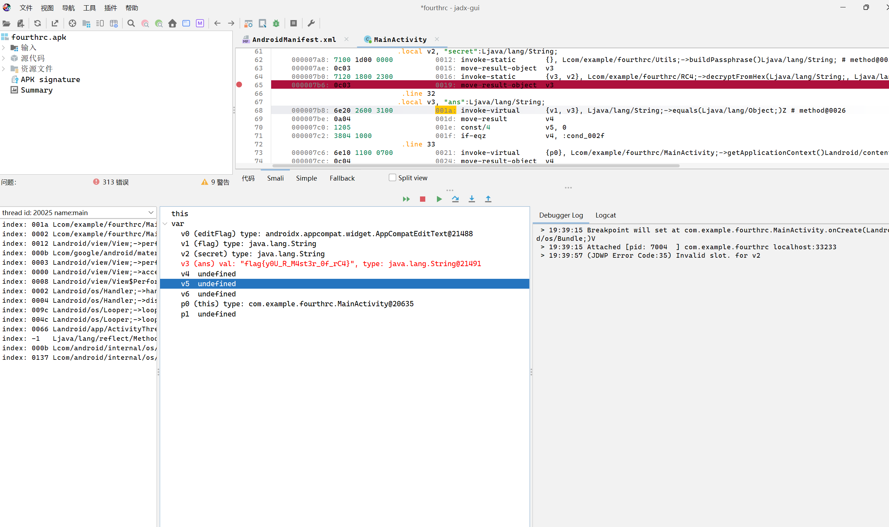

### B.启动JEB动调

点上方绿色start；

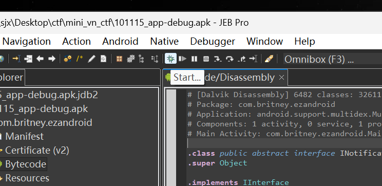

下面两个选项勾上，双击进程（蓝色的）；

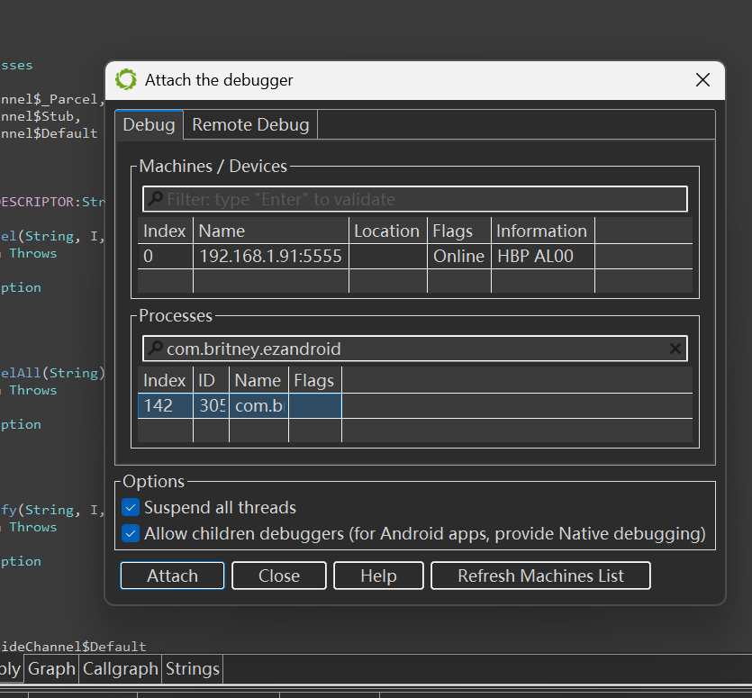

就成功了，（ctrl+b下smali层下断点）；

## 03 so层动调（ida）

### 1 准备adb环境

adb连接安卓设备，然后将ida目录下 \dbgsrv\android_x64_server 放进mumu；

**虚拟机用android_x64_server，真机用android_server;**

```bash
adb push "E:\wangan\IDA Professional 9.0\dbgsrv\android_x64_server" /data/local/tmp
> E:\wangan\IDA Professional 9.0\dbgsrv\android_x64_server: ...ile pushed, 0 skipped. 11.3 MB/s (1284216 bytes in 0.108s)
```

shell进入命令行

```bash
adb shell
> Welcome! If you need help getting started, check out our developer FAQ page at:

    https://g.126.fm/04jewvw

We're committed to making our emulator as useful as possible for developers,
so if you have any specific requirements or features that you'd like to see
in the emulator, please let us know. We're always open to new ideas and suggestions.
You can find our contact information on the FAQ page as well.

Thanks for using our emulator, happy coding!
```

切换su模式

```bash
su
> :/ #
```

> 如果有root但报错，需要在你的root管理器给com.android.shell这个app Root权限

给予可执行权限

```bash
cd /data/local/tmp
chmod 755 android_x64_server 
```

运行

```bash
./android_x64_server 
> IDA Android 64-bit remote debug server(ST) v9.0.30. Hex-Rays (c) 2004-2024
  2025-12-04 20:47:47 Listening on 0.0.0.0:23946...
```

然后打开另一个终端,进行adb的端口转发

```bash
adb forward tcp:23946 tcp:23946
> 23946
```

> ./android_server运行的默认端口是23946

### 2 开始附加进程

#### 普通启动

用ida打开要调试的so（**注意系统架构**，mumu是**x86_64**）;

再虚拟机打开app；

记得在**主要逻辑上打好断点**；

ida：debugger->attach to progress；

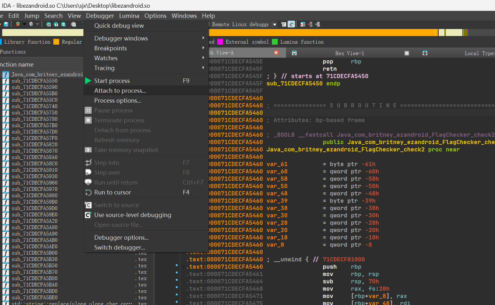

选择打开app的进程名进行附加；

进程名一般带有app名，找不到用下面的search搜索字符串；

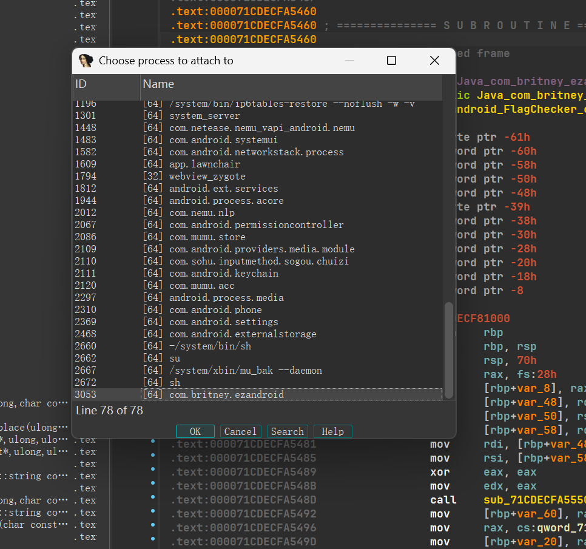

有警告选择same；

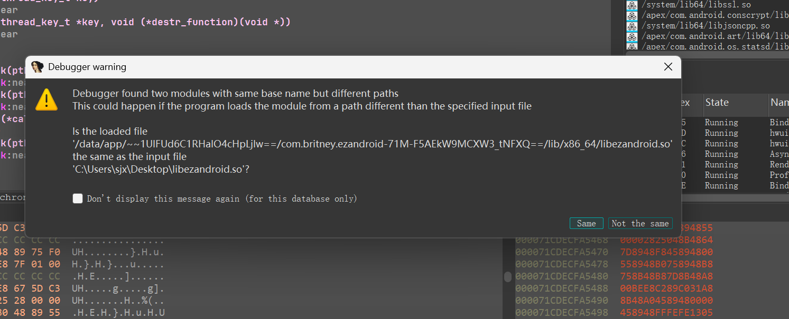

就能开始调了；

**注意！在这之前要保证函数能进入此java层，比如输入要能通过运行到调用此so之前的java层检测！**

#### Debug模式启动

在JEB/JADX中设置动调后，在弹出debugger窗口后，启动ida的附加，在ida中动调。

### 2  修哇修哇

**！！！ida现在不需要手动导入Jni.h，直接在变量上按【y】，改为【JNIEnv*】后回车即可。**

ida结构加载JNI头文件方便分析（jni.h）；*反编译的结构体会更清晰*

> 一般来说，JNI方法的第一个参数都是JNIEnv_类型；

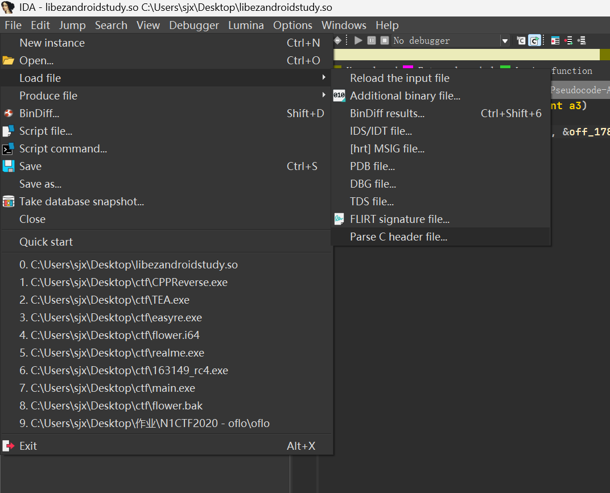

再对着JNI方法的第一个参数（JNIEnv_类型）执行如下操作；


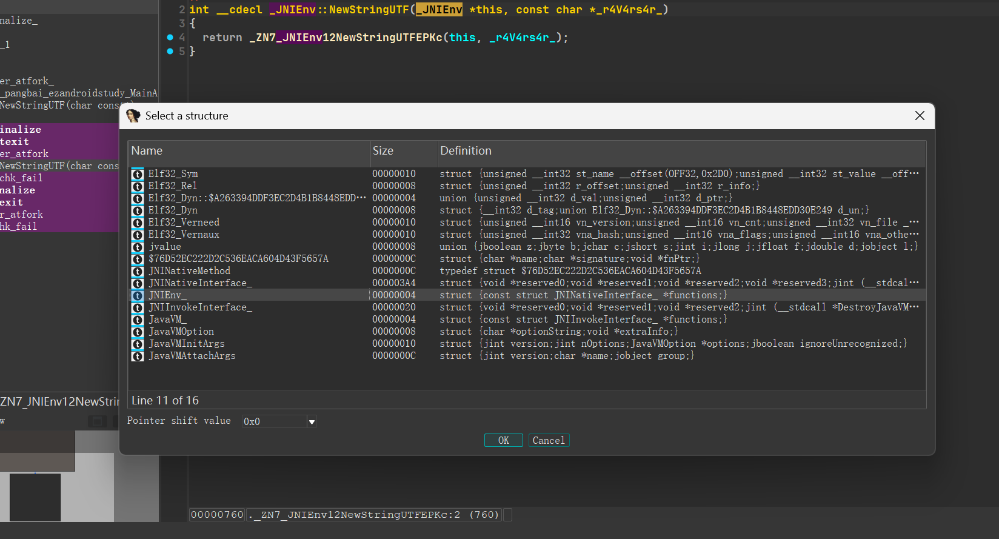

就会好看很多；
