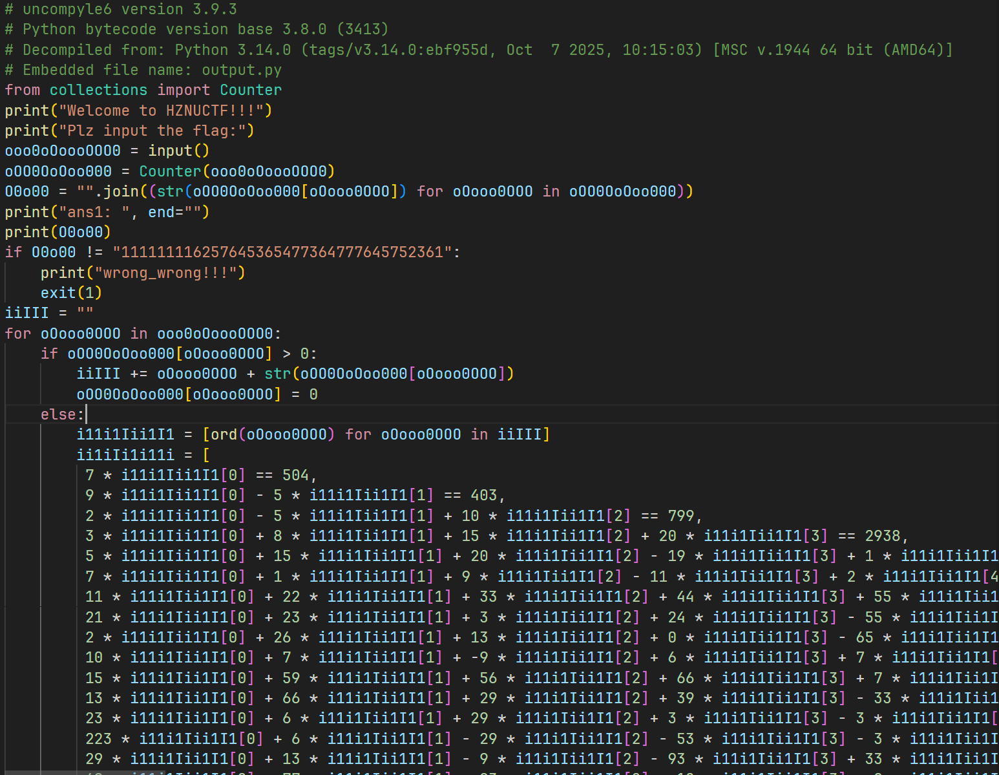

# rustyapp

shift+f12追一下显示的输入字符串，找到加密函数；


对不明函数打断点动调一下，找一下逻辑，35行是打印，37行是输入并读取，v22存输入，下个硬件断点


最后比较是if（v2），v2==0就成功，对v2按x查找一下，有一个v2|=v15^0x21,那么v15都要xor0x21==0，即v15都是0x21，即输入的每一字符xor后面的字符串都要是0x21；

硬件断点一直不触发，应该只有一层加密；

根据异或的对称性即可直接解密；


STRU~MHCS@SX~BNSD~@RRDSU


# 蛇年的本命语言

先将封装的.exe文件用pyinstx转为.pyc，出现版本问题，换用-ng；


再用uncompyle6将.pyc转成.py;

`uncompyle6 -o C:\Users\sjx\Desktop\ctf\moectf2025 "C:\Users\sjx\Desktop\ctf\moectf2025\ezpy (1).pyc"`


修复一下.py,很明显的z3



写脚本解一下；

```py
import z3;
i11i1Iii1I1 = [0] * 30
for i in range(30):
  i11i1Iii1I1[i] = z3.Int(name = 'i11i1Iii1I1[' + str(i) + ']')
s = z3.Solver()
s.add(7 * i11i1Iii1I1[0] == 504,
​     9 * i11i1Iii1I1[0] - 5 * i11i1Iii1I1[1] == 403,
​     2 * i11i1Iii1I1[0] - 5 * i11i1Iii1I1[1] + 10 * i11i1Iii1I1[2] == 799,
​     3 * i11i1Iii1I1[0] + 8 * i11i1Iii1I1[1] + 15 * i11i1Iii1I1[2] + 20 * i11i1Iii1I1[3] == 2938,
​     5 * i11i1Iii1I1[0] + 15 * i11i1Iii1I1[1] + 20 * i11i1Iii1I1[2] - 19 * i11i1Iii1I1[3] + 1 * i11i1Iii1I1[4] == 2042,
​     7 * i11i1Iii1I1[0] + 1 * i11i1Iii1I1[1] + 9 * i11i1Iii1I1[2] - 11 * i11i1Iii1I1[3] + 2 * i11i1Iii1I1[4] + 5 * i11i1Iii1I1[5] == 1225,
​     11 * i11i1Iii1I1[0] + 22 * i11i1Iii1I1[1] + 33 * i11i1Iii1I1[2] + 44 * i11i1Iii1I1[3] + 55 * i11i1Iii1I1[4] + 66 * i11i1Iii1I1[5] - 77 * i11i1Iii1I1[6] == 7975,
​     21 * i11i1Iii1I1[0] + 23 * i11i1Iii1I1[1] + 3 * i11i1Iii1I1[2] + 24 * i11i1Iii1I1[3] - 55 * i11i1Iii1I1[4] + 6 * i11i1Iii1I1[5] - 7 * i11i1Iii1I1[6] + 15 * i11i1Iii1I1[7] == 229,
​     2 * i11i1Iii1I1[0] + 26 * i11i1Iii1I1[1] + 13 * i11i1Iii1I1[2] + 0 * i11i1Iii1I1[3] - 65 * i11i1Iii1I1[4] + 15 * i11i1Iii1I1[5] + 29 * i11i1Iii1I1[6] + 1 * i11i1Iii1I1[7] + 20 * i11i1Iii1I1[8] == 2107,
​     10 * i11i1Iii1I1[0] + 7 * i11i1Iii1I1[1] + -9 * i11i1Iii1I1[2] + 6 * i11i1Iii1I1[3] + 7 * i11i1Iii1I1[4] + 1 * i11i1Iii1I1[5] + 22 * i11i1Iii1I1[6] + 21 * i11i1Iii1I1[7] - 22 * i11i1Iii1I1[8] + 30 * i11i1Iii1I1[9] == 4037,
​     15 * i11i1Iii1I1[0] + 59 * i11i1Iii1I1[1] + 56 * i11i1Iii1I1[2] + 66 * i11i1Iii1I1[3] + 7 * i11i1Iii1I1[4] + 1 * i11i1Iii1I1[5] - 122 * i11i1Iii1I1[6] + 21 * i11i1Iii1I1[7] + 32 * i11i1Iii1I1[8] + 3 * i11i1Iii1I1[9] - 10 * i11i1Iii1I1[10] == 4950,
​     13 * i11i1Iii1I1[0] + 66 * i11i1Iii1I1[1] + 29 * i11i1Iii1I1[2] + 39 * i11i1Iii1I1[3] - 33 * i11i1Iii1I1[4] + 13 * i11i1Iii1I1[5] - 2 * i11i1Iii1I1[6] + 42 * i11i1Iii1I1[7] + 62 * i11i1Iii1I1[8] + 1 * i11i1Iii1I1[9] - 10 * i11i1Iii1I1[10] + 11 * i11i1Iii1I1[11] == 12544,
​     23 * i11i1Iii1I1[0] + 6 * i11i1Iii1I1[1] + 29 * i11i1Iii1I1[2] + 3 * i11i1Iii1I1[3] - 3 * i11i1Iii1I1[4] + 63 * i11i1Iii1I1[5] - 25 * i11i1Iii1I1[6] + 2 * i11i1Iii1I1[7] + 32 * i11i1Iii1I1[8] + 1 * i11i1Iii1I1[9] - 10 * i11i1Iii1I1[10] + 11 * i11i1Iii1I1[11] - 12 * i11i1Iii1I1[12] == 6585,
​     223 * i11i1Iii1I1[0] + 6 * i11i1Iii1I1[1] - 29 * i11i1Iii1I1[2] - 53 * i11i1Iii1I1[3] - 3 * i11i1Iii1I1[4] + 3 * i11i1Iii1I1[5] - 65 * i11i1Iii1I1[6] + 0 * i11i1Iii1I1[7] + 36 * i11i1Iii1I1[8] + 1 * i11i1Iii1I1[9] - 15 * i11i1Iii1I1[10] + 16 * i11i1Iii1I1[11] - 18 * i11i1Iii1I1[12] + 13 * i11i1Iii1I1[13] == 6893,
​     29 * i11i1Iii1I1[0] + 13 * i11i1Iii1I1[1] - 9 * i11i1Iii1I1[2] - 93 * i11i1Iii1I1[3] + 33 * i11i1Iii1I1[4] + 6 * i11i1Iii1I1[5] + 65 * i11i1Iii1I1[6] + 1 * i11i1Iii1I1[7] - 36 * i11i1Iii1I1[8] + 0 * i11i1Iii1I1[9] - 16 * i11i1Iii1I1[10] + 96 * i11i1Iii1I1[11] - 68 * i11i1Iii1I1[12] + 33 * i11i1Iii1I1[13] - 14 * i11i1Iii1I1[14] == 1883,
​     69 * i11i1Iii1I1[0] + 77 * i11i1Iii1I1[1] - 93 * i11i1Iii1I1[2] - 12 * i11i1Iii1I1[3] + 0 * i11i1Iii1I1[4] + 0 * i11i1Iii1I1[5] + 1 * i11i1Iii1I1[6] + 16 * i11i1Iii1I1[7] + 36 * i11i1Iii1I1[8] + 6 * i11i1Iii1I1[9] + 19 * i11i1Iii1I1[10] + 66 * i11i1Iii1I1[11] - 8 * i11i1Iii1I1[12] + 38 * i11i1Iii1I1[13] - 16 * i11i1Iii1I1[14] + 15 * i11i1Iii1I1[15] == 8257,
​     23 * i11i1Iii1I1[0] + 2 * i11i1Iii1I1[1] - 3 * i11i1Iii1I1[2] - 11 * i11i1Iii1I1[3] + 12 * i11i1Iii1I1[4] + 24 * i11i1Iii1I1[5] + 1 * i11i1Iii1I1[6] + 6 * i11i1Iii1I1[7] + 14 * i11i1Iii1I1[8] - 0 * i11i1Iii1I1[9] + 1 * i11i1Iii1I1[10] + 68 * i11i1Iii1I1[11] - 18 * i11i1Iii1I1[12] + 68 * i11i1Iii1I1[13] - 26 * i11i1Iii1I1[14] + 15 * i11i1Iii1I1[15] - 16 * i11i1Iii1I1[16] == 5847,
​     24 * i11i1Iii1I1[0] + 0 * i11i1Iii1I1[1] - 1 * i11i1Iii1I1[2] - 15 * i11i1Iii1I1[3] + 13 * i11i1Iii1I1[4] + 4 * i11i1Iii1I1[5] + 16 * i11i1Iii1I1[6] + 67 * i11i1Iii1I1[7] + 146 * i11i1Iii1I1[8] - 50 * i11i1Iii1I1[9] + 16 * i11i1Iii1I1[10] + 6 * i11i1Iii1I1[11] - 1 * i11i1Iii1I1[12] + 69 * i11i1Iii1I1[13] - 27 * i11i1Iii1I1[14] + 45 * i11i1Iii1I1[15] - 6 * i11i1Iii1I1[16] + 17 * i11i1Iii1I1[17] == 18257,
​     25 * i11i1Iii1I1[0] + 26 * i11i1Iii1I1[1] - 89 * i11i1Iii1I1[2] + 16 * i11i1Iii1I1[3] + 19 * i11i1Iii1I1[4] + 44 * i11i1Iii1I1[5] + 36 * i11i1Iii1I1[6] + 66 * i11i1Iii1I1[7] - 150 * i11i1Iii1I1[8] - 250 * i11i1Iii1I1[9] + 166 * i11i1Iii1I1[10] + 126 * i11i1Iii1I1[11] - 11 * i11i1Iii1I1[12] + 690 * i11i1Iii1I1[13] - 207 * i11i1Iii1I1[14] + 46 * i11i1Iii1I1[15] + 6 * i11i1Iii1I1[16] + 7 * i11i1Iii1I1[17] - 18 * i11i1Iii1I1[18] == 12591,
​     5 * i11i1Iii1I1[0] + 26 * i11i1Iii1I1[1] + 8 * i11i1Iii1I1[2] + 160 * i11i1Iii1I1[3] + 9 * i11i1Iii1I1[4] - 4 * i11i1Iii1I1[5] + 36 * i11i1Iii1I1[6] + 6 * i11i1Iii1I1[7] - 15 * i11i1Iii1I1[8] - 20 * i11i1Iii1I1[9] + 66 * i11i1Iii1I1[10] + 16 * i11i1Iii1I1[11] - 1 * i11i1Iii1I1[12] + 690 * i11i1Iii1I1[13] - 20 * i11i1Iii1I1[14] + 46 * i11i1Iii1I1[15] + 6 * i11i1Iii1I1[16] + 7 * i11i1Iii1I1[17] - 18 * i11i1Iii1I1[18] + 19 * i11i1Iii1I1[19] == 52041,
​     29 * i11i1Iii1I1[0] - 26 * i11i1Iii1I1[1] + 0 * i11i1Iii1I1[2] + 60 * i11i1Iii1I1[3] + 90 * i11i1Iii1I1[4] - 4 * i11i1Iii1I1[5] + 6 * i11i1Iii1I1[6] + 6 * i11i1Iii1I1[7] - 16 * i11i1Iii1I1[8] - 21 * i11i1Iii1I1[9] + 69 * i11i1Iii1I1[10] + 6 * i11i1Iii1I1[11] - 12 * i11i1Iii1I1[12] + 69 * i11i1Iii1I1[13] - 20 * i11i1Iii1I1[14] - 46 * i11i1Iii1I1[15] + 65 * i11i1Iii1I1[16] + 0 * i11i1Iii1I1[17] - 1 * i11i1Iii1I1[18] + 39 * i11i1Iii1I1[19] - 20 * i11i1Iii1I1[20] == 20253,
​     45 * i11i1Iii1I1[0] - 56 * i11i1Iii1I1[1] + 10 * i11i1Iii1I1[2] + 650 * i11i1Iii1I1[3] - 900 * i11i1Iii1I1[4] + 44 * i11i1Iii1I1[5] + 66 * i11i1Iii1I1[6] - 6 * i11i1Iii1I1[7] - 6 * i11i1Iii1I1[8] - 21 * i11i1Iii1I1[9] + 9 * i11i1Iii1I1[10] - 6 * i11i1Iii1I1[11] - 12 * i11i1Iii1I1[12] + 69 * i11i1Iii1I1[13] - 2 * i11i1Iii1I1[14] - 406 * i11i1Iii1I1[15] + 651 * i11i1Iii1I1[16] + 2 * i11i1Iii1I1[17] - 10 * i11i1Iii1I1[18] + 69 * i11i1Iii1I1[19] - 0 * i11i1Iii1I1[20] + 21 * i11i1Iii1I1[21] == 18768,
​     555 * i11i1Iii1I1[0] - 6666 * i11i1Iii1I1[1] + 70 * i11i1Iii1I1[2] + 510 * i11i1Iii1I1[3] - 90 * i11i1Iii1I1[4] + 499 * i11i1Iii1I1[5] + 66 * i11i1Iii1I1[6] - 66 * i11i1Iii1I1[7] - 610 * i11i1Iii1I1[8] - 221 * i11i1Iii1I1[9] + 9 * i11i1Iii1I1[10] - 23 * i11i1Iii1I1[11] - 102 * i11i1Iii1I1[12] + 6 * i11i1Iii1I1[13] + 2050 * i11i1Iii1I1[14] - 406 * i11i1Iii1I1[15] + 665 * i11i1Iii1I1[16] + 333 * i11i1Iii1I1[17] + 100 * i11i1Iii1I1[18] + 609 * i11i1Iii1I1[19] + 777 * i11i1Iii1I1[20] + 201 * i11i1Iii1I1[21] - 22 * i11i1Iii1I1[22] == 111844,
​     1 * i11i1Iii1I1[0] - 22 * i11i1Iii1I1[1] + 333 * i11i1Iii1I1[2] + 4444 * i11i1Iii1I1[3] - 5555 * i11i1Iii1I1[4] + 6666 * i11i1Iii1I1[5] - 666 * i11i1Iii1I1[6] + 676 * i11i1Iii1I1[7] - 660 * i11i1Iii1I1[8] - 22 * i11i1Iii1I1[9] + 9 * i11i1Iii1I1[10] - 73 * i11i1Iii1I1[11] - 107 * i11i1Iii1I1[12] + 6 * i11i1Iii1I1[13] + 250 * i11i1Iii1I1[14] - 6 * i11i1Iii1I1[15] + 65 * i11i1Iii1I1[16] + 39 * i11i1Iii1I1[17] + 10 * i11i1Iii1I1[18] + 69 * i11i1Iii1I1[19] + 777 * i11i1Iii1I1[20] + 201 * i11i1Iii1I1[21] - 2 * i11i1Iii1I1[22] + 23 * i11i1Iii1I1[23] == 159029,
​     520 * i11i1Iii1I1[0] - 222 * i11i1Iii1I1[1] + 333 * i11i1Iii1I1[2] + 4 * i11i1Iii1I1[3] - 56655 * i11i1Iii1I1[4] + 6666 * i11i1Iii1I1[5] + 666 * i11i1Iii1I1[6] + 66 * i11i1Iii1I1[7] - 60 * i11i1Iii1I1[8] - 220 * i11i1Iii1I1[9] + 99 * i11i1Iii1I1[10] + 73 * i11i1Iii1I1[11] + 1007 * i11i1Iii1I1[12] + 7777 * i11i1Iii1I1[13] + 2500 * i11i1Iii1I1[14] + 6666 * i11i1Iii1I1[15] + 605 * i11i1Iii1I1[16] + 390 * i11i1Iii1I1[17] + 100 * i11i1Iii1I1[18] + 609 * i11i1Iii1I1[19] + 99999 * i11i1Iii1I1[20] + 210 * i11i1Iii1I1[21] + 232 * i11i1Iii1I1[22] + 23 * i11i1Iii1I1[23] - 24 * i11i1Iii1I1[24] == 2762025,
​     1323 * i11i1Iii1I1[0] - 22 * i11i1Iii1I1[1] + 333 * i11i1Iii1I1[2] + 4 * i11i1Iii1I1[3] - 55 * i11i1Iii1I1[4] + 666 * i11i1Iii1I1[5] + 666 * i11i1Iii1I1[6] + 66 * i11i1Iii1I1[7] - 660 * i11i1Iii1I1[8] - 220 * i11i1Iii1I1[9] + 99 * i11i1Iii1I1[10] + 3 * i11i1Iii1I1[11] + 100 * i11i1Iii1I1[12] + 777 * i11i1Iii1I1[13] + 2500 * i11i1Iii1I1[14] + 6666 * i11i1Iii1I1[15] + 605 * i11i1Iii1I1[16] + 390 * i11i1Iii1I1[17] + 100 * i11i1Iii1I1[18] + 609 * i11i1Iii1I1[19] + 9999 * i11i1Iii1I1[20] + 210 * i11i1Iii1I1[21] + 232 * i11i1Iii1I1[22] + 23 * i11i1Iii1I1[23] - 24 * i11i1Iii1I1[24] + 25 * i11i1Iii1I1[25] == 1551621,
​     777 * i11i1Iii1I1[0] - 22 * i11i1Iii1I1[1] + 6969 * i11i1Iii1I1[2] + 4 * i11i1Iii1I1[3] - 55 * i11i1Iii1I1[4] + 666 * i11i1Iii1I1[5] - 6 * i11i1Iii1I1[6] + 96 * i11i1Iii1I1[7] - 60 * i11i1Iii1I1[8] - 220 * i11i1Iii1I1[9] + 99 * i11i1Iii1I1[10] + 3 * i11i1Iii1I1[11] + 100 * i11i1Iii1I1[12] + 777 * i11i1Iii1I1[13] + 250 * i11i1Iii1I1[14] + 666 * i11i1Iii1I1[15] + 65 * i11i1Iii1I1[16] + 90 * i11i1Iii1I1[17] + 100 * i11i1Iii1I1[18] + 609 * i11i1Iii1I1[19] + 999 * i11i1Iii1I1[20] + 21 * i11i1Iii1I1[21] + 232 * i11i1Iii1I1[22] + 23 * i11i1Iii1I1[23] - 24 * i11i1Iii1I1[24] + 25 * i11i1Iii1I1[25] - 26 * i11i1Iii1I1[26] == 948348,
​     97 * i11i1Iii1I1[0] - 22 * i11i1Iii1I1[1] + 6969 * i11i1Iii1I1[2] + 4 * i11i1Iii1I1[3] - 56 * i11i1Iii1I1[4] + 96 * i11i1Iii1I1[5] - 6 * i11i1Iii1I1[6] + 96 * i11i1Iii1I1[7] - 60 * i11i1Iii1I1[8] - 20 * i11i1Iii1I1[9] + 99 * i11i1Iii1I1[10] + 3 * i11i1Iii1I1[11] + 10 * i11i1Iii1I1[12] + 707 * i11i1Iii1I1[13] + 250 * i11i1Iii1I1[14] + 666 * i11i1Iii1I1[15] + -9 * i11i1Iii1I1[16] + 90 * i11i1Iii1I1[17] + -2 * i11i1Iii1I1[18] + 609 * i11i1Iii1I1[19] + 0 * i11i1Iii1I1[20] + 21 * i11i1Iii1I1[21] + 2 * i11i1Iii1I1[22] + 23 * i11i1Iii1I1[23] - 24 * i11i1Iii1I1[24] + 25 * i11i1Iii1I1[25] - 26 * i11i1Iii1I1[26] + 27 * i11i1Iii1I1[27] == 777044,
​     177 * i11i1Iii1I1[0] - 22 * i11i1Iii1I1[1] + 699 * i11i1Iii1I1[2] + 64 * i11i1Iii1I1[3] - 56 * i11i1Iii1I1[4] - 96 * i11i1Iii1I1[5] - 66 * i11i1Iii1I1[6] + 96 * i11i1Iii1I1[7] - 60 * i11i1Iii1I1[8] - 20 * i11i1Iii1I1[9] + 99 * i11i1Iii1I1[10] + 3 * i11i1Iii1I1[11] + 10 * i11i1Iii1I1[12] + 707 * i11i1Iii1I1[13] + 250 * i11i1Iii1I1[14] + 666 * i11i1Iii1I1[15] + -9 * i11i1Iii1I1[16] + 0 * i11i1Iii1I1[17] + -2 * i11i1Iii1I1[18] + 69 * i11i1Iii1I1[19] + 0 * i11i1Iii1I1[20] + 21 * i11i1Iii1I1[21] + 222 * i11i1Iii1I1[22] + 23 * i11i1Iii1I1[23] - 224 * i11i1Iii1I1[24] + 25 * i11i1Iii1I1[25] - 26 * i11i1Iii1I1[26] + 27 * i11i1Iii1I1[27] - 28 * i11i1Iii1I1[28] == 185016,
​     77 * i11i1Iii1I1[0] - 2 * i11i1Iii1I1[1] + 6 * i11i1Iii1I1[2] + 6 * i11i1Iii1I1[3] - 96 * i11i1Iii1I1[4] - 9 * i11i1Iii1I1[5] - 6 * i11i1Iii1I1[6] + 96 * i11i1Iii1I1[7] - 0 * i11i1Iii1I1[8] - 20 * i11i1Iii1I1[9] + 99 * i11i1Iii1I1[10] + 3 * i11i1Iii1I1[11] + 10 * i11i1Iii1I1[12] + 707 * i11i1Iii1I1[13] + 250 * i11i1Iii1I1[14] + 666 * i11i1Iii1I1[15] + -9 * i11i1Iii1I1[16] + 0 * i11i1Iii1I1[17] + -2 * i11i1Iii1I1[18] + 9 * i11i1Iii1I1[19] + 0 * i11i1Iii1I1[20] + 21 * i11i1Iii1I1[21] + 222 * i11i1Iii1I1[22] + 23 * i11i1Iii1I1[23] - 224 * i11i1Iii1I1[24] + 26 * i11i1Iii1I1[25] - -58 * i11i1Iii1I1[26] + 27 * i11i1Iii1I1[27] - 2 * i11i1Iii1I1[28] + 29 * i11i1Iii1I1[29] == 130106)

if z3.Solver.check(s) == z3.sat: 
  ans = z3.Solver.model(s) 
  for i in i11i1Iii1I1:
​    print(chr(ans[i].as_long()), end='') #按顺序输出
```

H1Z1N1U1C1T1F1{1a6d275f7-463}1

有点问题，回看一下加密代码，分析一下；

```py
from collections import Counter
print("Welcome to HZNUCTF!!!")
print("Plz input the flag:")
inp = input()
coutinp = Counter(inp)  #统计输入的字符串（flag）中每个字符出现的次数
O0o00 = "".join((str(coutinp[inpstr]) for inpstr in inp))  #将每个字符按在flag中出现的字数为掩码替换
print("ans1: ", end="")
print(O0o00)
iiIII = ""
if O0o00 != "111111116257645365477364777645752361":  #比较掩码
    print("wrong_wrong!!!")
    exit(1)
for inpstr in inp:
    if coutinp[inpstr] > 0:
        iiIII += inpstr + str(coutinp[inpstr]) 
        coutinp[inpstr] = 0
#flag中每个重复的字符只输出第一次，并在后面加上重复次数
```

映射分析，H1Z1N1U1C1T1F1 {1 a6 d2 75 f7 -4 63 }1

​		  111111116257645365477364777645752361

第一个1对应H，第二个1对应Z，....,6都对应a......

手改一下，HZNUCTF{ad7fa-76a7-ff6a-fffa-7f7d6a}


# ⽔果忍者

dnspy打开Assembly-CSharp.dll文件

主类里翻到一个hint

```
"Locate the 'FlagContainer' class in the Program Resource Manager",
"Submit in format: flag{xxxx}"
```

找一下FlagContainer，其中

```
[EncodedFlag("D1ucj0u!tqjwf!fohjoffsjoh!xj!epspqz!ju!gvo!2025")]
```

再找到main函数

调用了一个decode()函数，得到的值传给text

猜测text中即为flag，直接下断点动调；

变量中直接看到flag内容，结合hint中的format，


flag{D1tbi0t_spive_engineering_wi_doropy_it_fun_2025}（好像没有检验程序？）


# cccc

dnspy打开.dll,明显被混淆


使用de4dot脱壳，重新打开


无法调试，发现这是32位程序，重新找一个32位的dnspy打开

也报错，最后发现要将-clean的文件重命名成原来的才能动调，非常奇怪；

函数太多了难以分析，先找到main函数一步步动调；


num中的值应该是密文；


前面的一大坨应该是对输入进行utf等的处理，先不管；

然后找到一个可疑text："doyouknowcsharp"


然后找到一个rc4；

```c#
T0[] array = GClass0.smethod_3<T0, T1>(GClass0.smethod_0<T0, T1, T2>(gparam_0));
		T1 t = 0;
		T1 t2 = 0;
		T0[] array2;   //输入
		for (;;)
		{
			IL_132:
			uint num = 965942686U;
			for (;;)
			{
				uint num2;
				switch ((num2 = (num ^ 1671582653U)) % 10U)
				{
				case 1U:
				{
					T1 t3 = 0;
					num = (num2 * 2964175099U ^ 3088226582U);
					continue;
				}
				case 2U:
					num = (num2 * 2557159329U ^ 3766832993U);
					continue;
				case 3U:
				{
					T0 t4;
					array[t2] = t4;
					num = (num2 * 1977227374U ^ 428192606U);
					continue;
				}
				case 4U:
				{
					T1 t3;
					num = ((t3 >= gparam_1.Length) ? 135939119U : 530945064U);
					continue;
				}
				case 5U:
				{
					T1 t3;
					array2[t3] = (byte)(gparam_1[t3] ^ array[(array[t] + array[t2]) % 256] ^ 100);		//多异或了一个100
					num = (num2 * 1446099815U ^ 1371508486U);
					continue;
				}
				case 6U:
				{
					T1 t3;
					t3++;
					num = (num2 * 1047750269U ^ 2517980139U);
					continue;
				}
				case 7U:
					array2 = new T0[gparam_1.Length];
					num = (num2 * 835581391U ^ 1087374551U);
					continue;
				case 8U:
					goto IL_132;
				case 9U:
				{
					t = (t + 1) % 256;
					t2 = (array[t] + t2) % 256;
					T0 t4 = array[t];
					array[t] = array[t2];     //这里交换s盒很好分辨rc4
					num = 593623138U;
					continue;
				}
```

然后就没有能看懂的有意义的了，基本上全是输入输出字符串处理；

cyberchef试着解一下，对了；


flag{y0u_r34lly_kn0w_m@ny_pr0gr@mm1ng_l@ngu@g3$}

# ~~rust_baby~~

### 做蒙了才发现这个_baby原来不是简单一点的意思，加密也太多了，以后再来探索吧(

ida打开，main函数看不清逻辑，字符串搜索也一无所获，尝试动调；

对每个不太能识别的函数下断点，试图定位输入函数；


断点命中172行，疑似是主逻辑，sub_298a中东西很多；


定位到函数中318行为print，319行为输入，351行为处理输入


栈空间和hexview中抓到了输入；8位一处理，不全补e，现在要看它转到了哪；

感觉是处理了之后存到v195_4里面了给这个打个硬件断点，断到了v185


继续下断点，知893行即为判断逻辑，n32_5里的是密文，src是加密后的明文，逐位比较；


