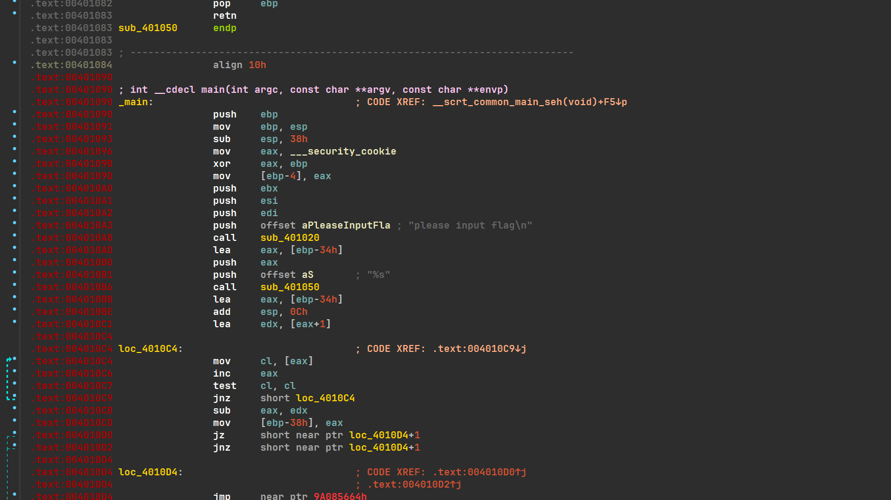
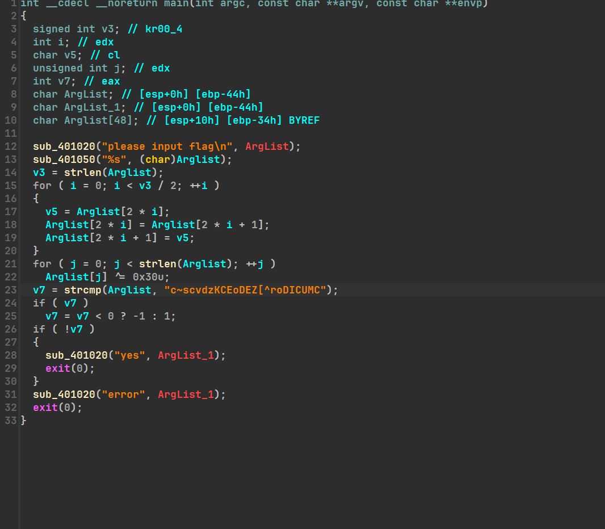
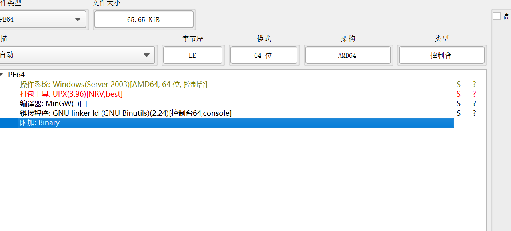
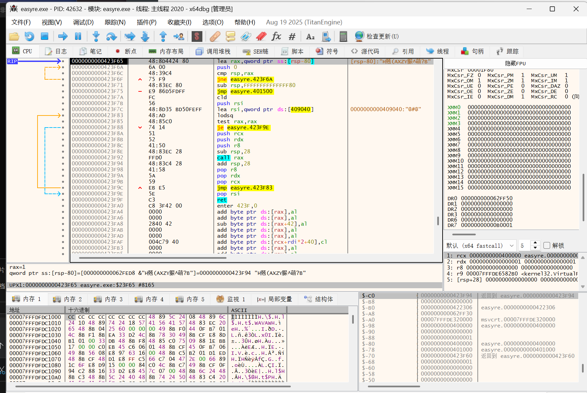
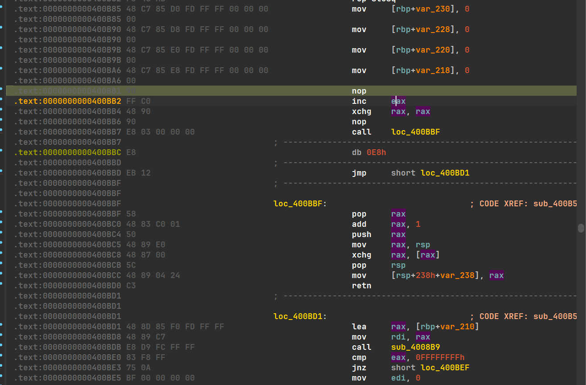
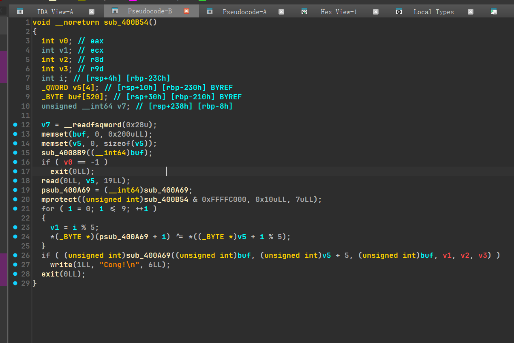

## 一道非常简单的去花

打开ida发现标红；

4010d4jmp的地址错误，而上面很明显是花指令标志；



`jz`和`jnz`互补，必有一个执行，所以4010D4的字节一定不会被执行，nop掉这个字节即可；

然后再对函数头`_main`按U再按P重定义；

就能正常按F5反编译了；



分析加密，可以看到是先对字符串每两字节交换位置，再逐字节异或0x30，再与密文比较；

解密：先用cyberchef对密文异或0x30，再复制代码换位即可；

```cpp
#include<iostream>
#include<string>
#include<algorithm>
#include<vector>
#include<cstdint>
using namespace std;

string t="SNCSFTJ{su_tujknB_tyse}s";

int main()
{
    for (int  i = 0; i < t.size() / 2; ++i )
  {
    char v5 = t[2 * i];
    t[2 * i] = t[2 * i + 1];
    t[2 * i + 1] = v5;
  }
  cout<<t;
}
```

NSSCTF{Just_junk_Bytess};


## 一道非常简单的壳

DIE查壳，64位程序，UPX壳；



### 机脱

`sudo ./upx -d C:\Users\sjx\Desktop\ctf\例会作业\#4\作业\一道非常简单的壳\easyre.exe`


### 手脱

x64dbg打开，先寻找入口点；

追到pushad处，在push结束的栈顶下硬件断点，再按F9寻找popad；


硬件断点命中，明显jmp_401500是大跳转；



F4过去，点进地址开始dump；


把标红的删了，rebuild PE,再fix dump；

拖入ida就能正常分析了；


### 解密

根本不让输入，那么查找字符串；

找到一个part2;


左边函数表发现part1；


像16进制，解一下得`XPU{galf`

拼接得XPU{galfd_0n3_4nd_tw0}；


## N1CTF2020 - oflo

打开ida发现标红；

400bb1的jmp很明显是花，分析发现执行到这里会直接jmp到+1位置，也就等效为不jmp，直接顺序运行，但跳过400bb1；

那么直接nop400bb1即可；


在重定义一下，红变少了，应该对了；



400BB7的call后面有三字节未定义很奇怪，分析一下；

call进的400BBF中先把在栈顶的地址400BBC（call的下一条指令地址）推栈到外部rax，再对rax+1，再压栈，

则call返回的地址就偏移了一字节到400BBD，这个的地址直接jmp到400BD1;

那么~~盲猜~~先假定return前的都没用；就等价于nop掉call和其后面的一个字节；

红又少了，变成了一个jmp，又感觉对了；


还有个一样的花，一样改掉；


又出现一样的花，继续nop；


再往下翻，注意到`call mprotect`,可能是要修改地址了，进附近函数分析一下；

修改后重定义即可f5反编译；



接下来太难了看wp了，不写了qwq；

- 首先调用 `sub_4008B9()`
- 接下来从输入读取 19 字节
- 调用 `mprotect()` 修改 `main & 0xFFFFC000` 处权限为 `r | w | x`，由于权限控制粒度为内存页，因此这里实际上会修改一整张内存页的权限
- 修改 `sub_400A69()` 开头的 10 个字节
- 调用 `sub_400A69()` 检查 flag


