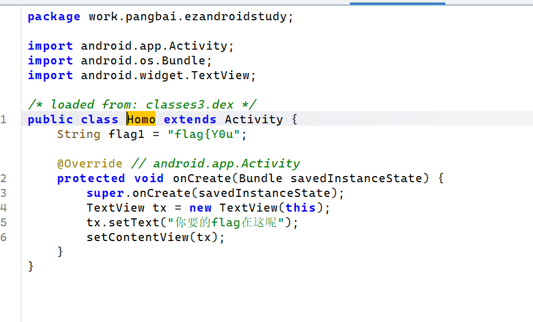
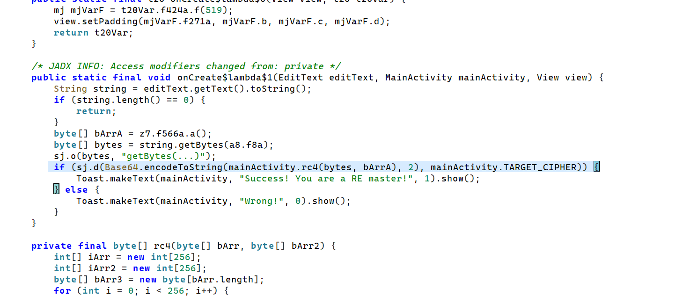
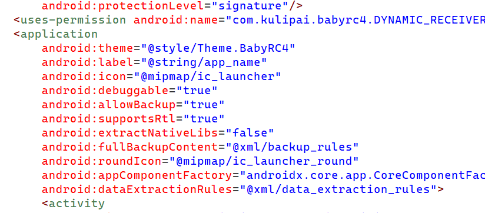
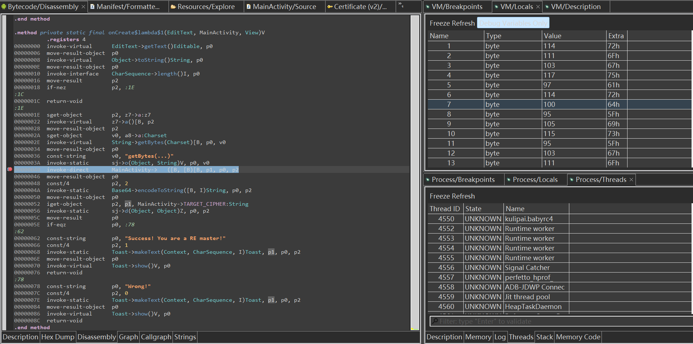

# 例会作业#5

##  ezAndroidStudy

先运行，发现竟然是引导式！


跟着引导找到2个activity；


在第二个activity中找到flag1；

flag{Y0u



flag2直接根据提示搜索字符串得到；

_@r4


flag3同上，

_900d；


flag4:_andr01d


flag5开始逆向so层，打开找到主程序

_r4V4rs4r}；


综上，

**flag{Y0u_@r4_900d_andr01d_r4V4rs4r}**


## ezRC4

先RC4再BASE64;



RC4密钥有点难以分析，尝试动调；

不能debug运行，发现mainfest缺少debuggable字段，用MT管理器加上；



能debug了，但是jadx很难调出rc4数组密钥；

换成JEB，对调用rc4的函数下断点，抓出解密数组；

array@20848 (type=[B)
[112 (0x70), 114 (0x72), 111 (0x6F), 103 (0x67), 117 (0x75), 97 (0x61), 114 (0x72), 100 (0x64), 95 (0x5F), 105 (0x69), 115 (0x73), 95 (0x5F), 103 (0x67), 111 (0x6F), 111 (0x6F), 100 (0x64)]




写解密：

```py
import base64

def rc4(key_bytes: bytes, data: bytes) -> bytes:
    # KSA
    S = list(range(256))
    j = 0
    key_len = len(key_bytes)
    for i in range(256):
        j = (j + S[i] + key_bytes[i % key_len]) % 256
        S[i], S[j] = S[j], S[i]

# PRGA

i = j = 0
out = bytearray()
for byte in data:
    i = (i + 1) % 256
    j = (j + S[i]) % 256
    S[i], S[j] = S[j], S[i]
    K = S[(S[i] + S[j]) % 256]
    out.append(byte ^ K)
return bytes(out)

if __name__ == "__main__":
    key = b"proguard_is_good"
    ct_b64 = "QbSfnpGb7yajG9NtlQ+DBtuJZ9fgplE8SXgWU2c="
    ct = base64.b64decode(ct_b64)
    pt = rc4(key, ct)

    # Print as UTF-8 if it’s text; otherwise show bytes hex too

    try:
        print("Plaintext (utf-8):", pt.decode("utf-8"))
    except UnicodeDecodeError:
        print("Plaintext (bytes):", pt)
        print("Plaintext (hex):", pt.hex())


```

**flag{u_rea11y_kn0w_debugg1ng}**；


## flipower

安装发现损坏，反编译发现安卓版本太高；


改了之后能安装了，但是不让运行，最后看lib发现只有arm架构，我没真机很难动调，被迫静态；


分析so文件，一个RC4,一个DES,对这一大串字符串加密后（v15）与输入（src）异或；

再与0x21异或，并与v11密文比较；

所以要是能动调就能出v15了，呼欸欸；


直接静态吧；

发现密钥src就是对输入前四字节复制两遍，即flagflag;

直接猜标准DES和RC4，ai写解密；

```py
from Crypto.Cipher import ARC4, DES

def rc4_encrypt(key: bytes, data: bytes) -> bytes:
    return ARC4.new(key).encrypt(data)

def des_ecb_encrypt(key: bytes, data: bytes) -> bytes:
    return DES.new(key, DES.MODE_ECB).encrypt(data)

def build_target(xmmword_74CDB, xmmword_74CEB, v12, v13, little_endian=True):
    if little_endian:
        v12_bytes = v12.to_bytes(8, 'little')
        v13_bytes = (v13 & 0xFFFF).to_bytes(2, 'little')
    else:
        v12_bytes = v12.to_bytes(8, 'big')
        v13_bytes = (v13 & 0xFFFF).to_bytes(2, 'big')
    return xmmword_74CDB + xmmword_74CEB + v12_bytes + v13_bytes

def recover_flag():
    dest = b"flagflag"
    ascii_plain = "a4c3f8927d9b8e6d6e483fa2cd0193b0a6e2f19c8b47d5a8f3c7a91e8d4b9f67"
    v14 = rc4_encrypt(dest, ascii_plain.encode('ascii'))
    v15 = des_ecb_encrypt(dest, v14)

xmmword_74CDB = bytes.fromhex("1E5881791AD962F4E39EA7A6A9010078")
xmmword_74CEB = bytes.fromhex("A62DC6F3C81F1447954FF1CBA1BED0AF")
T = build_target(xmmword_74CDB, xmmword_74CEB, 0x89DDAB508133AF93, 0x8E92, little_endian=True)
assert len(T) == 42

flag_bytes = bytes(T[i] ^ 0x21 ^ v15[i] for i in range(42))
return flag_bytes.decode('ascii')

if __name__ == "__main__":
    print(recover_flag())
```

**flag{b92d40df-840a-43a8-bdb4-5de79eca13fD}**；